---
hide:
    - toc
---

##### Week 4

# First Experiments

This set of experiments started from the curiosity of growing almost anything and the use of efficient resources as a way to develop projects.

I chose the first role of prototyping, that starts from a very simple hypothesis and then turn it into an experiment that was possible to made almost in the moment or in a few days, with the minimum amount of resources.

The first experiment starts from the question of "Can I add value to some existing object, growing something into it?

The Second one was to replace an existing objects using the minimum amount of resources.

The third one aims to use the mechanical energy of living organisms to enable them to comunicate with humans when they move.(output)

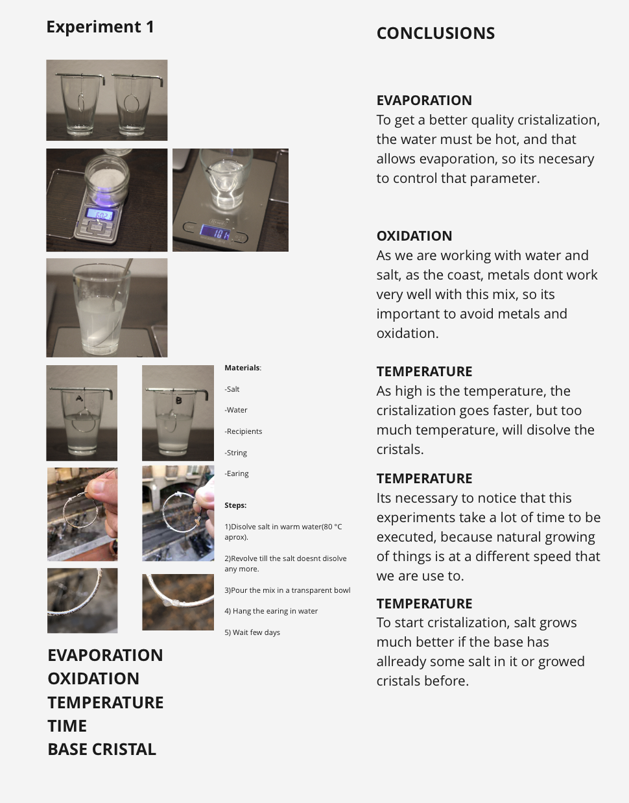

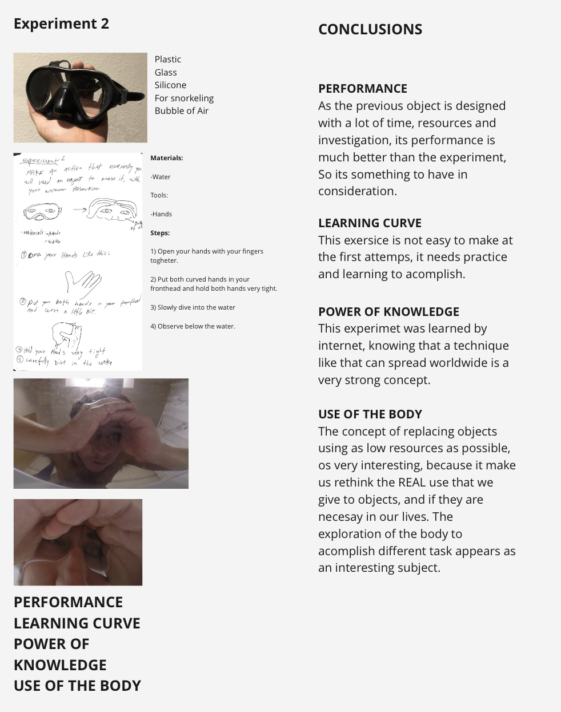

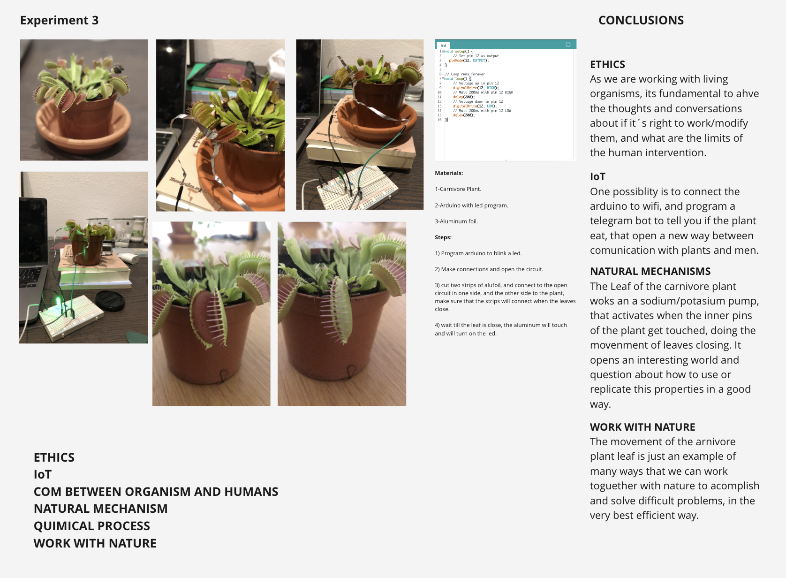

Second set of experiments:

Experiment 4:

Frecuencies vibration.

This set of experiments, aim to know what happens when different material sources encounter frecuencies vibrations from a speaker.

The firts one is a metal plate straight to the speaker filled up with water, when the volume of the speaker is raised , its possible to  appreciate how the water reacts to the frecuencies. Should be possible to freeze this water mantaining the shape that is formed?

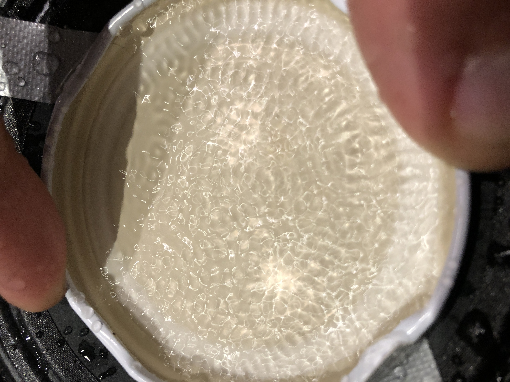

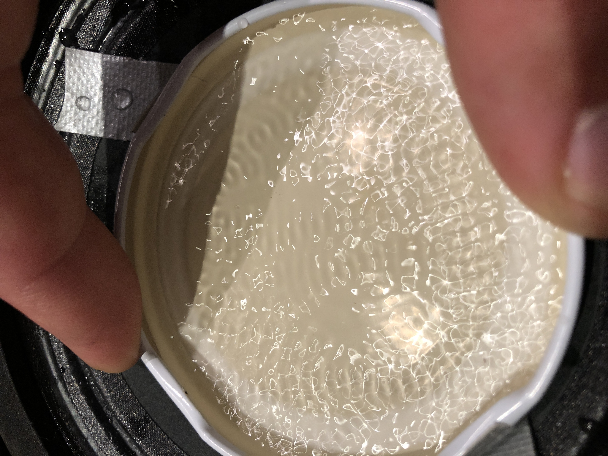

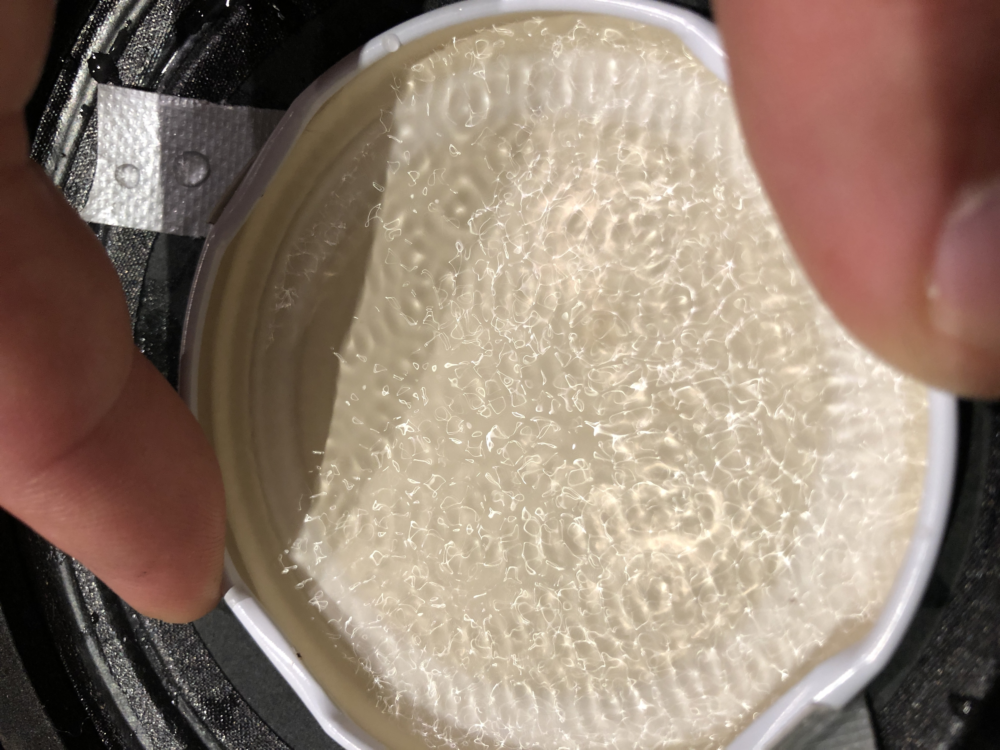

Experiment 5:

Chladni Plate:

This experiments is called Chladni Plate, it is the most common way to visualize frecuencies using resonance systems and granulated materials.

When a note is played, the plate is atttached to the vibrating speaker, creating different shapes related to the frecuencie played.

Would be possible to capture these shapes in a three dimensional space? to create a singular way to manufacture with sound frecuencies?

<iframe src="https://player.vimeo.com/video/657836820?h=60cf031306&amp;badge=0&amp;autopause=0&amp;player_id=0&amp;app_id=58479" frameborder="0" allow="autoplay; fullscreen; picture-in-picture" allowfullscreen style="position:absolute;top:0;left:0;width:100%;height:100%;" title="Chladni plate"></iframe>

*The setup*

*Frecuencie Result N°1*

*Frecuencie Result N°2*

*Frecuencie Result N°3*

*Frecuencie Result N°4*

*Using a video from youtube, of the same experiment, the interesting observation is that the result obtainedis different from the video.*

Experiment 6:

Balloon + mirror

This experiment aims to show the frecuencies in different ways, in this case there is a laser pointing to a mirror glued to a balloon. With a speaker sounding, its possible to see the shapes that frecuencies make with vibration.

The music source was some variatons of music, from just notes, to classical music.

<iframe src="https://player.vimeo.com/video/658534554?h=74cdc9ee5a&amp;badge=0&amp;autopause=0&amp;player_id=0&amp;app_id=58479" frameborder="0" allow="autoplay; fullscreen; picture-in-picture" allowfullscreen style="position:absolute;top:0;left:0;width:100%;height:100%;" title="Laser.mp4"></iframe>

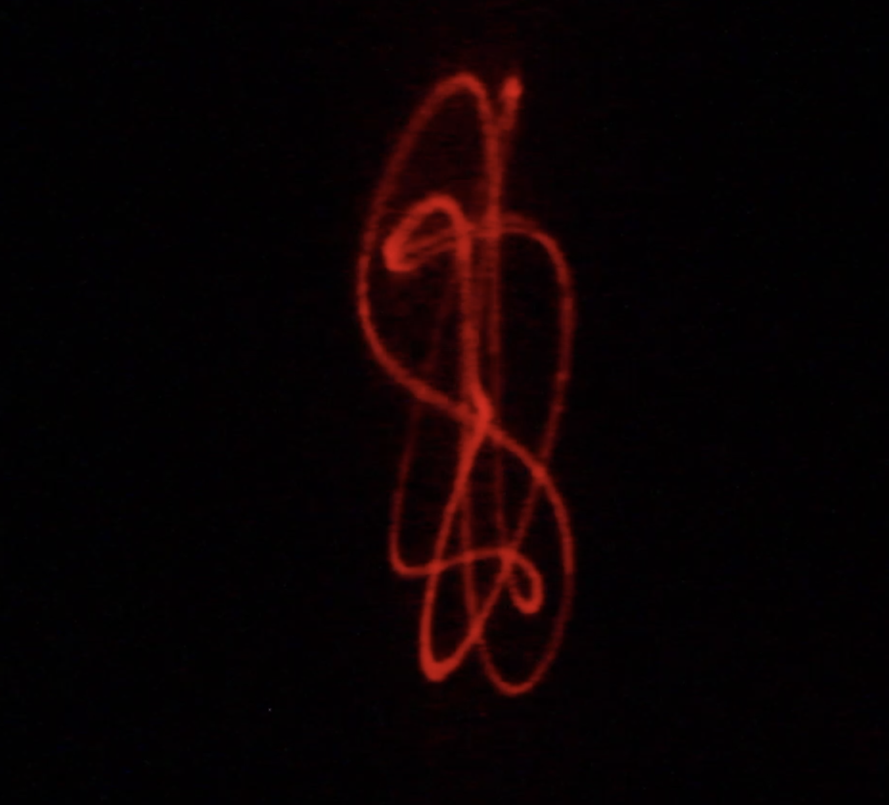

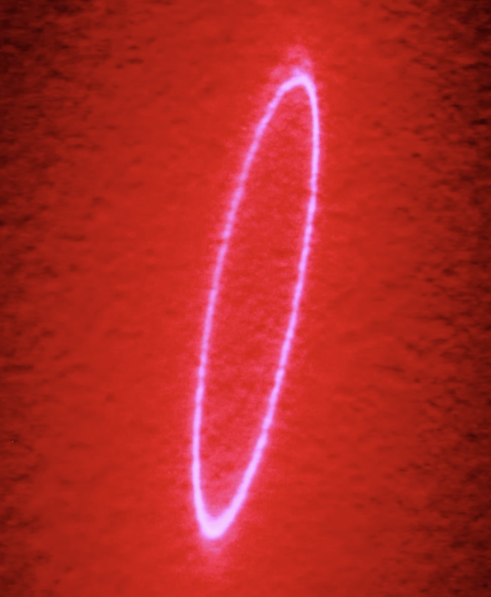

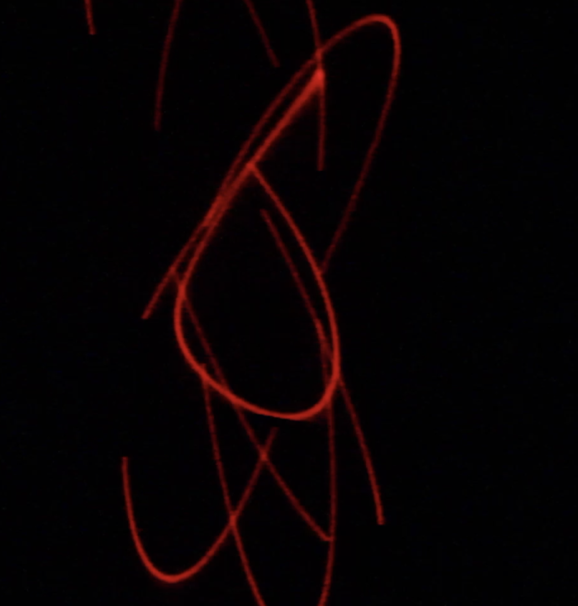

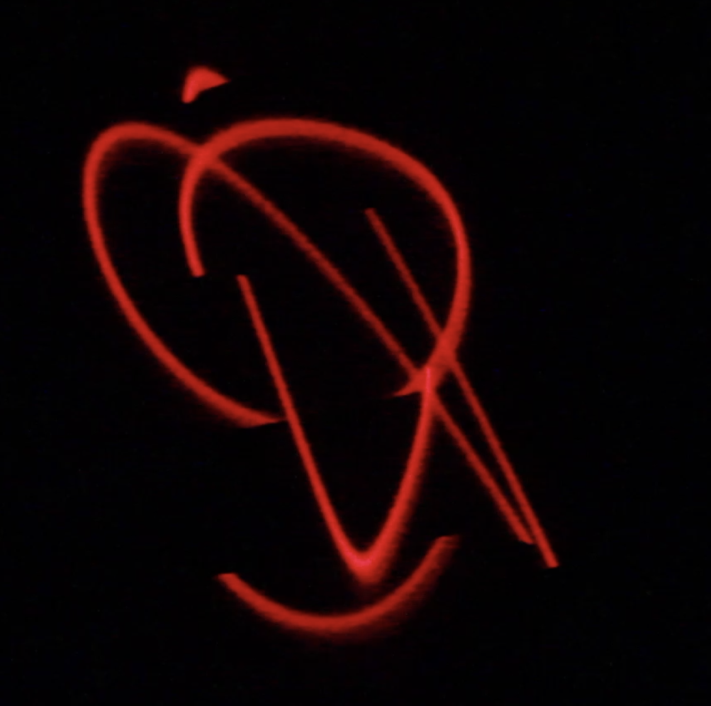

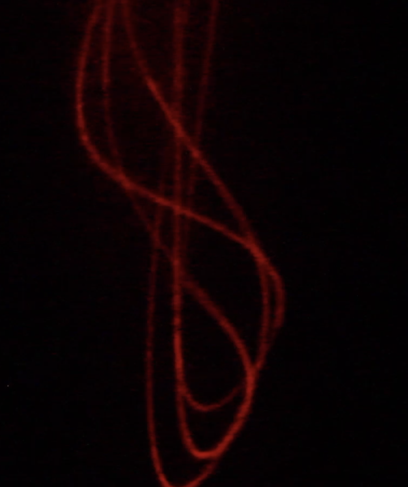

Experiment 7:

plastic can and frecuencies.

This experiment is similar to the Chladni plate, but using a plant can and a trash bag for the vibrating surface.
Also changing the dust powder with a more thin one.

<iframe src="https://player.vimeo.com/video/658562950?h=a20b734215&amp;badge=0&amp;autopause=0&amp;player_id=0&amp;app_id=58479" frameborder="0" allow="autoplay; fullscreen; picture-in-picture" allowfullscreen style="position:absolute;top:0;left:0;width:100%;height:100%;" title="20211217_201432.mp4"></iframe>

Intervention/Experimentation 2.0

Pure Data exploration

