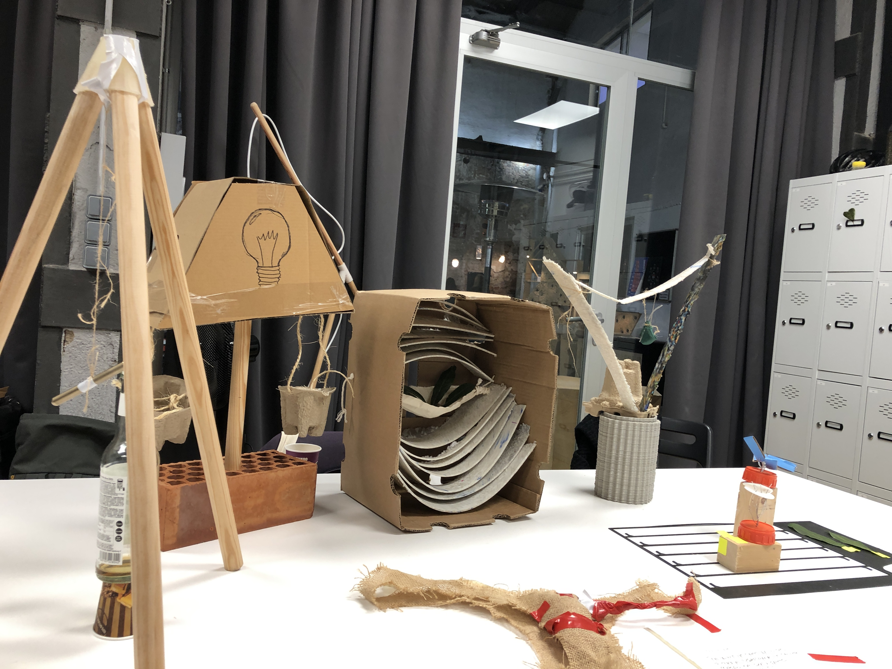
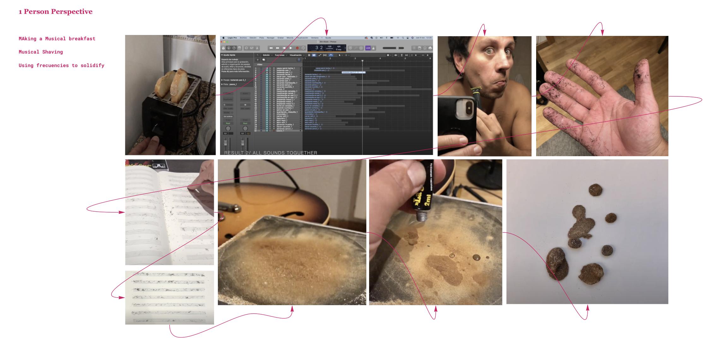

---
hide:
    - toc
---

# Living With your own Ideas

Kristina Anderson
Oscar Tomico

Myself Drawing in a minute:

#### 

I picture myself as a very big guy with a pencil in a hand, and a guitar for making music, also with open arms reminding me that I have to be open to new ideas, also in a forest, because i allways like to be arround nature.

# My Magic machine:

The instrument of random music, is a magic machine that plays with creativity, creating music when the metalic pencil hits the glass bottle in a random way, as talking with people, would be great that there were more pencils to enable the instrument to be colaborative and be used by more peole, instead as only one.

Also the machine is kind of a mask in a way, because it shows the desire of creativity and joy but not in a total transparent way, so also would be great if the machine could be more transparent showing not only what I want to show the world who I am,but the whole spectrum of personality, and that should be great to show in its functionality.

Group Machines:

In the conversation/reflection that we had as a group, one of the main comments were that almost all the machines that we made, were to make an statement, more than reflecting us as individuals, they were for showing something to someone else, not just for us. For example Didacs machine, the one with the brick at the bottom, was to show in a methaphorical way, when justice is reached, it a good chance to new ideas or oportunities, so it will turn on a light, when the balance is reached.

Another observation that we made as a group was that at the same time, we aim to things that are right, or things that make possitive ways to funtion and for others, rather than random ideas.

One thing that i learned is how the materiality of objects, can lead to different interpretations of reality and can make people to connect with very deep and abstract ideas, making this exersice a great vehicle for creativity and connection with our selfs, and our thoughts and emotions in the context that we are or in a context that we want to be.

# THE FIRST DAY OF MY NEW LIFE / 1PP 

## Concepts:

-Auto ethnography
-Radical thinking
-Change yourself
-Extreme situations
-Design Intervention

<a>https://www.youtube.com/watch?v=VDu9yRFaVko</a> 

I started with the Question, Can be the Music a potential "energy" to materialize something?

Recomendation from teachers: 
Keep it close, do a lot of experiments, "see what happens", the restriction: Had to be music made by me, not others.

## A guide to successfull Auto Ethnography 

# Define Study Boundaries:

My limits were determined principaly by the question I made, It was the starting point, but open to changes, The main thing was the direction, that was to materialize something with/by music. Maybe some boundarie was the time (a day) and the place, because I determine that the place should be my work/music room, using thingsthat I allready had in that specific time and place.

# Authenticity:

At first, when I begun the experiment, It felt not that authentic, because I had seen a lot of this before, on social network, or youtube. The next step was way more authentic(musical shaving) because my brain allready was on a mood of doing something different, and different conection with things that normally wouldnt be connected on this subject, for example grabbing my facial hair and pur it on a music pentagram, to make "music notes", and that was very inspiring for grabing an instrument and start creating music.

# Plausibility

It relates with my personal interests ( Music and fabrication) and how I made them to work toghether. Also I think that I can add more value, exploring creativity from these areas and join points that I had never thinked before, like music and fabrication.

# Criticality

This projects gathers very technical and abstract concepts. The 1PP exersice put me on a very different starting point, from beng too methodogical, to start creating from a very fast and plastic state of mind, The mindset from the initial question, kept me motivated to make things different than usual.

# Self reavealing comunication. (honesty)

My project was made under a stream of consciousnes, so I think that was also very honest made. Using no filters to each activity. The thing that I missed, was to show my emotions and thoughts in the video, because in every discovery, I was a very exited, where I knew that the emotions had a lot to give. Maybe the documentation is sometimes an obstacle to work freely.

# Ethnographic material with confesional content.

For this experiment, I made very personal actions, like playing guitar in my house. The video itself was not that confetional, because the actions were guided through a secuencial time. Maybe the most personal thing is that the subjects that I worked, are very related to my passions.

# Generalizability 

The Idea of manufacture with music, can be very interesting for other musicians, designers, scientist, sound engeneers, etc. It is in a very initial stage, but it can be extrapolated into a different area and context, to give and involve more meaning for others.

I totally would use these exersise in the future, for different tasks.

# What happen when I envolved myself / as an instrument?

I enyoed this process in a very insightfull way, it was like entering in a totally diferent state of mind with no stops, also with a lot of emotions happening at the same time. I felt also that this exersise was the push that I needed to start a project from a totally different aproach, from this vulnerable position from myself.

# Did anything change about the way of working?

It was kind of revealing to work in this way, It allowed me to move faster into the challenges  in a much more creative way and with less constrains, Also it makes the process very enjoyable, personal and intense.

# Coments about my colective videos

I feel very inspired by the work of my collective, at first it was difficult to find similarities, but after analizing and speaking with my classmates, we find that the concepts behind each video, had a lot of crossing concepts viewed from different perspcetives, but with the same goal, or the same intention.

