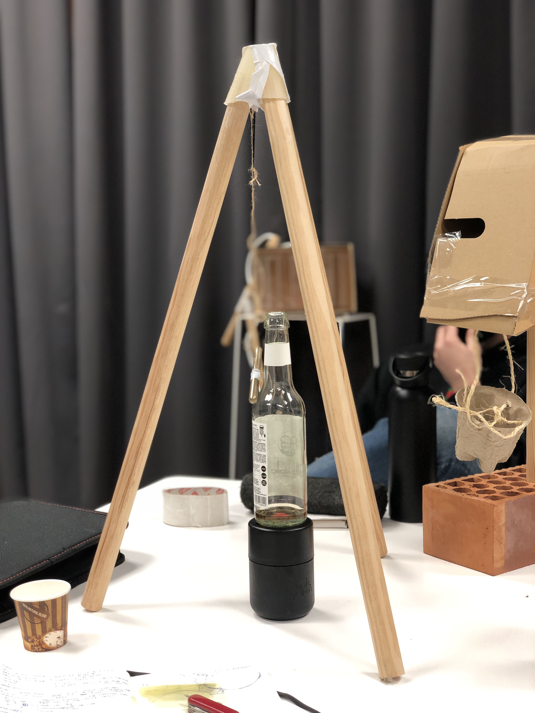

---
hide:
    - toc
---

# Living With your own Ideas

Myself Drawing:

I picture myself as a very big guy with a pencil in a hand, and a guitar for making music, also with open arms reminding me that I have to be open to new ideas, also in a forest, because i allways like to be arround nature.

# My Magic machine:

The instrument of random music, is a magic machine that plays with creativity, creating music when the metalic pencil hits the glass bottle in a random way, as talking with people, would be great that there were more pencils to enable the instrument to be colaborative and be used by more peole, instead as only one.

Also the machine is kind of a mask in a way, because it shows the desire of creativity but not in a total transparent way, so also would be great if the machine could be more transparent in the behaviour of functionality.

Group Machines:

