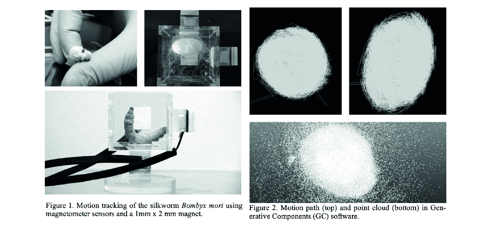

---
hide:
    - toc
---

##### Week 3

# BIOLOGY ZERO

**Teachers:**

Jonathan Minchin

Nuria Conde

Sintetic Biology
Tools
Grow reproduce

"Anything that have a piece of information that can perpetueate its elf is alive"

Quantum mechanics/Chemistry/Bio Chemistry/Molecular Biology/Micro Biology/Celular Biology/Physiology
/Synthetic Biology.

"You can blame yourself if you conntinue doing bad things that you didnt knew that where bad before"

EMPOWER¡¡

PLANETARY WELLBEING

Climate refugees
global/local

Antthropocene
contamination
element extractivism

PARADOX WORLDS

how digital emits C02
Population

Links:

[https://www.census.gov/popclock/]
[https://sci-hub.mksa.top]

Books: 

Critical mass / phillip ball
The sixth extintion

# Biological Optimized Design

 If a different planet were instaled, it would be the same? 

 Evolution machine that has constrains

 Development/Convergent Evolution/ Optimized for creation/The evolution of usefull things/Material cultural evolution/Biommimicry/ Serendipity (Velcro) Mimetize or copy/Genetic algorithms

# Most optimized way (Micelyum example for prototype a city flow)

Complex behaviors/Synthetic Biology/DIY lab Elements

**Experiments**

-Create a generic media for frowing bacterias
-Grow kombucha Scooby
-Grow Spirulina
-Use of microscopes
-How to make a PCR
-Cook Biomaterials

Tasks

Make a "mutant", project, how we can empower with gene modification. using igem.

**Scientific Paper:**

#### Robotically Controlled Fiber-based Manufacturing as Case Study for Biomimetic Digital Fabrication

*N. Oxman, M. Kayser, J. Laucks and M. Firstenberg
Massachusetts Institute of Technology, Cambridge, Massachusetts, USA*

Neri Oxman job has allways impressed me, the first time I saw the silk pavilion, I was amazed about the concept about collaborating with nature instead of make nature work for humans. The sinergy beetween technology, digital fabrication and technological systems is very well designed.

the process of obtainnig the silk, has been for hundreds of years a process againts nature, because normally the cocoons of silk are boiled to separate the silk, killing the worms, growed in farms and in a non organic way. The interesting thing about this new process, Is that they propose a new way to extract sik without killing the worms, by letting them to wove their cocoons, and at the same time, evolve into the next stage of the larva.

I picked this paper to understand in an specific way, how this ingestigation started, how the probes were made, to understand how is possible to work with this organic systems and to create new ways of manufacture.

**Sumary**

3d printing vs natural fabrication

3D printing traditional methods, are very funtional in a way, but it is not as efficient as natural fabrication, like spider webs, birds nests, or worm silk, wich contruction is organic and high efficient, ussing the less resource ass posible, working in an incredible way, so that statement opens a new investigation direction, where the natural procesess inspired humands, to develop new methods of manufacture.

Fiber orientation

"Using additive manu- facturing technologies are much less sustainable: from a material perspective - homogeneous materi- als offer less potential for structural optimization; and from a fabrication perspective - additive manu- factured components are constructed in layers, rely- ing on the deposition of significant amounts of wasted support material"

The fiber construction method is very effective, because it uses a high resistant material, to the purpose of protecting the cocoon, till it reaches its evolving stage, the puppa. One cocoon has more than a kilometer long, and its deposited in the most efficient way.

About silk

Silk is an amazing material, its one of the most high ended, exensive and old materials recolected by humans, its used to make clothes, fibers, and its used in textile industry and medicine. The silk as a material also has a binder, the cericin.
The worm makes the cocoon using its own environment attaching the silk into different points.

Motion tracking

In the reaserch, they installed a worm into a acrilic box, and they used different of cameras to analyse how many points of contact were used by the worm to make the sik structure, concluding that they were more than 1.000.000 points of contact. that motion track, encouraged the team to speculate about a robotic process of fabrication.

Fiber based robot simulating construction

Using a Kuka robot, they manage to install a headset to the robotic arm, that deposit HDPE, a termoplastic that can be used for 3d printing. Also they conclude that changing the extrude power and speed of the headset, would be possible to vary in density, thikness and quality of the material. Also they simulated the contact points with hook on the wall, enabling the robotig arm to create HDPE structures based on the silk worm funtion.

**Images:**

