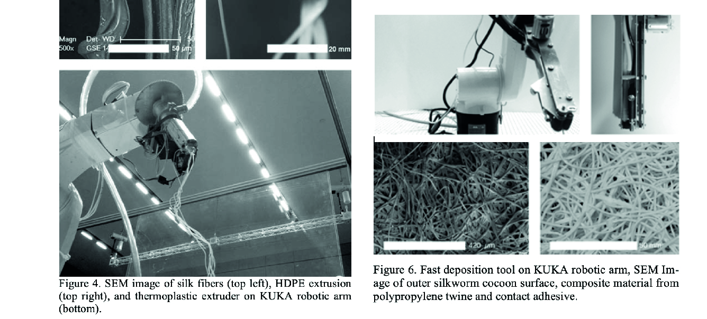

---
hide:
    - toc
---

##### Week 3

# BIOLOGY ZERO

**Teachers:**

Jonathan Minchin

Nuria Conde

**Grow your own Bacteria**

**Spirulina**

**Microscopes**

**Grow scooby**

**PCR**

**Scientific method and tools**

##### Week 4

**Analisis and comparison of Soils**

**Analise ph levels**

**Cook biomaterials**

**Get escential Oils from laurel**

**Scientific Paper:**

#### Robotically Controlled Fiber-based Manufacturing as Case Study for Biomimetic Digital Fabrication

*N. Oxman, M. Kayser, J. Laucks and M. Firstenberg
Massachusetts Institute of Technology, Cambridge, Massachusetts, USA*

Neri Oxman job has allways impressed me, the first time I saw the silk pavilion, I was amazed about the concept about collaborating with nature instead of make nature work for humans. The sinergy beetween technology, digital fabrication and technological systems is very well designed.

the process of obtainnig the silk, has been for hundreds of years a process againts nature, because normally the cocoons of silk are boiled to separate the silk, killing the worms, growed in farms and in a non organic way. The interesting thing about this new process, Is that they propose a new way to extract sik without killing the worms, by letting them to wove their cocoons, and at the same time, evolve into the next stage of the larva.

I picked this paper to understand in an specific way, how this ingestigation started, how the probes were made, to understand how is possible to work with this organic systems and to create new ways of manufacture.

**Sumary**

3d printing vs natural fabrication

3D printing traditional methods, are very funtional in a way, but it is not as efficient as natural fabrication, like spider webs, birds nests, or worm silk, wich contruction is organic and high efficient, ussing the less resource ass posible, working in an incredible way, so that statement opens a new investigation direction, where the natural procesess inspired humands, to develop new methods of manufacture.

Fiber orientation

"Using additive manu- facturing technologies are much less sustainable: from a material perspective - homogeneous materi- als offer less potential for structural optimization; and from a fabrication perspective - additive manu- factured components are constructed in layers, rely- ing on the deposition of significant amounts of wasted support material"

The fiber construction method is very effective, because it uses a high resistant material, to the purpose of protecting the cocoon, till it reaches its evolving stage, the puppa. One cocoon has more than a kilometer long, and its deposited in the most efficient way.

About silk

Silk is an amazing material, its one of the most high ended, exensive and old materials recolected by humans, its used to make clothes, fibers, and its used in textile industry and medicine. The silk as a material also has a binder, the cericin.
The worm makes the cocoon using its own environment attaching the silk into different points.

Motion tracking

In the reaserch, they installed a worm into a acrilic box, and they used different of cameras to analyse how many points of contact were used by the worm to make the sik structure, concluding that they were more than 1.000.000 points of contact. that motion track, encouraged the team to speculate about a robotic process of fabrication.

Fiber based robot simulating construction

Using a Kuka robot, they manage to install a headset to the robotic arm, that deposit HDPE, a termoplastic that can be used for 3d printing. Also they conclude that changing the extrude power and speed of the headset, would be possible to vary in density, thikness and quality of the material. Also they simulated the contact points with hook on the wall, enabling the robotig arm to create HDPE structures based on the silk worm funtion.

**Images:**

**Making a mutant**

**Reflection**

This set of lectures, were very interesting and inspiring because from the biology point of view, my interest in grow almost anything, has to do a lot. Also for me, is necesarry to know the basics of biology, if im going to work with biofabrication, biomaterials and living organisms. I also would be using a lot my toolbox network, to contact profesionals if I have more doubts about biology.

The only comment that I would do to Nuria is that in some parts, the concepts were too "scientific", so I get lost sometimes in the terminology, but with a bit of asking and time, I was able to understand the main concepts.

Also all the practical area in both Bio / Agri, were very insightfull, because we were able to see how a lot of things work, like how to grow bacterias, or how to work in a sterile environment. That are totally usefull things that I will be useing for shure along the master.

For de Agri Zero week, I found that im much more interested and related to the conuntryside that I was aware. All my youth I used to lived in  the countryside of Curicó, a city in the middle south of Chile, famous for its Vineyards and fields for agriculture. Also my both parents are agronomists, so I had been related to the field mostly all my life. I find very interesting to use Barcelona as a natural laboratory. we have a big opportunity to work with nature here, and take advantage of Valldaura labs as well, if we need some countryside help or inspiration

