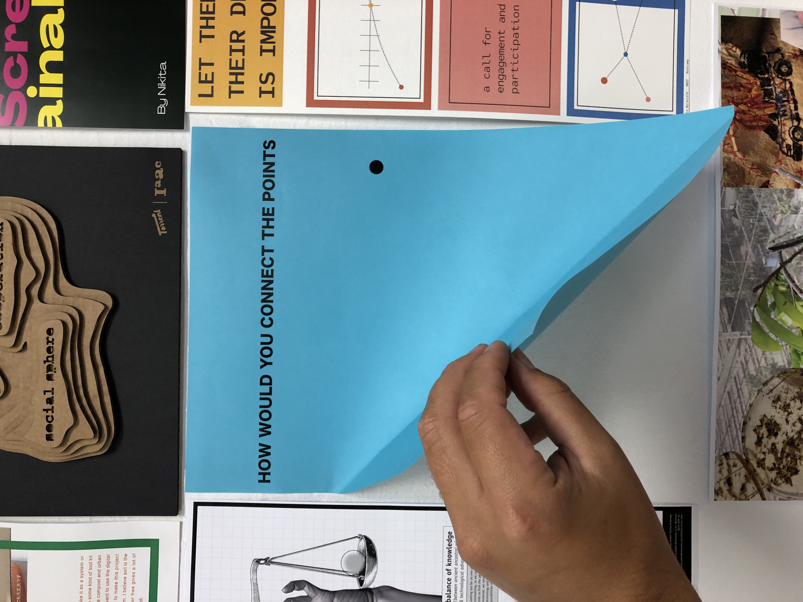
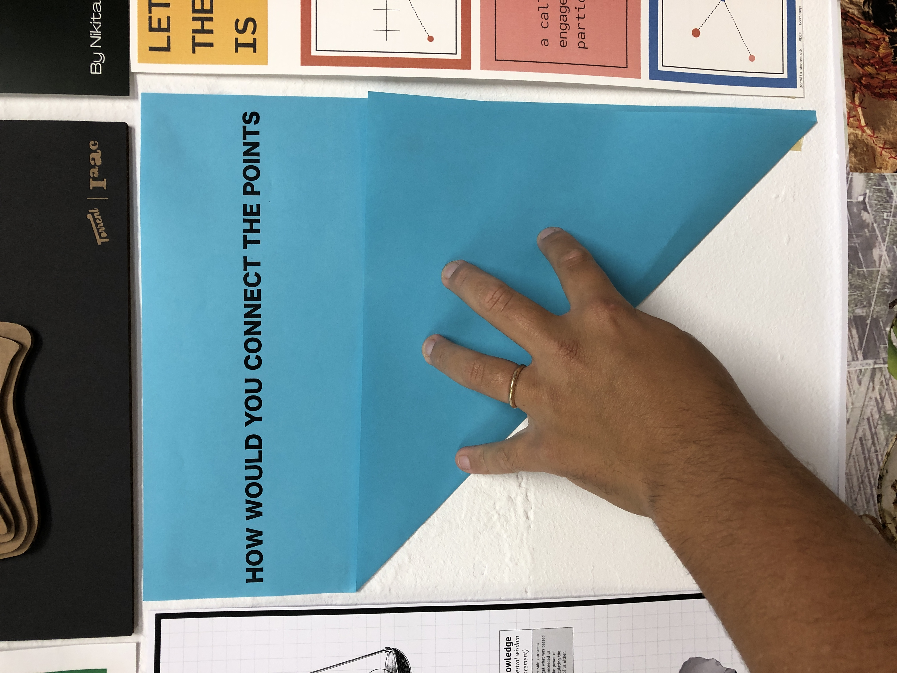
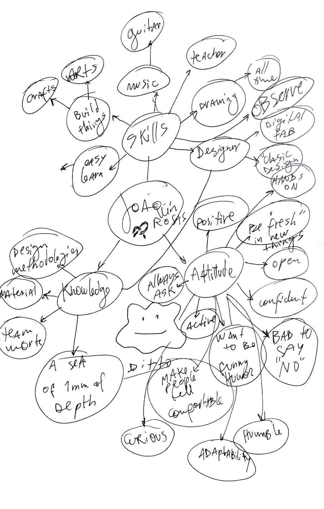
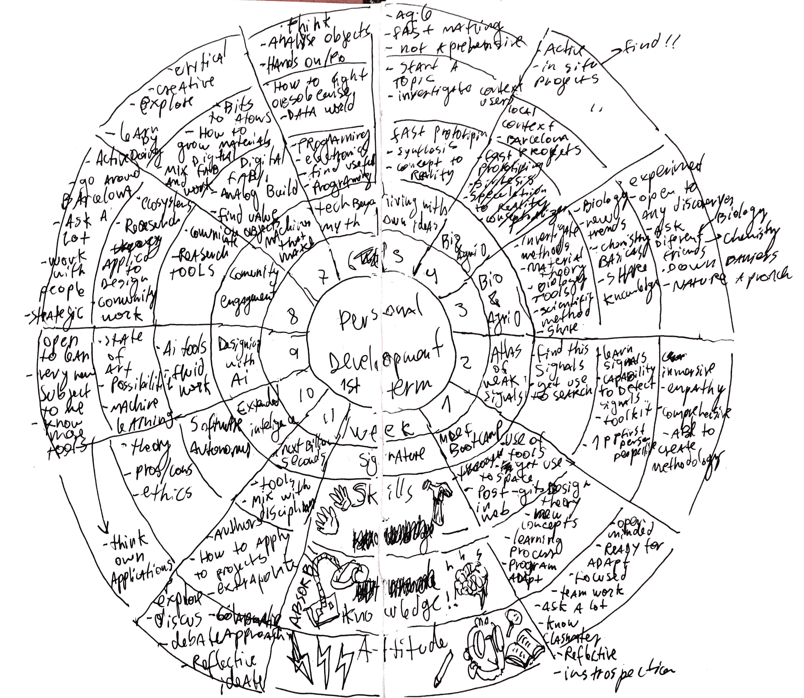

---
hide:
    - toc
---

##### Week 1

### Design Bootcamp

Activities:

**1) Whats your fight?**

I realised my "personal" fight when I was doing my degree project, it s called Make Care. Its about taking care of the necesities of young people with Epidermolisis Bullosa(Cristal Skin) and a development of a set of products that tackles Daily life issues, that allows tho the young self dependancy of their caretakers, ussually fathers or family members that protect this kids in an overprotective way.

The project is open source, and all objects are 3d printed, and assembled with commercial pieces, because there are 200 people with this desease in Chile, But a lot in the world, so the idea is to enable people, foundations, and hospitals, to download and link with digital fabricators, such as fablabs, maker spaces, to Connect the products with young People with EB.

In this process I had discovered that my fight will be the “bridge” or connection beetween comunities, people, minorities, and joinig them with multidisciplinary teams, professionals, and creative people that are more used to develop and create new things. Connecting the unconnected points in the most creative, locally, efficient and resourcefull way.

Poster:

 

**Some of my actual questions are:**

Research:

-minorities

-Peripherical communities

-Music and social impact

Design methods:

How digital biofabrication can be usefull

-Digital Bio-fabrication, grow it yourself materials.
-Metamaterials

-Music

-Biomimmicry applied to design projects.

https://joaquinrosas.com/MAKE-CARE

2)Your profesional Identity, Skills, Knowledge. and acttitude.

**"Personal development Plan"**

Know, want I want to learn. make the switch, form passive learning to take control where i want to go, and where I want to learn.

### 1) Look at your poster as your design vision of how our (social) world could be in the (near) future

My poster reflects how the future should be, in my perspective, there has to be people "joining the dots", unifying the creative aspects and profesions, with citizens and people, as Victor Papanek said, Design can be a very well use tool, or the most dangerous carreer of all. The main thing is that design can change realities, points of view, and the most important, can improve peoples lifes.

### 2) Describe your professional identity in terms of skills, knowledge and attitude.

****

My Identity is very powerfull as a designer itself, from a long time ago, I started designing even before start going to Design school, Almost every Sunday, I tried to create something interesting and usefull. My skills are maily from building things, related to design, crafts and arts, to beaing an easy learner in some aspects, I have to recognize that electronics and programming are a bit difficult for me to learn.

Related to my attitude, I feel like a very positive person, allways trying to go for the bright side, aalso trying to be a fresh person, related to people, and new knowledge that is arround. Also Im very Open and confident about the things that I do, and im very bad to say No to challenges. 

My knowledge goes mainly in creative ways, like design, arts, materials, methodologies, etc. I find myself like a " sea of 1mm of depth" because I love to learn  and do a lot but mainly with no depth in everything

### 3) Reflect on the “meetings” by analyzing what attracts you from their skills, knowledge and attitude

With the meetings I had found that I had been atracted to lear programming and coding as some classmates, but it allways goes to nothing, because I don´t keep practising it, and when I had the chance, in FabLab U. de Chile, I had been "safe" in my own knowledge and tasks. So thats a very interesting challenge for me.

Also im beginning to interest in new subjects, as AI, VR, and Biology.

### 4) Based on your vision and what attracts you from the “meetings” create your desired professional identity

My new professional Identity, would be like an digital fabrication designer + Technological tools, like programming and the use of electronics in projects. I would love to learn more about it in "Tech beyond myth"

### 5) Map the courses we are having this trimester in terms of what you have learned (for the past ones), and what you would like to learn (ones to come).

### 6) Justify and describe your "draft" personal development plan for the master program.

I had made a circular draft for the first term, because I think that the 1st term process is circular, not returning to zero, but to gain the experience of the courses and become a "new me" with all the new knowledge and experiences.

**Week 1**

**Asignature**:MDEF Bootcamp

**Skills**:Use of workshop tools, get use to iaac space, Learn git, and web programming

**Knowledge**: design theory, new concepts of design, new learning process, working adaptation.

**Attitude:**Open minded, ready for adapt/change, effort on focus, team work, ask a lot, open with classmates, effective in time.

**Week  2**

**Asignature**:Atlas of weak signals

**Skills**:Learn tools and methods to find this signals, get use to search tools, create vocabulary.

**Knowledge**: Learn this signals, maybe create a toolkit?, 1 person perspective

**Attitude:**Inmersive, Develop empathy, comprehensive, able to develop some methods.

**Week 3**

**Asignature**:Bio 0

**Skills**:Investigate methods, material theory, Biology tools, put in practice scientific method, learn to share.

**Knowledge**: Biology, New trends, biology and chemistry basics, share knowledge.

**Attitude:**Experimental, Open to any disovery, ask Biologist and Chemistry friends in Chile,Break the barriers and stereotypes of "professionals" or "traditional careers", Nature aproach to develop projects.

**Week 4**

**Asignature**:Agri 0

**Skills**:Investigate methods, material theory, Biology tools, put in practice scientific method, learn to share.

**Knowledge**: learn about local waste, and local industry.

**Attitude:**Active, talk to local people, in neighborhoods, find in situ projects.

**Week 5**

**Asignature**:Living with own Ideas

**Skills**:Fast prototiping, synthesis hability, from concept to reallity.

**Knowledge**: Start a topic, investigate, know more about user and context investigation.

**Attitude:**Agile, fast learning, open and flexible, not aprehensive.

**Week 6**

**Asignature**: Tech beyond myth

**Skills**:Programing, electronics, get used to work with tech, look for usefull projects.

**Knowledge**: data world, how to fight obsolescence. how to use/understand tech as a tool.

**Attitude:**Open minded, ready for adapt/change, effort on focus, team work, ask a lot, open with classmates, effective in time.

**Week 7**

**Asignature**: Machines that make

**Skills**:Use of digital fabrication machines, analog building, find value on electronic waste.

**Knowledge**: Bits to atoms theory, how to grow materials, how to mix digital fab and work.

**Attitude:**Critical, creative, explore a lot, trial and error, learn by doing.

**Week 8**

**Asignature**: Comunity Engagement

**Skills**:Comunicate in an efficient way, research tools, etnography.
**Knowledge**: Understand Ecosystems, learn new research methods, how to design and work with communities.

**Attitude:**Active, alert for local context, talk and work with people a lot, register, strategic.

**Week 9**

**Asignature**: Designing with AI

**Skills**:Learn about AI tools, projects, get used to work with.
**Knowledge**: state of the art, find possibilities, mix it with machine learnig.

**Attitude:**Open to learn, is a very new subject to me, be agile to "join the dots".

**Week10**

**Asignature**: Expanded Inteligence

**Skills**:Software tools, autonomy tools.

**Knowledge**: Theory, ethics involved, be concient of pros and cons.

**Attitude:**Open, think of applications to the real world.

**Week 11**

**Asignature:**Next Billion Seconds

**Skills:**Mix with different disciplines, learn tools

**Knowledge:** how to apply this info to projects, authors, extrapolate info.

**Attitude:**Explore, discus, colaborative, debate approach, reflective, ideate.

To continue exploring, is necessary to make things!!
The task is to just make an experiment, as simple as posible, related to the subject.
