---
hide:
    - toc
---

##### Week 6

## Tech Beyond Myth

**Teachers:**

Guillem Camprodon

Victor Barberan

Oscar Gonzalez

Santiago Fuentemilla

#### Forensics of the obsolescence

We manage to disasemble diferent thigs, like a Irobot Roomba, A tv, a Macbook. and then we had to analize them in very different ways, and documented here.

https://hackmd.io/INk2gThpSkObQQ_E62gxow?both

###### We manage to disasemble a Roomba Robot by team, It was a very interesting choice, because is a very multifuntional robot, that have motors, wheels and sensors. We find out that the Robot was much more simple that we imagine, when we resume the functions, in navigation, sensors, hardware, we manage to undertand the main function of it. Then We search for different parts online, to find out what they were, and look for info.

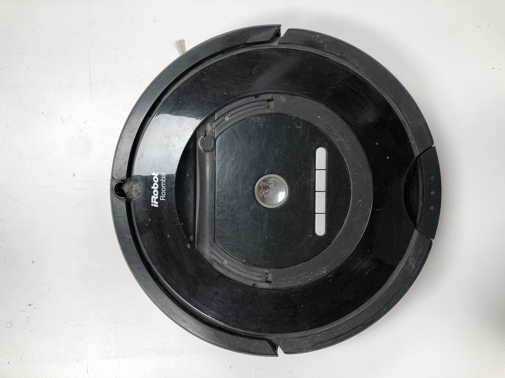

######  Roomba cleaner before dissasebmbly

###### DC motor R500, we look for it in google to see how much the voltage was.then we turned it on with a power source.

###### Some pieces of the roomba, wheels, DC motors, a LOT of plastics parts from the filter.

###### All pieces of the dissasembled roomba.

###### 2021 Roomba

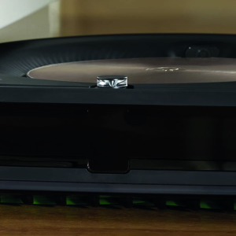

#### A world in Data

## Actity: Find an objective, that can be very local, and can be extrapolated to new opportunities.

https://hackmd.io/DoyUHU3PRxqc3-BeWHck3w?view

###### Sense-Making Journal: Loneliness Among Young Adults in Barcelona

### Project Goals

**Objective** 

###### Make young people feel less lonely in Barcelona

**Question** 

###### Is instant messaging making young people more lonely than other generations in Barcelona?

**Hypothesis** 
 
###### Instant messaging is making people feel lonely in Barcelona

**Tips**

###### -We think we could have been more definitive while setting the age group.

###### -Linking social media usage and loneliness as an assumption and the only factor.

###### -Generating our own data instead of an external source.

###### The tool we used was Ardurino with LSR sensor  to measure light.

(###### foto arduino, foto sensor)

###### We had two other options, the web scraper for collecting data about online behaviours or the physical intervention to interact with people for understanding loneliness from different perspectives. 
 
###### Now we are satisfied with the tool we used, but in the future we would add more interactions to it by using audio visual ways of collecting data.

### Tool usage documentation

**Data capturing tool set:**
###### - Ardurinio board with LDR sensors.
- Data capturing device, either  laptop or a small computer device attached to the Ardurino.

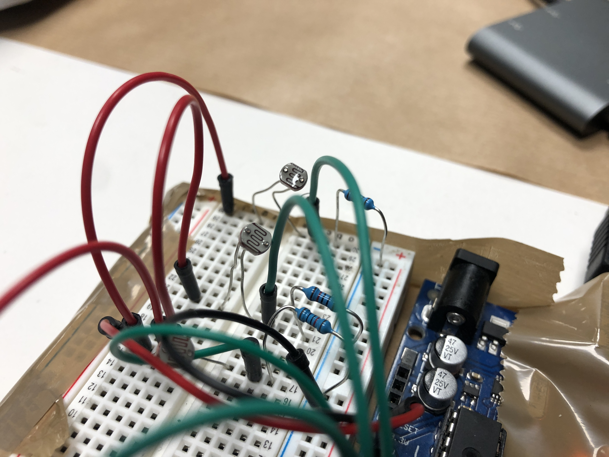

**Installation:**
- Face the LDR sensors by bending to directions based on the locations of the people around the table.
- Attach the machine to a piece of cardboard and attached to the bottom of the table with tape.
- If the LDR sensor does not capture enough light, when the device is too far, cover the device with a diffuser paper for capturing distant light.

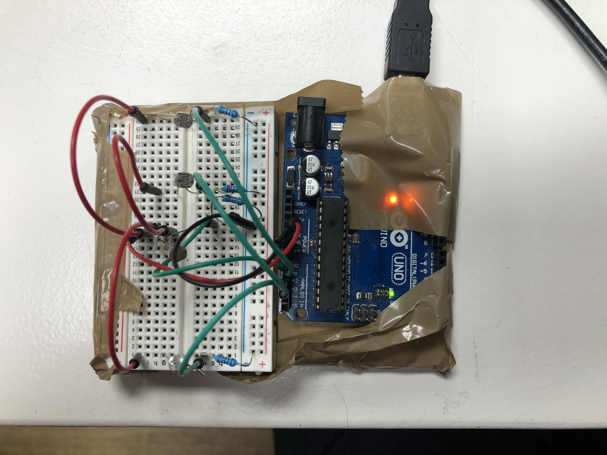

**Capturing data:**

#### Data capturing strategy

###### We wanted to see with our data collection, if people use their phones for instant social interactions and messaging even when they have a company around them. 
 
###### Restaurants could be a good place for capturing this, by seeing people being together, but some of them use their phones secretly under the table, disconnecting themselves from others. We couldn’t measure it in real life, because we couldn’t install the device without the laptop under the table, so we observed if this is a valid case by visiting restaurants during lunch time around Poblenou. 
 
The findings:
###### - When people are alone, they don’t just focus on their lunch, but they interact with their phones
- When people want to use their phones in company, they do this under the table, to not show 

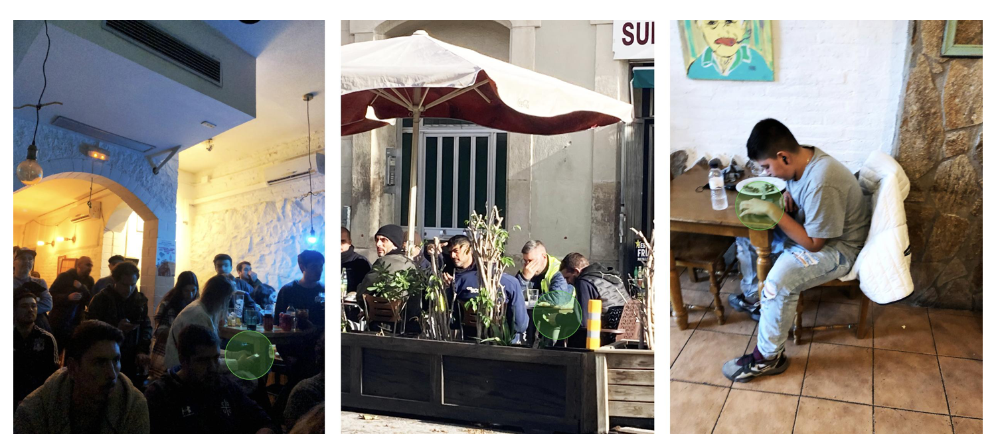

#### Materials needed

- arduino board
- jumper wires
- LDR light sensors (4)
- breadboard
- 10k transistors (4)
- usb cable to power
- cardboard
- masking tape
- phone

#### Data collected

###### We used a serial monitor at first to give us a visual representation of the light changes then used CSV to give us a numerical output which represents the same information in another fashion. The CSV is able to give us the tabular data to evaluate in further steps. 

###### We gave each sensor its own line so that theoretically, if there were multiple phones, we could see which direction the light was coming from. We could identify micro changes based on the different curve points the light intensity from differing media apps which are based on how users usually interact with and navigate them.

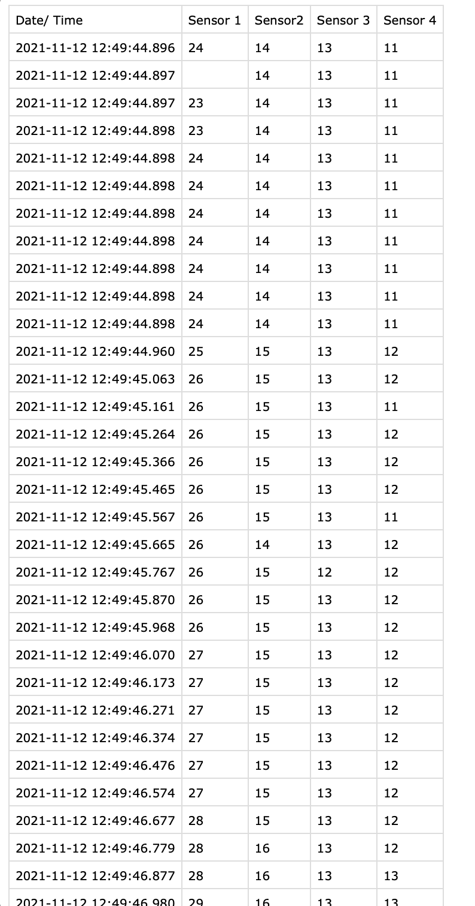

#### Tips
- The data that was collected was only when the device was used under the table. No data was gathered when it is used above the table.
- The usage was calculated precisely only when the device was on full brightness mode. Dark mode might mess with the data and might miss the usage.
- The sensor works to its full potential only in dark environments.
- To connect it through internet so that we didn't have to use the wires and be restricted.

### Data insights
- The amount of time spent on an app can be a window into what kind of connection the user needs or desires. 
- The sudden spike and fall of data graph represents the speed of the scrolling activity. This maybe can be an indication of the mood of the person- maybe how anxious the person is. 
- Frequency of use- how often is the urge to use phone when already in a social situation?
- How often the spikes change between apps could indicate the attention span or focus of a person

#### No phone

Four sensors are turned on, but detecting almost no light.

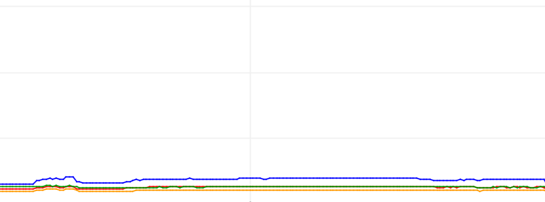

#### Instagram

Every peak is a scroll down, at the left is a slow scrolling, in the right its a fast scrolling (Anxious people?)

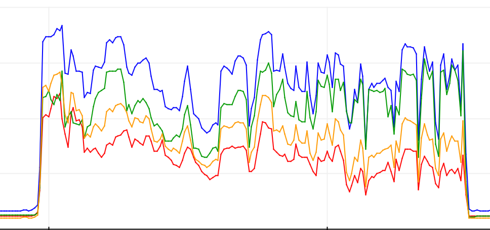

#### Whatsapp

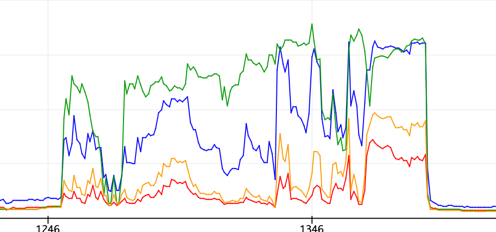

#### Photo browsing

The flat areas show less movement in the screen. 

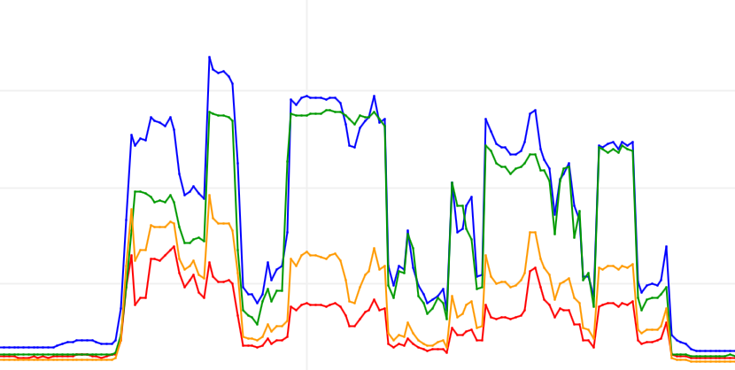

#### Gmail

the interface of gmail is practically white, so there are no radical changes in the brightness.

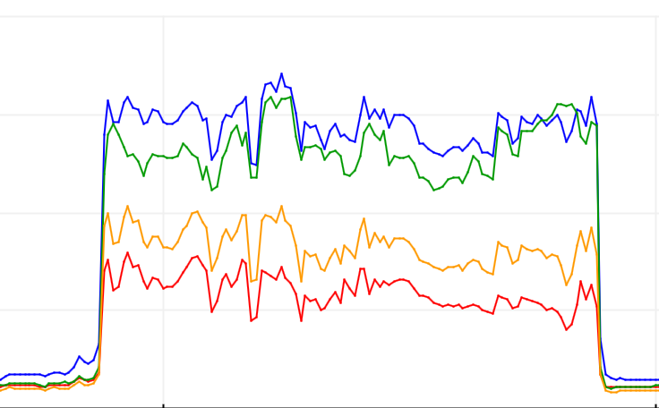

### Tips
Future steps for the experiment:

- Increase number of sensors across different tables
- Make them unattached from the computer to be more discreet(using arduino feather with wifi data transfer)
- Identify further connections between media app usage and loneliness
- Use unbiased test subjects
- Test in crowded, social environments

**Reflection**

######  I had found profoundly interesting this course, from forensics of the obsolescence to world of Data, there has been so many insights, concepts, discoveries from the teachers and us, that is necessary to order it by different areas and acttivities.

1.Dissasembling roomba/Forensics

###### I liked very much this activitie, because i have been disasembling things since I was a kid, so it have an emotional factor as well. We manage to disasemble by team, a roomba. Analising its parts, components, electronic hardware, etc. Also we managed to turn on a motor using a power source, understanding some concepts of electronics, and understanding the value of spare pieces in technological trash. Also was super interesting that we can see at the same time, the class doing the same exersice with different things, so even we dissasemble one thing, we managed to understand a lot about evreryone.

2.Tools reverse auction

###### An interesting activity that we did, was the reverse auction of tools, where each group had to think of wich tool is better to each project, and then debate about wich tool is better or worst to the activitty. That is a very desafing process because we nad to resolve how to recollect data with that specific tool.

3.Data analysing

###### For me, this is the most interesting topic, because I realized that is possible to make all new ways of data recolecting beyond cualitative or quantitative information. Imagine new ways of data recolection and analisis has been the most learning from this course.

