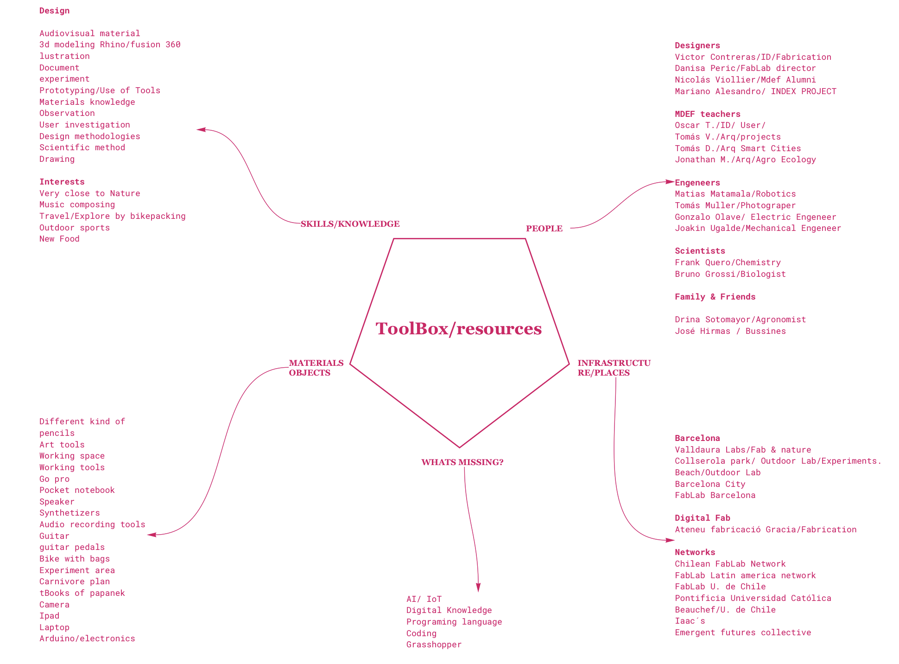
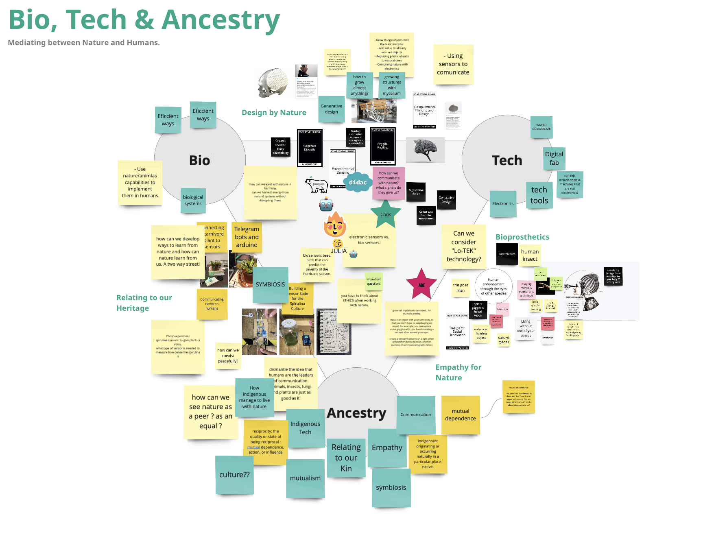
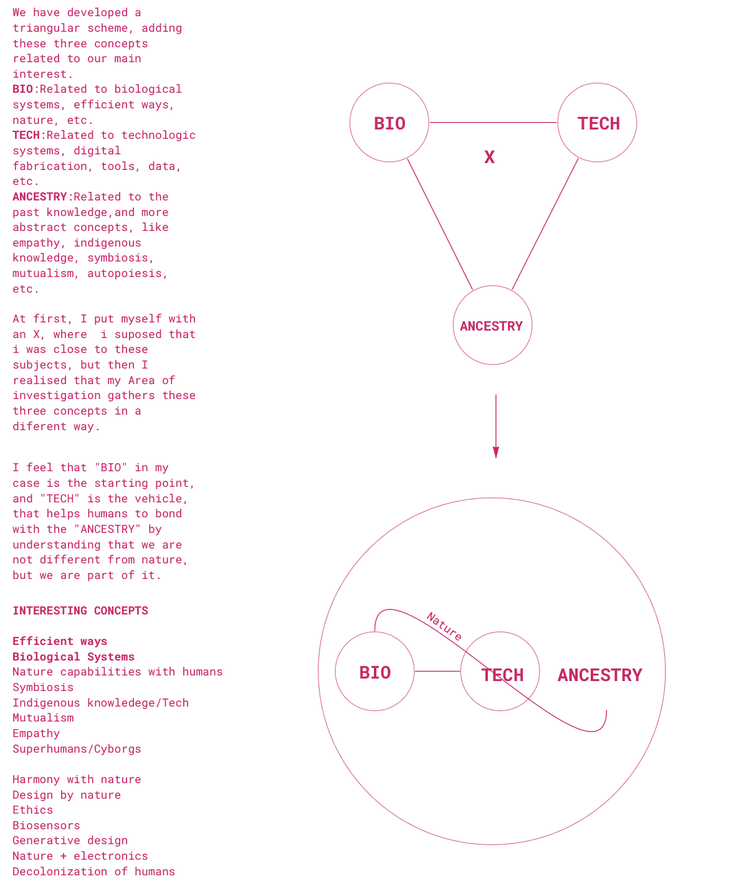

---
hide:
    - toc
---

##### Week 4

**Teachers:**

Oscar Tomico

Tomás Vivanco

# Design Studio

### 1. Reflect on your own RtD toolbox based on “your new me” and create a “new workspace”. 

I had created a new workspace based on my new investigation subject, I started with the subject " How to grow almost anything", but its interesting how the subject starts to grow itself.

My new workspace have new areas, like an instagram page, where im collecting all of the "growed" things that I find dalyly, like parrots nest on a light tower, or furballs made by peoples hair in transtation, thats a very nice activity to do because it feeds the workspace almost everyday with things that I see everyday.

Also I had added a "field notes" part, because I like to write notes of everything that I see, classes, talks, conversations, Ideas. Its comfortable to have that Pages visually in the design space, also is material to share with my classmates.

Im adding as well state of the art projects, to see what can I learn from them, and what its missing in that state, Would be great to found some new ways in the field.

I had notice that my studio relates to two main fields, materials and energy, so I will focus my project In that direction. I will make profund observation of this subjects in the process of the master.

### 2. Select the main roles of prototyping and other design activities that you want to use based on the context you are in (onion mapping from the Atlas) and add them to your design space.

My way of prototiping, at the moment has been near to different Roles, at first I thought that my process was accumulative, going deeper into the "grow" subject, but I have realised that the concept is more abstract, that only grow biological things, so It has been a mix of comparative, and probing as well.

3. Do your first design experiment applying one or different roles of prototyping.

### Experiments:

***Details of the experiments are in the "Project" tab.***

##### 1)Grow Materials to generate something Usefull.

The first experiment starts from the question of "Can I add value to some existing object, growing something into it?

The first experiment was to grow salt cristals in an earing, showing in a simple way, that a growed system can add value to a simple object as an earing. Also in terms of time, jewellery is very acord because  the salt don´t need that much time to grow in it.

##### 2)Make an action that normally you will use an object to acomplish, with the minimum resources.

I had saw that technique in youtube, to see underwater only with my hands, I do it all the time when I dont have my snorkelling googles. This experiment has amazed me because the concept of useing nothing but your body to make a task, is something that we don´t question  that much in our normal lifes, we allways think that we need "something" to archieve our goals, for example if we teach our children to do this technique, we are avoiding buying that cheap snorkeling googles that are selled on the beach, used once and thtown away, because they were broken, bad quality, or the kid wasnt interested anymore.

##### 3)Using natures energy to create something

The third one aims to use the mechanical energy of living organisms to enable them to comunicate with humans when they move.(output)

For this project I had used the energy of the Carnivore plant, so when it picked a bug or a fly, it will move and let me know when it catches something. For the experiment I had attached to aluminum foil, because of the weight, to each leaf of the plant, and the foil were connected to an arduino with the Led program, so the foils were the "circuit cut", and when they get togheter, they turn the Led On. This project made me wonder a lot of questions, for example how would be to work with nature, and not nature work for you, also the moving "energy" of the plant is a very interesting way to keep investigating natural and not conventional uses of energy..

## New Toolbox

### Position ourselves in the Design space and make a reflection.

##### Week 5

### A reflection on how you are documenting and communicating your work

### 3 min Video aprox wich can include multiple ways of video journaling documenting the course tech beyond myth. (EXPERIENT!!)

