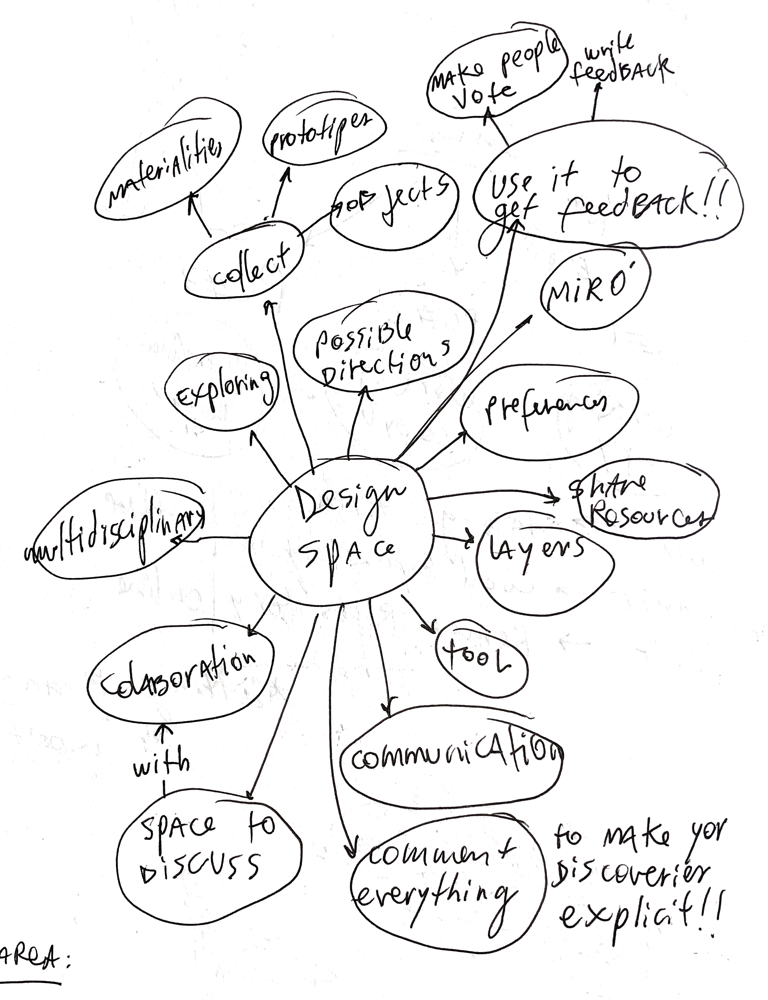
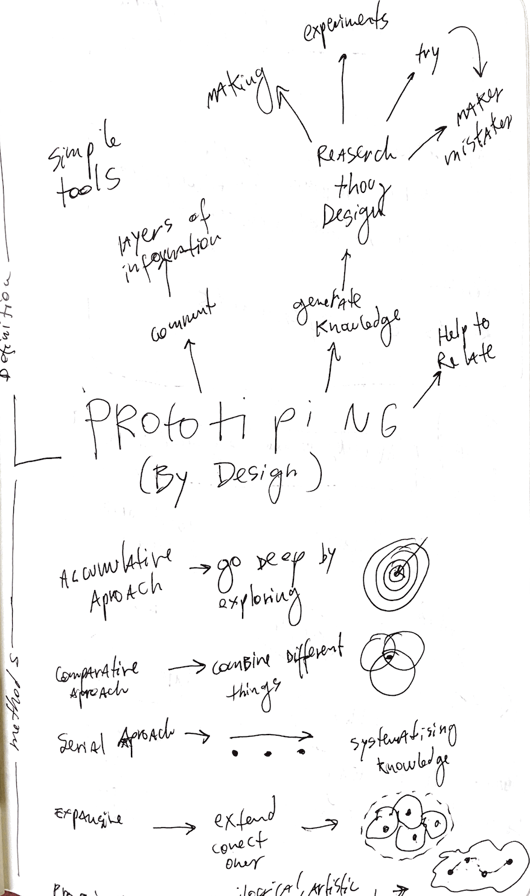
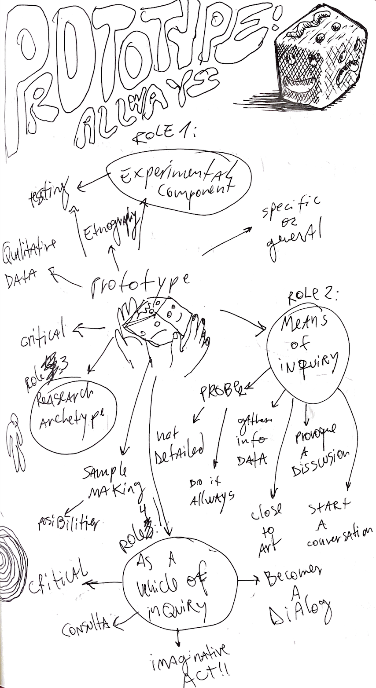
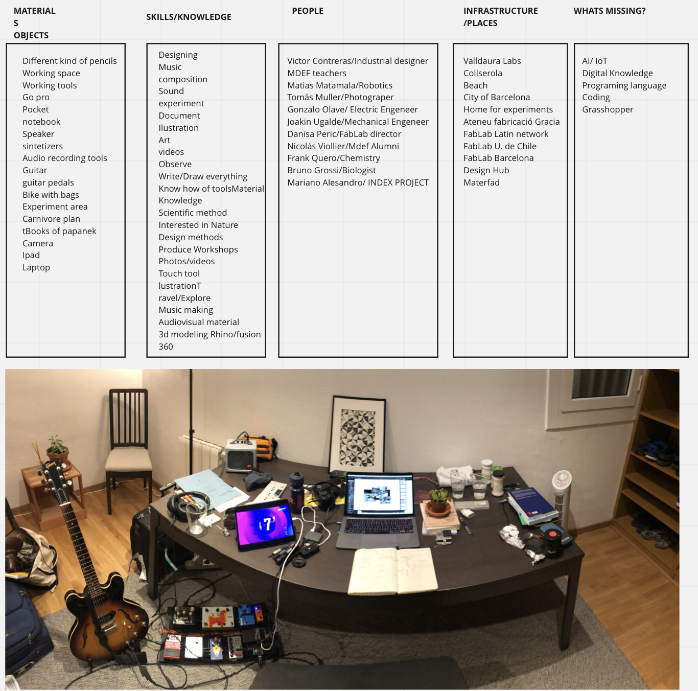

---
hide:
    - toc
---

# DESIGN STUDIO

1. Reflect on your own RtD toolbox based on “your new me” and create a “new workspace”. 

2. Select the main roles of prototyping and other design activities that you want to use based on the context you are in (onion mapping from the Atlas) and add them to your design space.

3. Do your first design experiment applying one or different roles of prototyping.

Experiments:

# 1)Grow Materials to generate something Usefull.

# Materials:

-Salt

-Water

-Recipients

-String

-Earing

# Steps:

1)Disolve salt in warm water(80 °C aprox).

2)Revolve till the salt doesnt disolve any more.

3)Pour the mix in a transparent bowl

4) Hang the earing in water

5) Wait few days

# Process:

# 2)Make an action that normally you will use an object to acomplish, with the minimum resources.

Materials:

-Water

Tools:

-Hands

# Steps:

1) Open your hands with your fingers togheter.

2) Put both curved hands in your fronthead and hold both hands very tight.

3) Slowly dive into the water

4) Observe below the water.

# 3)Using natures energy to create something

Materials:

1-Carnivore Plant.

2-Arduino with led program.

3-Aluminum foil.

# Steps:

1) Program arduino to blink a led.

2) Make connections and open the circuit.

3) cut two strips of alufoil, and connect to the open circuit in one side, and the other side to the plant, make sure that the strips will connect when the leaves close.

4) wait till the leaf is close, the aluminum will touch and will turn on the led.

# INITIAL WORSPACE

