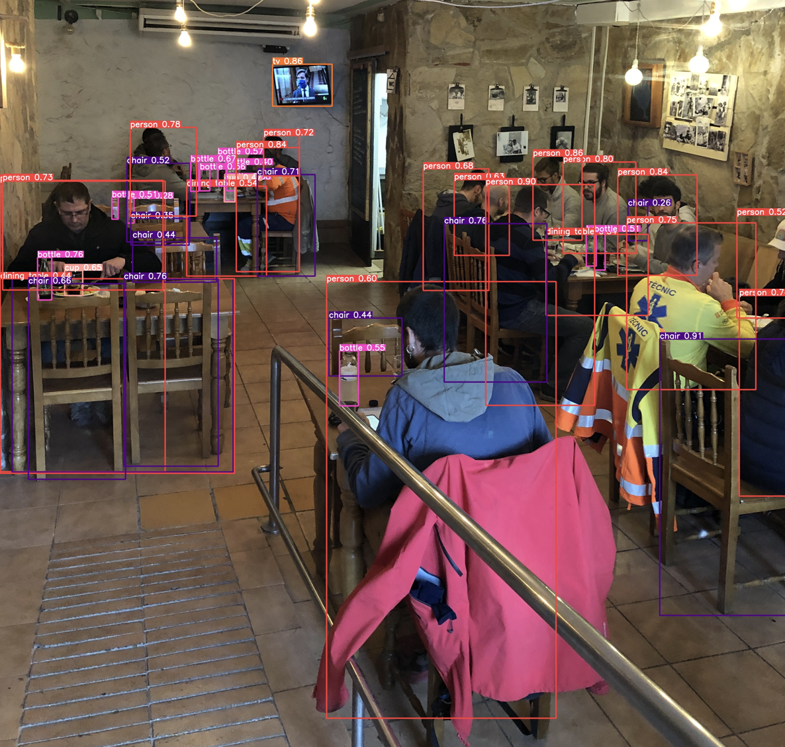
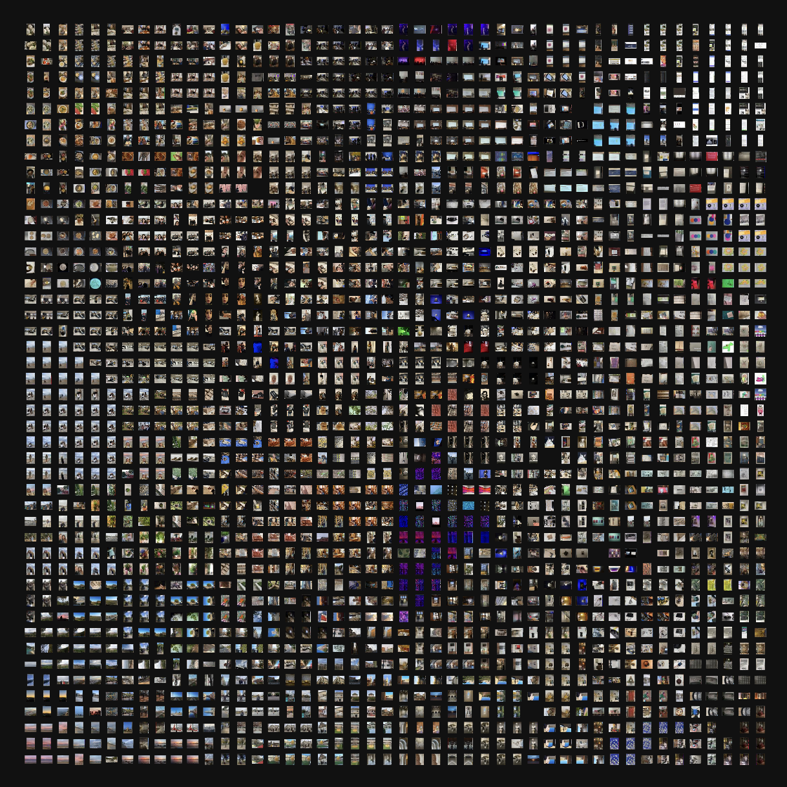
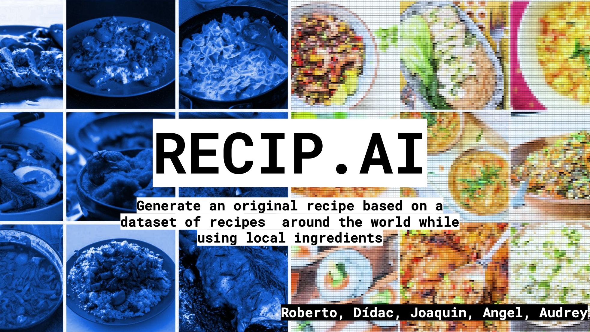
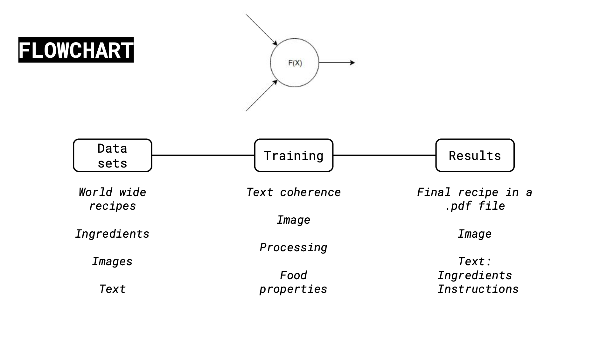
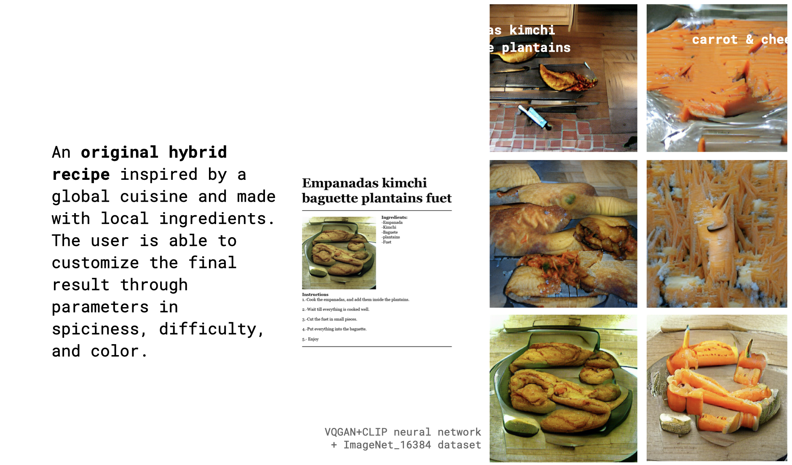
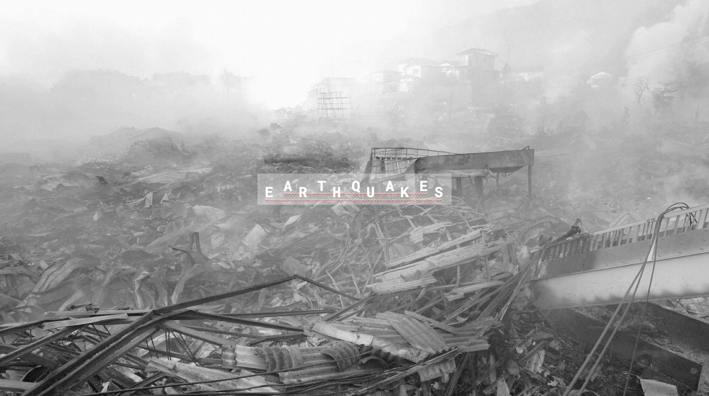
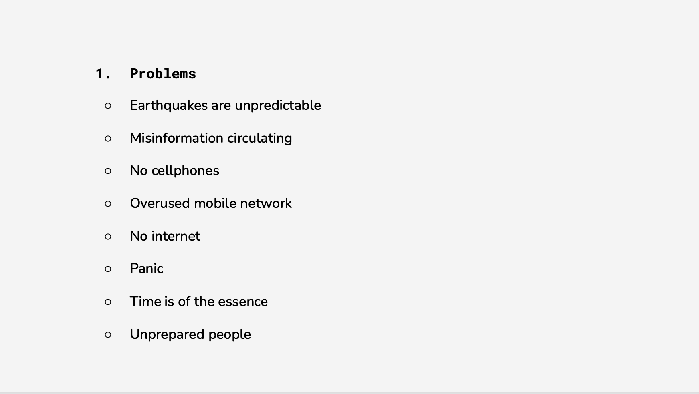
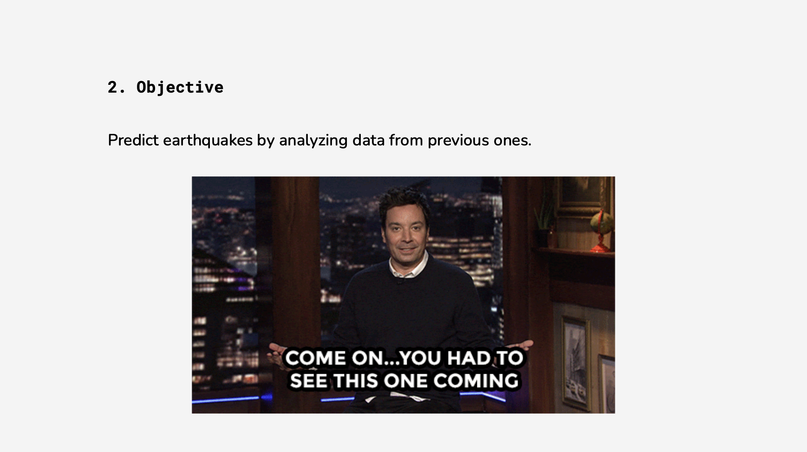
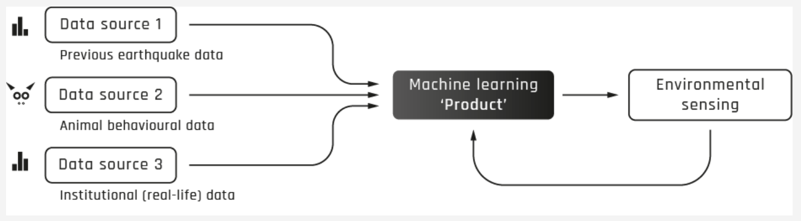

---
hide:
    - toc
---

##### Week 10

## Extended intelligences

**Teachers:**

Taller Estampa

Pau Artigas
Daniel
Ramón Sanhueza
Lucas Peña

Concepts:

-Artificial Intelligence as a tool.
##### Machine Learning: 

Automating tasks by providing examples, instead of writting instructions.

##### Neural networks: 

global architecture that can "self configurate" itself from examples provided. cna be images, text, audio, etc.)
works as inputs of information, creating outputs.
we have to define a task to automate, from different datasets.

##### Datasets: 

Sample data to provide the network, it can be quantitative or cualitative information.

##### Training the neural network.

##### Bias

##### Ethics in AI

##### What is intelligence

##### Anatomy of an AI system

##### Animistic design

Example of an automated program to recognise diferent objects, faces, etc.

Exercises:
Create a dataset from Poblenou Images, showing the "old and new"

Deliberables:

Recip.AI
New way to create food recipies using datasets from all over the world.

Deliberable 2: Speculate for a AI object.

Its possible to anticipate earthquakes?

