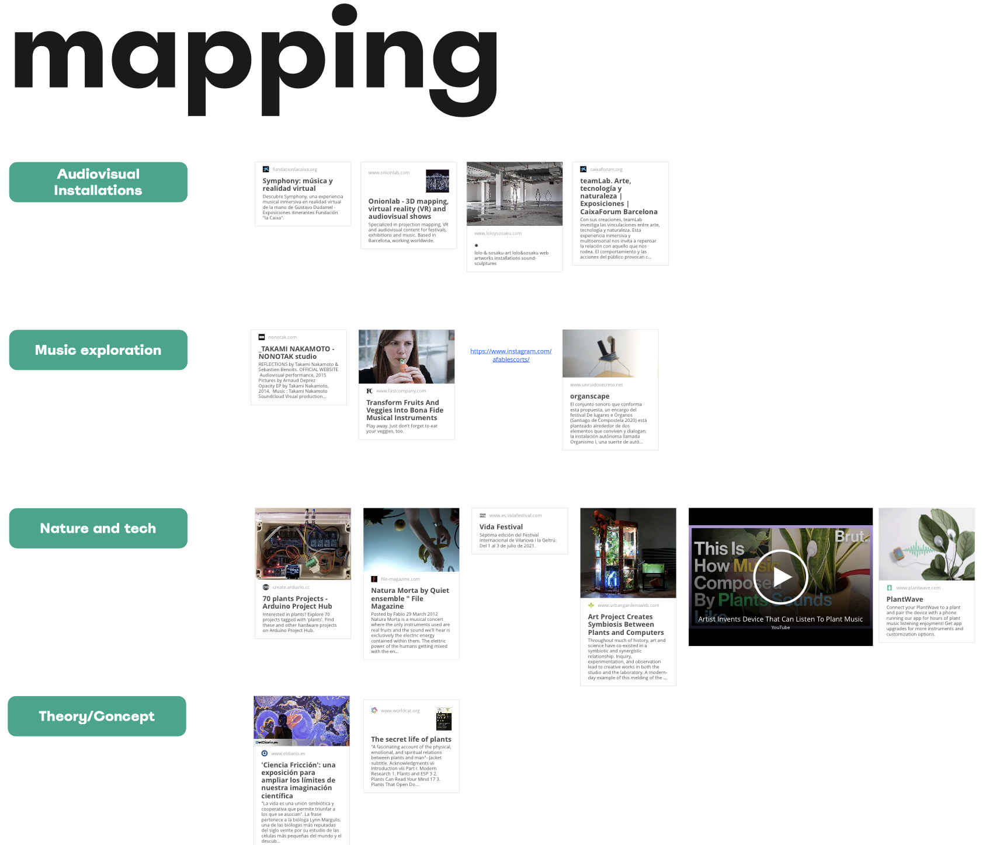
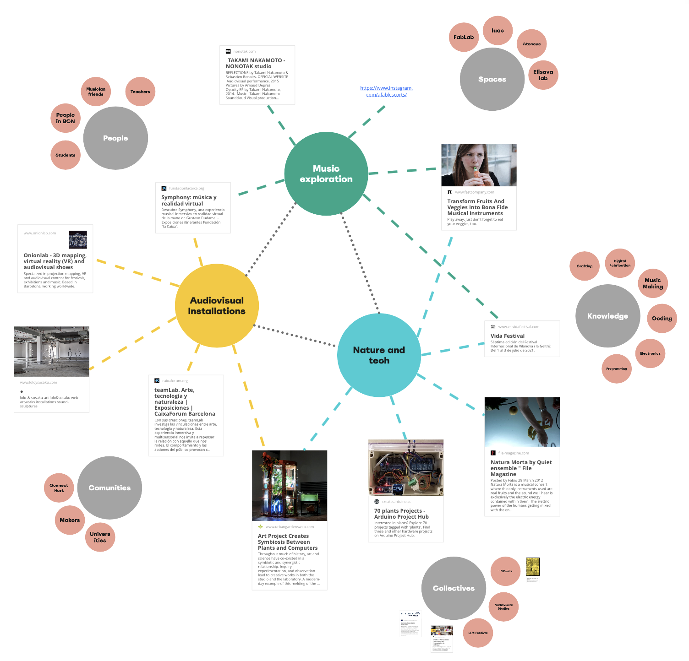

---
hide:
    - toc
---

##### Week 8

## Community Engagement

**Teachers:**

Merce Rua

Markel Cormenzana

Day 1

First day was about talkin about Holon projects and how to embrace challenge of working with comunities

Day 2

Human Sculptures

Day 3

Whats urgently waiting to be done in the world

-Evidences supporting that urgency

-Glimpses can I find in the present of those futures waiting to be done.

Day 4

Theories of change

Definition of Emergence

Deliberables:

-Local ecosystemn mappping

## Reflections:

Communitites:

Embrace complexity:

From Ego to Eco:

