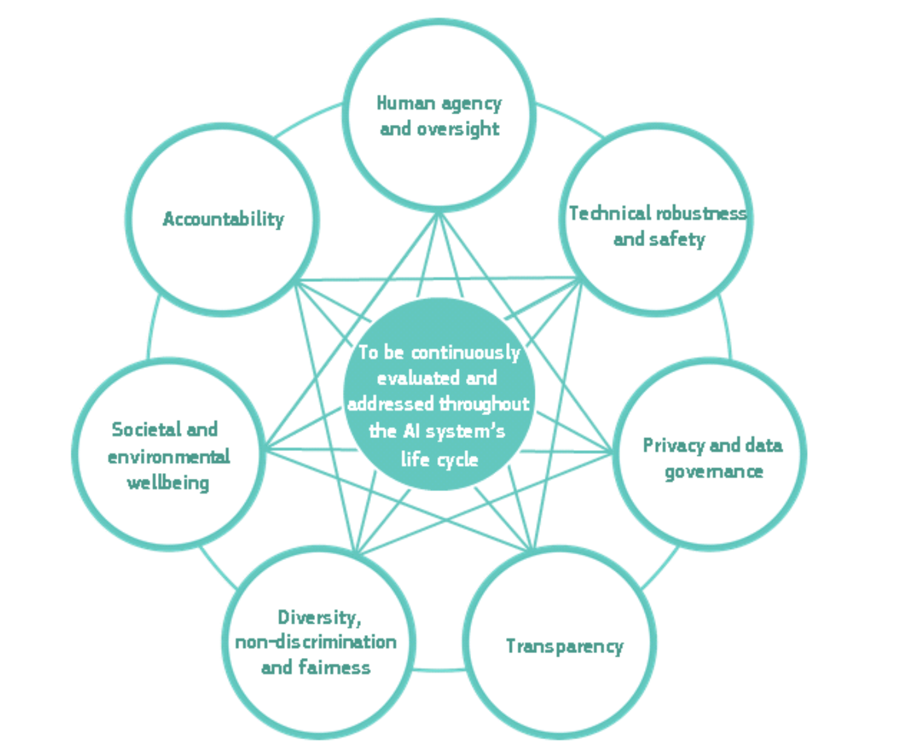
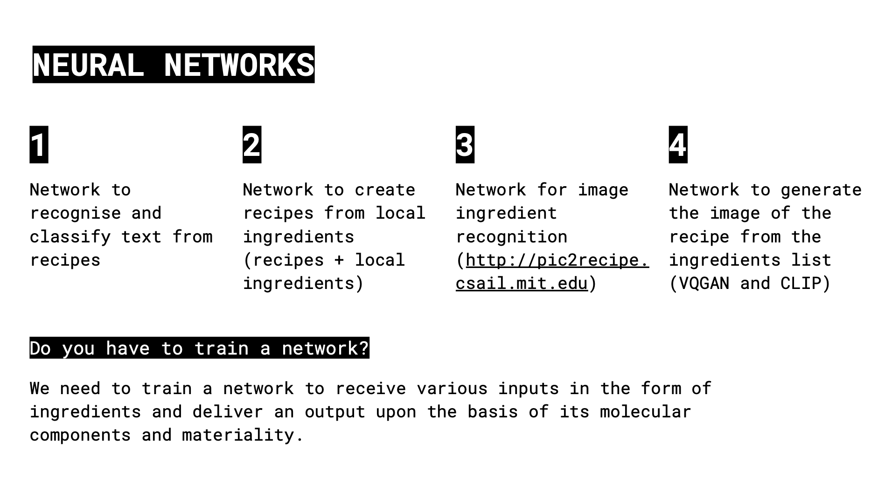

---
hide:
    - toc
---

##### Week 10

## Extended intelligences

**Teachers:**

Taller Estampa

Pau Artigas
Daniel

Ramón Sanhueza

Lucas Peña

**Concepts:**

##### Machine Learning: 

###### Automating tasks by providing examples, instead of writting instructions.

##### Neural networks: 

###### global architecture that can "self configurate" itself from examples provided. cna be images, text, audio, etc.)works as inputs of information, creating outputs.we have to define a task to automate, from different datasets.

##### Datasets: 

###### Sample data to provide the network, it can be quantitative or cualitative information. they are fundamental in machine learning for generating networks.

*Example of an automated program to recognise diferent objects, faces, etc.*

##### Training the neural network.

###### Self configuration process of network based on the dataset, Its also depends on the time of the training, how acurate or complete will be the processing of information. After the training, the net will be the same, but trained.

##### Bias

###### This is a super important matter in AI, because as it works with very specific information, sometimes, it fails showing bias of different subjects, for example, if the data set is created in an specific environmet, it will be usefull only for that environment, because if its changes context, it will mean some completely different.

##### Ethics in AI

###### This Diagram made by high-level experts group, lead by the european commission, Shows a resume of all the topics that acctually on the ethics table, related to AI, Is very impoortant that these topics are in a continuing revue and development, because as we know technology goes much more faster that regulations, so is very important that this is allready a main talk in AI.

##### What is intelligence

###### In artificil Intelligence, the word intelligence is more or less something that complete tasks, as an input orders to. Also the quality of the processed info is considered "intelligence ass well". Some experiments commented in the class is the turing imitation game, that consist on a machines ability to exhibit intelligent behaviour equivalent, or indistinguishable from a human. If the evaluator cannot reliably the result, the machine pass the test.

##### Anatomy of an AI system

###### In basic terms, the anatomy of a AI systems, starts from an input, then the informations goes to a process whe its compared and connected, and then it goes through an output, delivering results. In a more complex way, that process complements with AI decision making, machine learning and data processing, that also generates a specific output but with more complexity.

**Exercise 1:**

##### Poble Nou pictures

###### The first exersise was to go around poblenou taking 100 pictures of averything that give us some old and new vibes, like architectrure, people, graffitis, etc.

*This is the result of all pictures creating an arranged dataset, its possible to see that the program arranges the pictures into specific categories, like, selfies, landscapes, objects, nature, etc.*

**Deliberables:**

*Create a project, speculating on how we can use AI and machine learning to generate some system using mahcine learning.*

### Recip.AI

New way to create food recipies using datasets from all over the world.

**Deliberable 2:**

Speculate for a AI object.

Its possible to anticipate earthquakes?

**Reflections:**

###### This course was a very good instance for demistifying AI, obviously its a very complex and interesting subject. Learning in a very superficial way how it works and all the concepts behind, give us an idea of the machinery behind, and the projections that this technologies can give us in the future as designers. Now I realise that if I need to work with AI, I can talk to some expert with more knowledge, and know what I am dealing with, and make better decisions.

###### Also the knowledge of how to use AI tools like Colab is very important, Its a new world of exploration for me, so I will try to relate this kind of new technologies, that have a lot of potential for creating new projects with more complexity and automatization.

