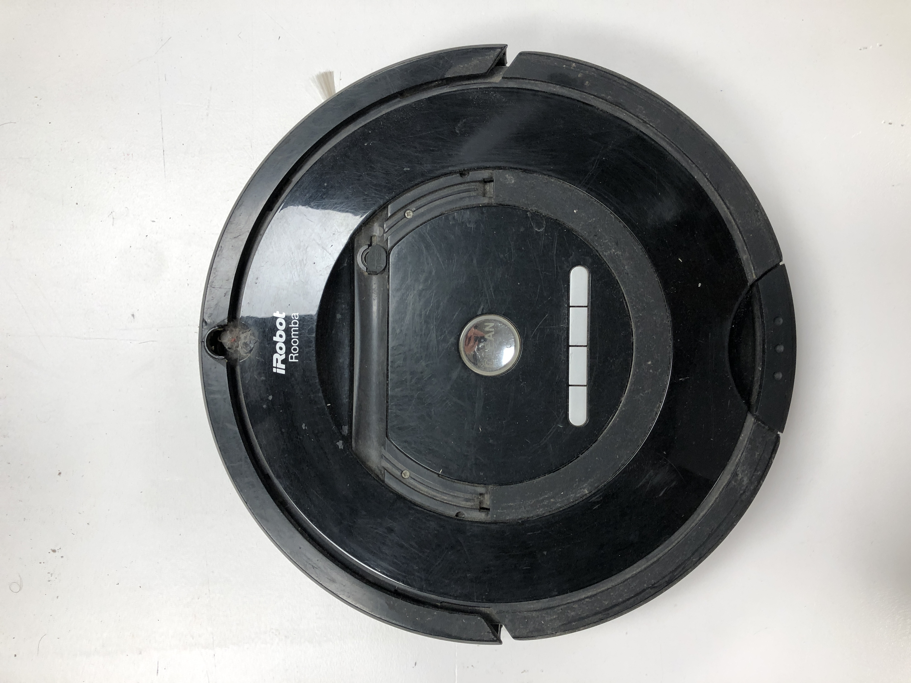
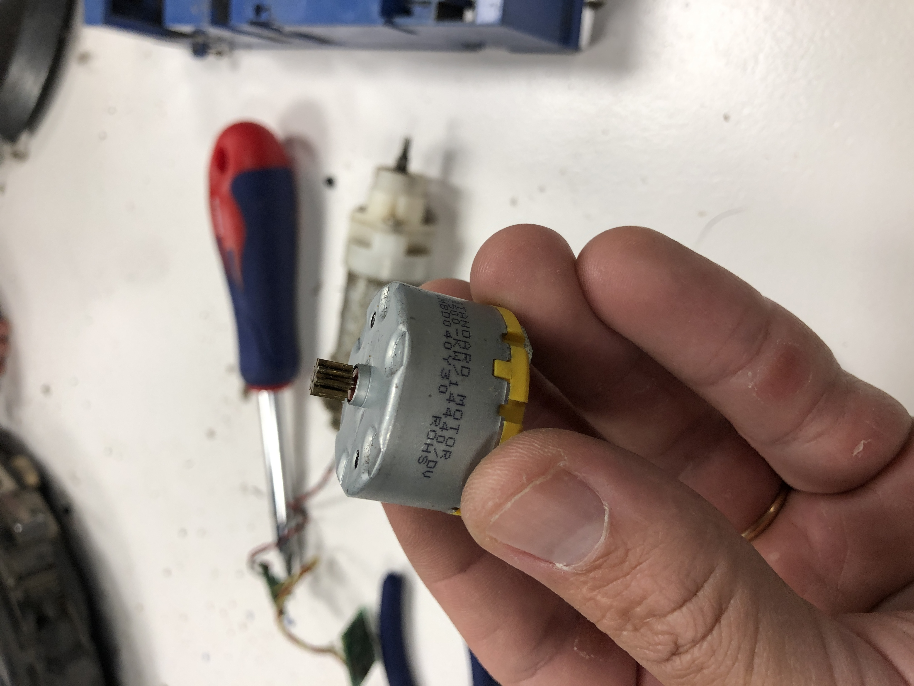
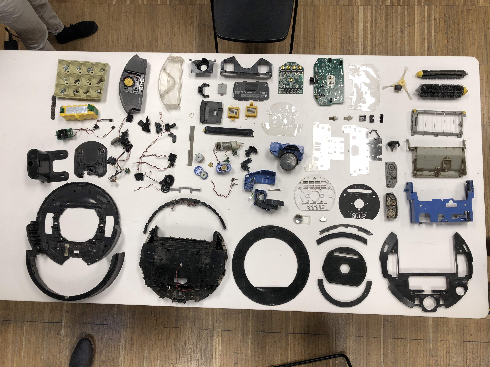

---
hide:
    - toc
---

##### Week 6

## Tech Beyond Myth

#### Forensics of the obsolescence

We manage to disasemble diferent thigs, like a Irobot Roomba, A tv, a Macbook. and then we had to analize them in very different ways, and documented here.

https://hackmd.io/INk2gThpSkObQQ_E62gxow?both

We manage disasemble a Roomba Robot by team, It was a very interesting choice, because is a very multifuntional robot, that have motors, wheels and sensors. We find out that the Robot was much more simple that we imagine, when we resume the functions, in navigation, sensors, hardware, we manage to undertand the main function of it. Then We search for different parts online, to find out what they were, and look for info.

Roomba cleaner before dissasebmbly

DC motor R500, we look for it in google to see how much the voltage was.then we turned it on with a power source.

Some pieces of the roomba, wheels, DC motors, a LOT of plastics parts from the filter.

All pieces of the dissasembled roomba.

