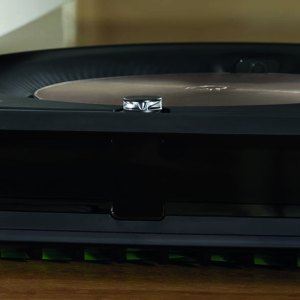
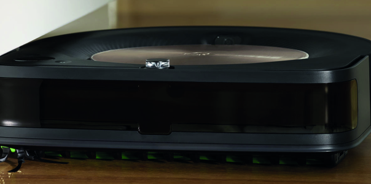

---
hide:
    - toc
---

##### Week 6

## Tech Beyond Myth

**Teachers:**

Guillem Camprodon

Victor Barberan

Oscar Gonzalez

Santiago Fuentemilla

#### Forensics of the obsolescence

We manage to disasemble diferent thigs, like a Irobot Roomba, A tv, a Macbook. and then we had to analize them in very different ways, and documented here.

https://hackmd.io/INk2gThpSkObQQ_E62gxow?both

We manage disasemble a Roomba Robot by team, It was a very interesting choice, because is a very multifuntional robot, that have motors, wheels and sensors. We find out that the Robot was much more simple that we imagine, when we resume the functions, in navigation, sensors, hardware, we manage to undertand the main function of it. Then We search for different parts online, to find out what they were, and look for info.

Roomba cleaner before dissasebmbly

DC motor R500, we look for it in google to see how much the voltage was.then we turned it on with a power source.

Some pieces of the roomba, wheels, DC motors, a LOT of plastics parts from the filter.

All pieces of the dissasembled roomba.

2021 Roomba

Day 2 Data

## Actity: Find an objective, that can be very local, and can be extrapolated to new opportunities.

**Objective**

Make young people feel less lonely

**Question**

Is instant messaging make people more lonely than other generations?

**Hypothesis**

Instant messaging is making people feel lonenly in Barcelona

**Plan**

Ussually when people feel alone, they get into their cellphones, even if they are with more people, We noticed that people "hide their cellphone under the table, to get into whatsapp of different apps, so we decided to use the Arduino LDR sensor to detect the bright of the cellphone screen down the table.

(photo of people)

At firts, We tried to get information with one light sensor, trying different sources of light, like phonescreen, phone led, Also understanding the levels of the sensor reflected in the screen.

(photo of arduino, with one sensor)

With the light sensor working, we noticed that the LDR sensor is very directional, so with the help of Victor and guillem, we manage to program add three more sensors to have more directions for recieving light. 

(photo of arduino program)

**Capture**

At first, We went to different restaurants and coffees, looking lonely people sitting and having luch, we found a lot of people alone, looking their phones, but then we realized that people that sit alone, use their cellphones above the table. So we imagine our data collector
in situations like bars at night or restaurants, where people gather toghether but they still use messaging, or check instagram,etc.

(photo of restaurants)

Finally we went to Itnig coffee, to apply the sensor in a table, so we 

**Evaluate**

