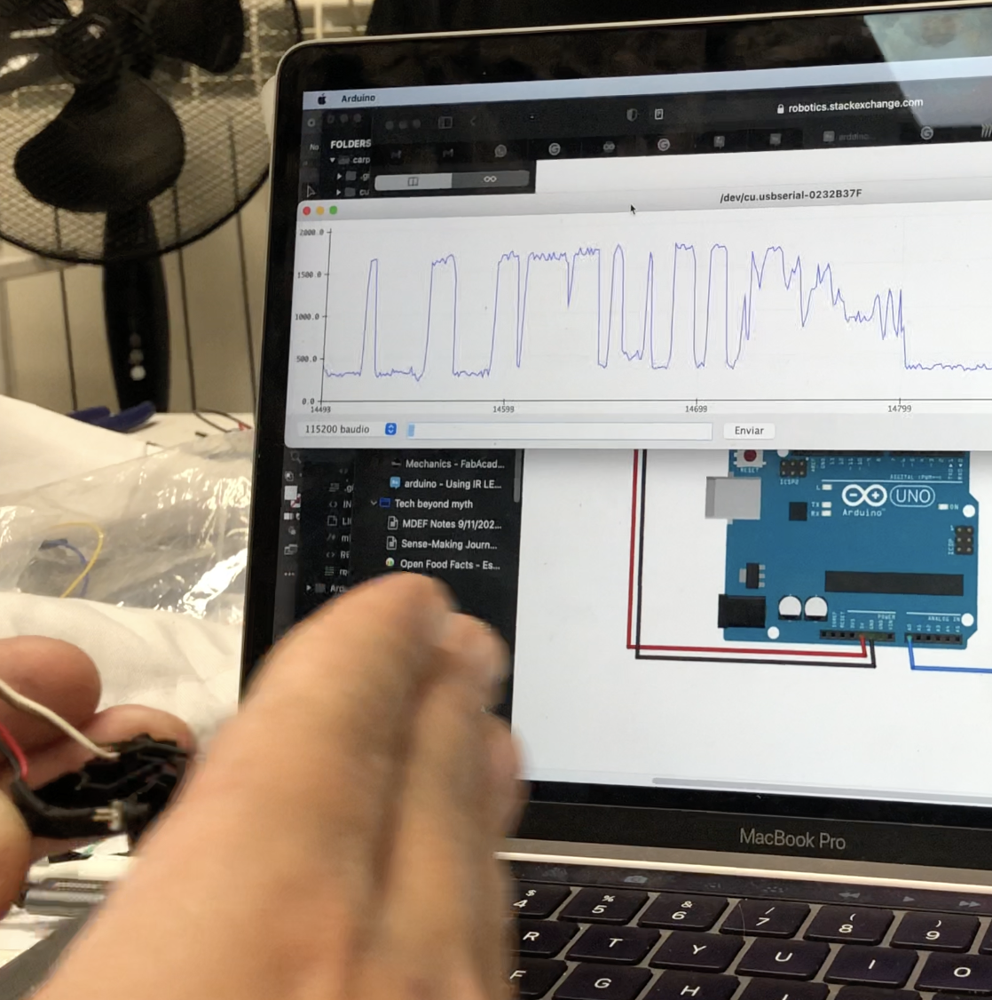
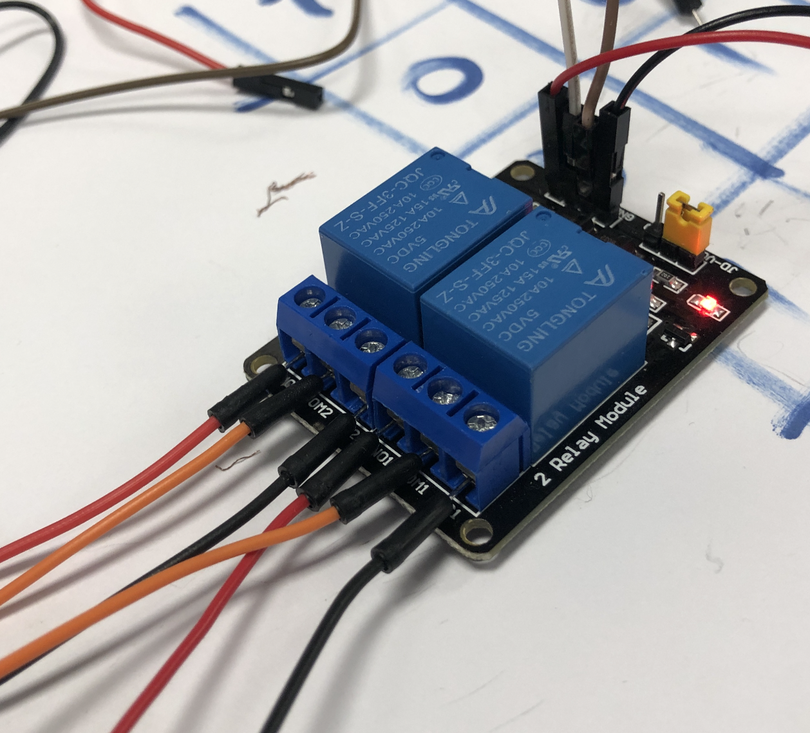

---
hide:
    - toc
---

##### Week 6

Almost useless Machines

<iframe src="https://player.vimeo.com/video/650258634?h=bb4597ccf6" width="640" height="360" frameborder="0" allow="autoplay; fullscreen; picture-in-picture" allowfullscreen></iframe>

<a href="https://vimeo.com/650258634">MEH...RROR</a> from <a href="https://vimeo.com/user156898441">Ruben</a> on <a href="https://vimeo.com">Vimeo</a>.

#### Process ####

Triying the DC motor from the roomba brushes, in the back, the power source let us try different levels of voltages for managing the movement that we needed for the robot.


Testing the roomba IR sensor with arduino. The most difficulty was to callibrate the sensor for different levels of light during the ambient variations.


As we wanted to use the recycled dc motor, we had to use relays, to enable the arduino to controll the dc motor to move to both sides. Also because the motor was too big for the usb power or the arduino power, so the relays acted as a AC/DC convertor.


We also use almost recycled parts for building the robot, the body was from some used parts from fablab, we designedthe vertical post to make space for the motor. then we added the electronics to the body.


The mirror was taken from a hard drive, and the IR sensors were attached to the center of the mirror with a wooden circular piece.


We also 3d print two pieces to atach the dc motor to the structure, and the black cilinder to grab the motor movement, to rotate de disk.


The arduino ESP32 was attached to a breadboard, a very tough solution, but for the purpose of the machine, was enough for the function of the robot. We also put black tape to the wires to ensure that the cables doesnt tangle with the robots movement.

#### Reflection: 

Recicling parts: We added to our challenge to use only recycled parts for electronics mostly, it was a challenge because we had to use more complex electronics, like relays, to make the motor run both ways, that could be done much more easier with a servo motor but the challenge to use a recycled part, strech our limits to make it work.

Programming: It was very interesting that we build our groups by our capacities, so I had added me because of my fabrication skills, but I wanted to learn arduino and programming, I challenge myself to make the motor and the sensor work. then it was a teamwork to program and understand the function of the whole system.

Teamwork: It was very interesting to build the group with different capacities and interest, we saw that capacities fully proved during the process, we aimed to distribute the work by fabrication, programing, electronics testing, and documenting.finnally we ended doing different tasks by everyone, and also at different points, we presented explaining each other what we were doing at the time.

Doing something Useless: I realize that is very difficult to do something “useless”, because as designers, we are used to create something for a user, or someone else, but allways usefull.

Documentation: We made a 1 min video, that reflects very well the concept of the robot, showing its function, and reflecting the “uselessnes” of it. The blue background used for video recording, gives also a profesionalism to the class videos.
Its a very good way to document something that its going to be disasembled for shure to be reused to build more robots.

