---
hide:
    - toc
---

##### Week 3-4

# BIO_AGRI_ZERO

**Teachers:**

Jonathan Minchin

Nuria Conde

**Grow your own Bacteria**

###### For this activity we manage to grow a bacteria from residues in iaacs environment, for the sample, I took pidgeon poop, that was outside Iaac, at the bicycle parking. The dark spots are different kind of fungus that had appeared on the Agar Agar base.

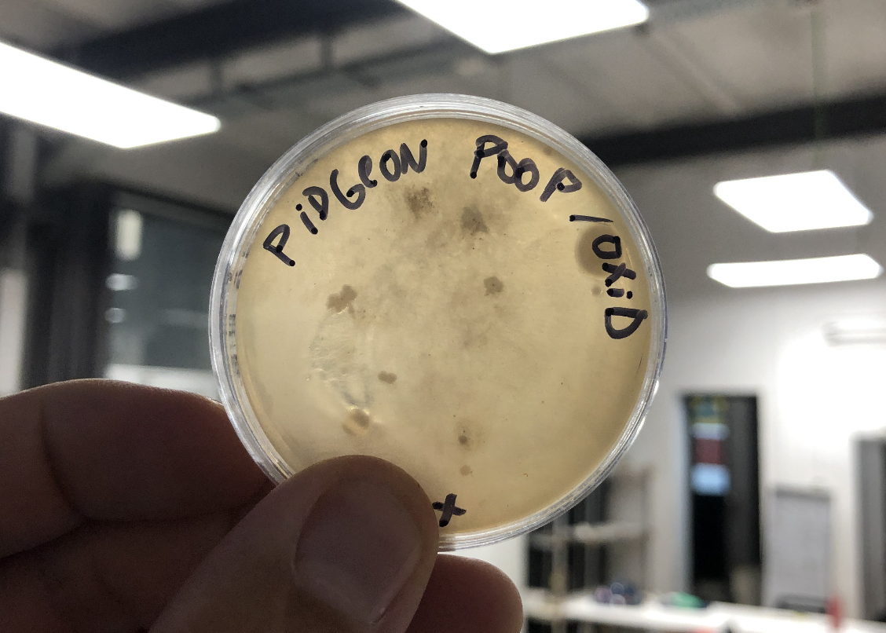

###### We learn also how to work in a sterile invironment, using fire as a "safe" for inoculating bacteria into the petri dish.

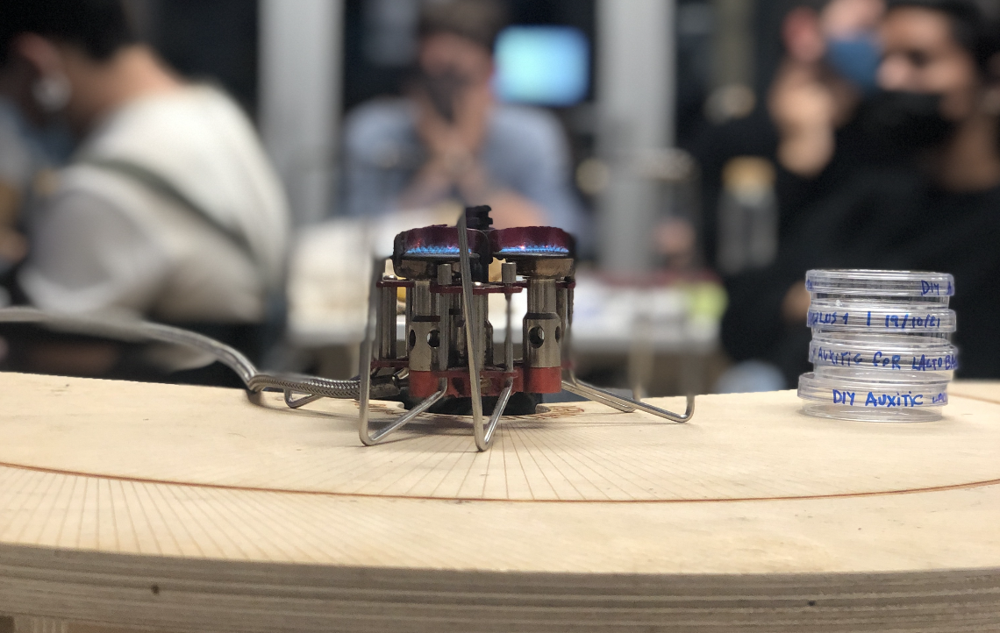

**Spirulina**

**Microscopes**

**PCR**

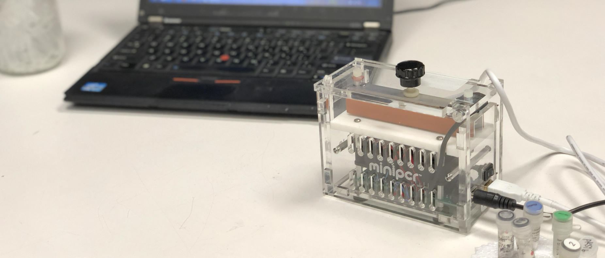

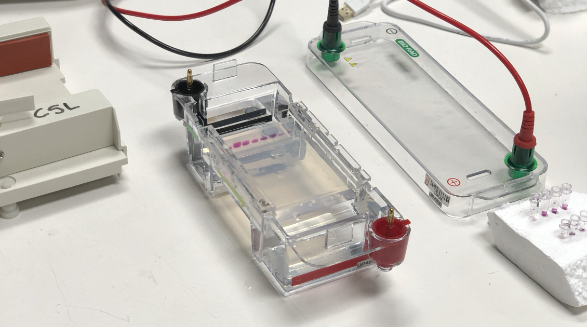

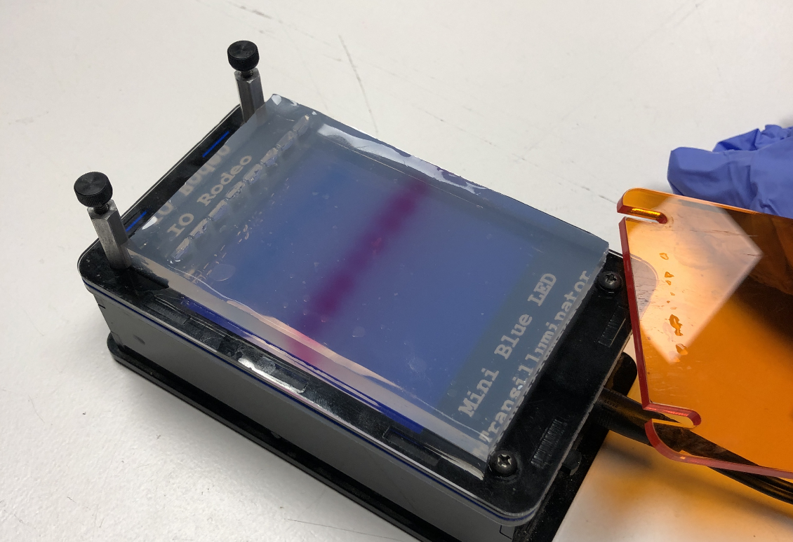

**Scientific method and tools**

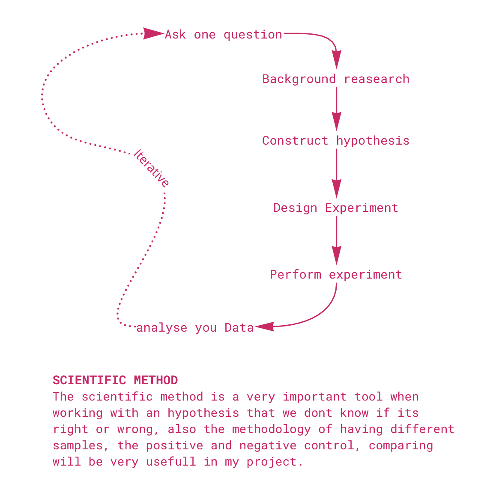

##### Week 4

**Analisis and comparison of Soils**

**Analise ph levels**

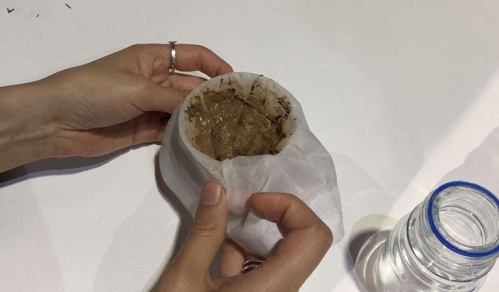

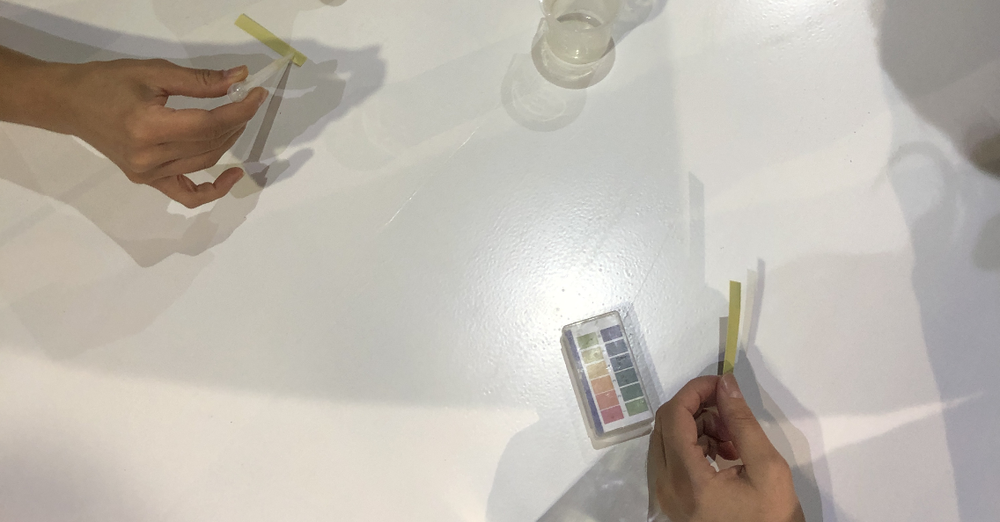

**Cook biomaterials**

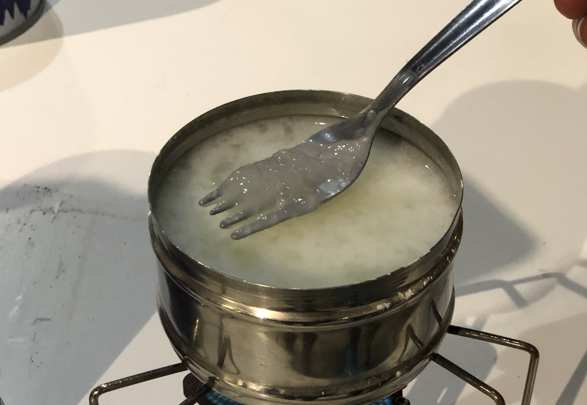

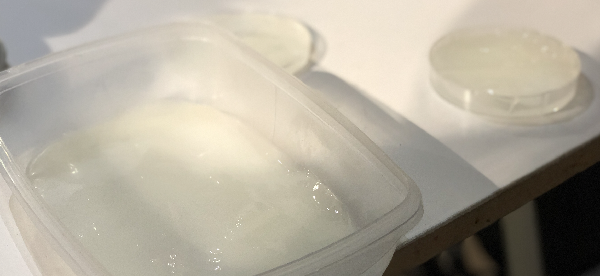

**Get escential Oils from laurel**

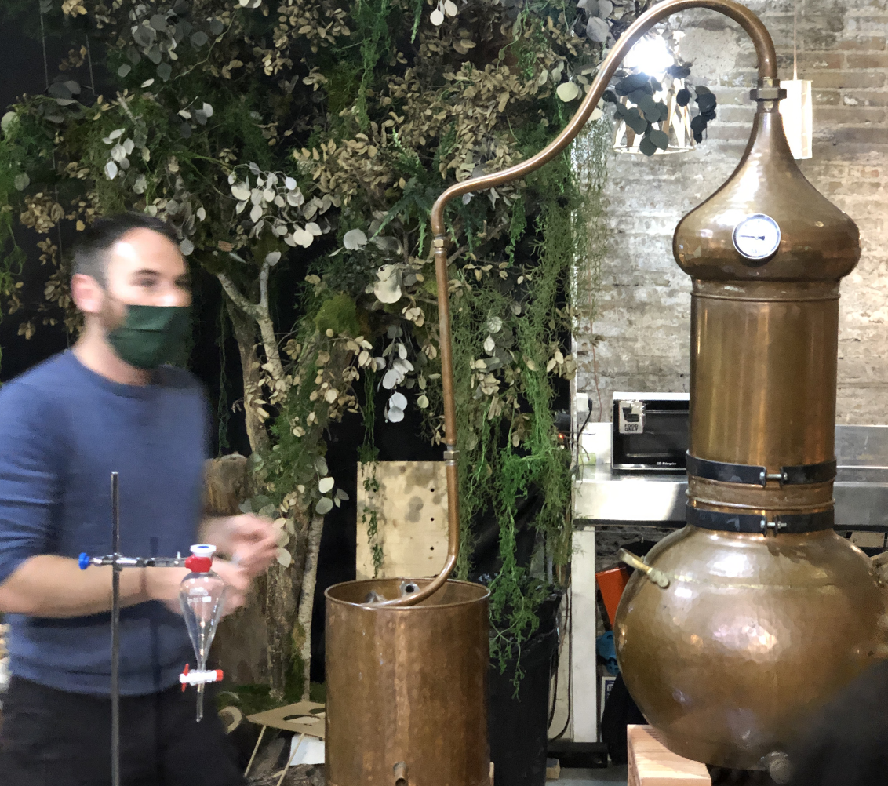

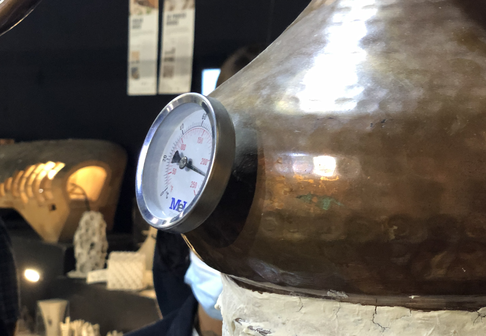

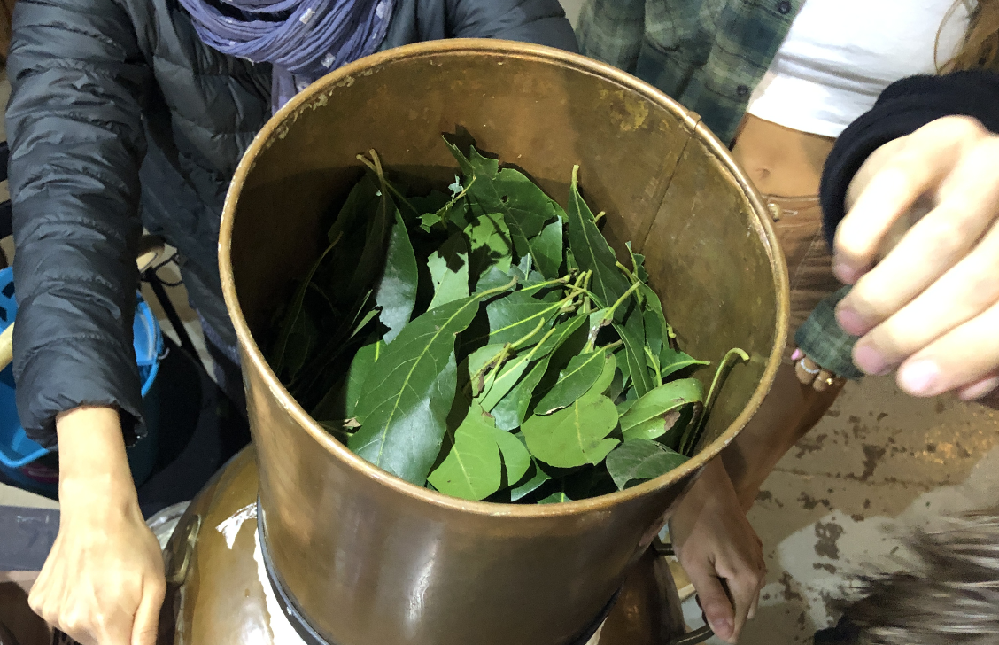

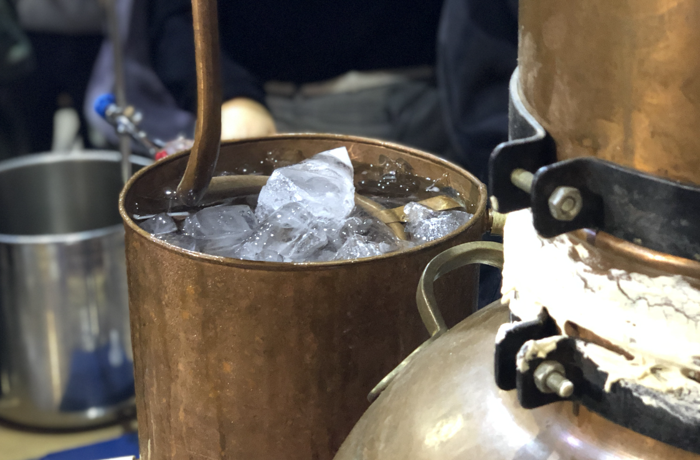

**Analize plants with iNaturalist**

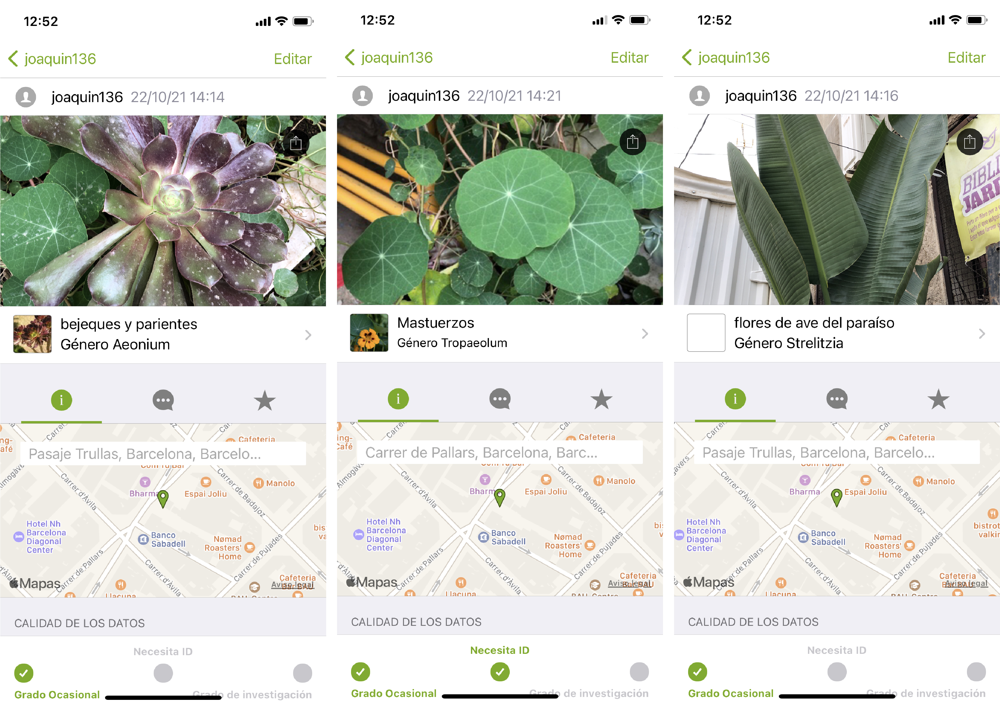

**¿Scientific Paper:**

#### Robotically Controlled Fiber-based Manufacturing as Case Study for Biomimetic Digital Fabrication

*N. Oxman, M. Kayser, J. Laucks and M. Firstenberg
Massachusetts Institute of Technology, Cambridge, Massachusetts, USA*

###### Neri Oxman job has allways impressed me, the first time I saw the silk pavilion, I was amazed about the concept about collaborating with nature instead of make nature work for humans. The sinergy beetween technology, digital fabrication and technological systems is very well designed.

###### the process of obtainnig the silk, has been for hundreds of years a process againts nature, because normally the cocoons of silk are boiled to separate the silk, killing the worms, growed in farms and in a non organic way. The interesting thing about this new process, Is that they propose a new way to extract sik without killing the worms, by letting them to wove their cocoons, and at the same time, evolve into the next stage of the larva.

###### I picked this paper to understand in an specific way, how this ingestigation started, how the probes were made, to understand how is possible to work with this organic systems and to create new ways of manufacture.

**Sumary**

###### 3d printing vs natural fabrication

###### 3D printing traditional methods, are very funtional in a way, but it is not as efficient as natural fabrication, like spider webs, birds nests, or worm silk, wich contruction is organic and high efficient, ussing the less resource ass posible, working in an incredible way, so that statement opens a new investigation direction, where the natural procesess inspired humands, to develop new methods of manufacture.

#### Fiber orientation

###### "Using additive manu- facturing technologies are much less sustainable: from a material perspective - homogeneous materi- als offer less potential for structural optimization; and from a fabrication perspective - additive manu- factured components are constructed in layers, rely- ing on the deposition of significant amounts of wasted support material"

###### The fiber construction method is very effective, because it uses a high resistant material, to the purpose of protecting the cocoon, till it reaches its evolving stage, the puppa. One cocoon has more than a kilometer long, and its deposited in the most efficient way.

#### About silk

###### Silk is an amazing material, its one of the most high ended, exensive and old materials recolected by humans, its used to make clothes, fibers, and its used in textile industry and medicine. The silk as a material also has a binder, the cericin.The worm makes the cocoon using its own environment attaching the silk into different points.

#### Motion tracking

###### In the reaserch, they installed a worm into a acrilic box, and they used different of cameras to analyse how many points of contact were used by the worm to make the sik structure, concluding that they were more than 1.000.000 points of contact. that motion track, encouraged the team to speculate about a robotic process of fabrication.

#### Fiber based robot simulating construction

###### Using a Kuka robot, they manage to install a headset to the robotic arm, that deposit HDPE, a termoplastic that can be used for 3d printing. Also they conclude that changing the extrude power and speed of the headset, would be possible to vary in density, thikness and quality of the material. Also they simulated the contact points with hook on the wall, enabling the robotig arm to create HDPE structures based on the silk worm funtion.

**Images:**

**Making a mutant**

###### The drought has been a issue from long time ago, but now we can see its impact in a lot of scenes. In Chile, The desertification its happening rigth know, and its effects are vissible to the eye. "Aculeo" lagoon was a balneary 30 min far from Santiago, where families have houses arround the lake, and ussually go for the weekend to swim and make watersports. Today that lagoon is a desert field of dry land, where horses and cows eat grass.

###### There are some local inventions to battle the drought, One is called "fresh water". Its a home machine that literaly takes water from the air and transform it to drinkable water. That process is very interesting, and it has been used for little comunities  that have no acces to potable water.

###### This kind pf project are very nice inventions, but to make that proceses, they use a lot of energy, electricity, and resources to be constructed. Other iniciatives, are the recollectors of morning humidity in the coast, called "camanchaca". They are inspired in plants or grass, that recollect the morning fog´s water to hidratate the plant or soil. Its the same Idea, but with a horizontal net that gathers drops of water to acumulate it to pipes or more bigger water containers, so we are literally getting water from humidity.

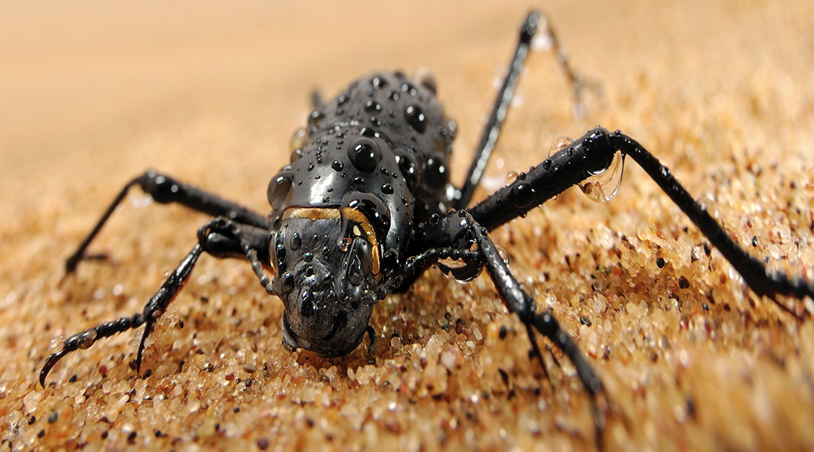

###### My idea of gene mutation is inspired by human made water recolection systems, and some nature systems, like the Namib desert beetle, that use its legs to recollect or harvest water from the fog in the air.

###### There is an impressive reptile, that has the possibillity to control its temperature form external factors. The Leatherback turte.

###### *"Leatherback sea turtles are so successful at regulating their body temperature that they have the ability to maintain constant body temperature 18 degrees above or below the ambient temperature. That is so incredible that some researchers argue because this process is metabolically accomplished leatherback sea turtles are actually endothermic. However, this process is not anatomically conducted, therefore most researchers suggest this is a diminutive version of endothermy at best."*

###### Would be possible to modificate humans genes, to give the biological cappacity to obtain and hydratate with the water from the environment? 

###### Looking to igem.org tools and projects, I havent found anything like this kind pfo project, As we talked in class, CrispCas-9 should be a possible way to edit or modify human DNA, specifically the generation of cells that help us regulate our inner temperature system.

https://www.science.org/content/article/could-desert-beetle-help-humans-harvest-water-thin-air

https://oceanadventures.co.za/animals-regulate-body-temperature/

https://oceanfdn.org/the-thermoregulating-ectotherm/

**Reflection**

###### This set of lectures, were very interesting and inspiring because from the biology point of view, my interest in grow almost anything, has to do a lot. Also for me, is necesarry to know the basics of biology, if im going to work with biofabrication, biomaterials and living organisms. I also would be using a lot my toolbox network, to contact profesionals if I have more doubts about biology.

###### The only comment that I would do to Nuria is that in some parts, the concepts were too "scientific", so I get lost sometimes in the terminology, but with a bit of asking and time, I was able to understand the main concepts.

###### Also all the practical area in both Bio / Agri, were very insightfull, because we were able to see how a lot of things work, like how to grow bacterias, or how to work in a sterile environment. That are totally usefull things that I will be useing for shure along the master.

###### For de Agri Zero week, I found that im much more interested and related to the conuntryside that I was aware. All my youth I used to lived in  the countryside of Curicó, a city in the middle south of Chile, famous for its Vineyards and fields for agriculture. Also my both parents are agronomists, so I had been related to the field mostly all my life. I find very interesting to use Barcelona as a natural laboratory. we have a big opportunity to work with nature here, and take advantage of Valldaura labs as well, if we need some countryside help or inspiration

