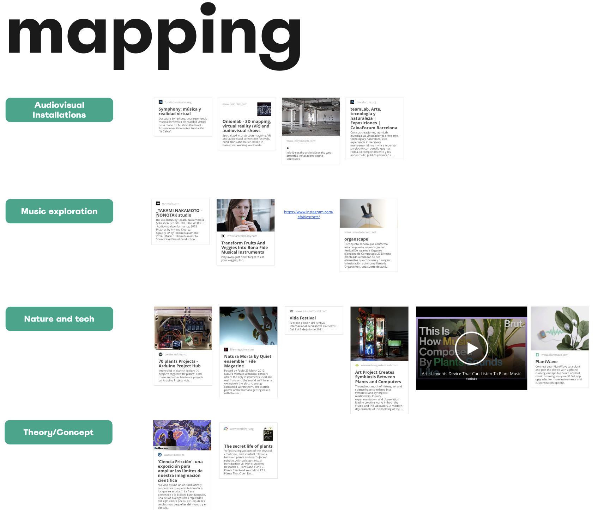
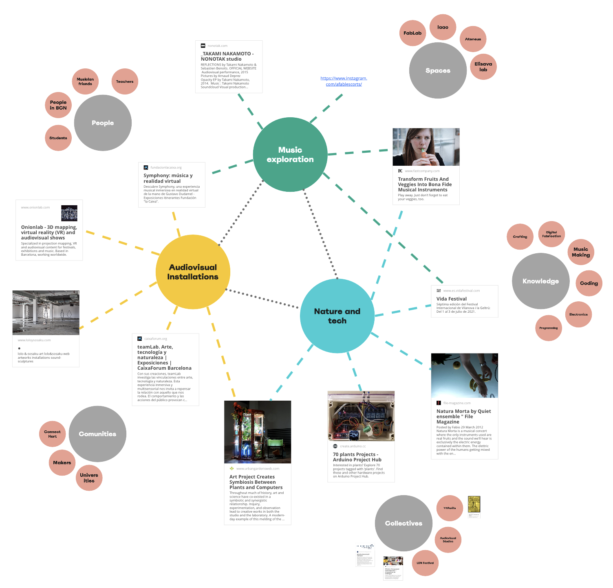

---
hide:
    - toc
---

##### Week 8

## Community Engagement

**Teachers:**

Merce Rua

Markel Cormenzana

Day 1

First day was about talkin about Holon projects and how to embrace challenge of working with comunities

Day 2

Human Sculptures, defining the educational system.

Day 3

Whats urgently waiting to be done in the world?

-Evidences supporting that urgency

-Glimpses can I find in the present of those futures waiting to be done.

Day 4

Theories of change

Definition of Emergence.

Deliberables:

-Local ecosystemn mappping

## Reflections:

Communitites:

###### The interesting of looking for communities is the fact that you are not alone , not enven in your project or anything, its possible and much easier to embrace any project with the support of a specific community. We had recently done our design intervention, mixing nature, music and technology, the day before the intervention we found that there was a gathering here in Barcelona, to show projects related to sound art, we found it too late to participate, but it was very interesting that a community is allready working on that so it validates our work, and embrace us to talk and interact with more people.

From Ego to Eco:

###### The concept Ego to eco makes a lot of sense to me. As designers or creators, we start more often from our ego, doing projects that start from our most deeply interests(I think that is a very good way to start), and then we extrapolate them into someones need or oportunity. Turning this as a concept, make it much more evident that the ego is like a fuel to do things, but the ecosystem that we are interacting is the same or more valid to our projects. 

