---
hide:
    - toc
---

##### Week 11

**PLANT B**

<iframe src="https://player.vimeo.com/video/656108576?h=ba88d0dd62" width="640" height="360" frameborder="0" allow="autoplay; fullscreen; picture-in-picture" allowfullscreen></iframe>

<a href="https://vimeo.com/656108576">PLANT B INTERVENTION</a> from <a href="https://vimeo.com/user84956374">D&iacute;dac Torrent</a> on <a href="https://vimeo.com">Vimeo</a>.

<iframe src="https://player.vimeo.com/video/656142700" width="640" height="564" frameborder="0" allow="autoplay; fullscreen" allowfullscreen></iframe>

**An Exploration of Inter-Species Collaboration**

###### For the final Design Dialogues event at the end of term 1, Joaquin, Didac and Chris teamed up for the accompanying design intervention. We are interested in the intersection between music, collaborative jamming, nature and how these things can be combined. We wanted to research how engaging in an intimate collaborative setting with plants could foster a meaningful inter-species connections. For that, we decided to enable a inter-species jam session, where the plants would be both musicians and instruments. Below, our conceptual ideas and project planning can be found, as well as some first sketches for the final project artifact. 

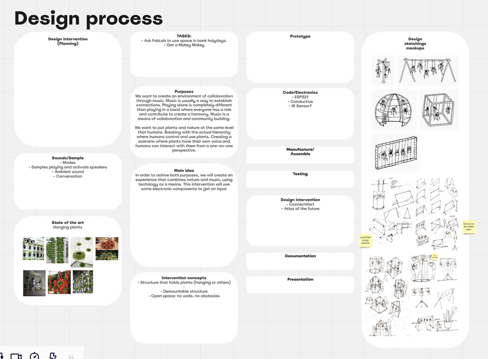

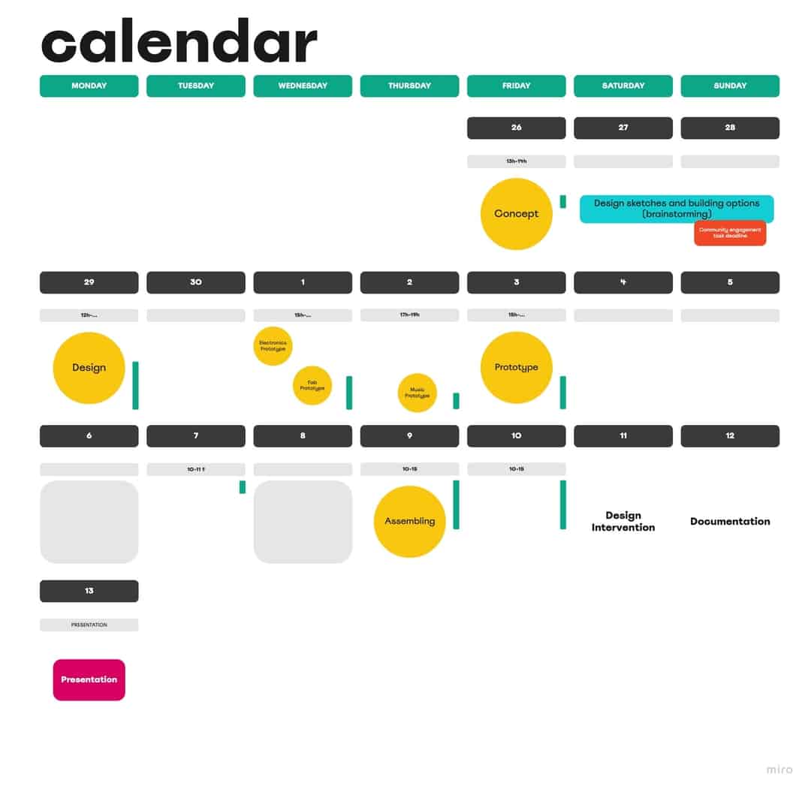

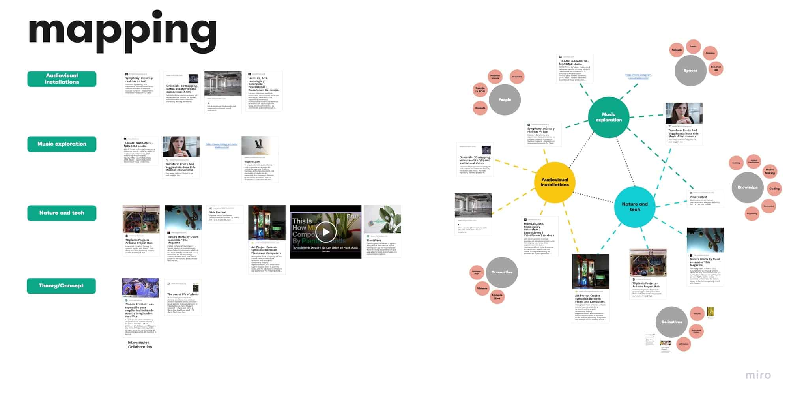

Building a Prototype

###### With the help of the MakeyMakey, some plants from the Fab Lab office (thank you!) and Ableton Live, we managed to get a first minimal viable product for a few classmates to test out. See some of the impressions below:

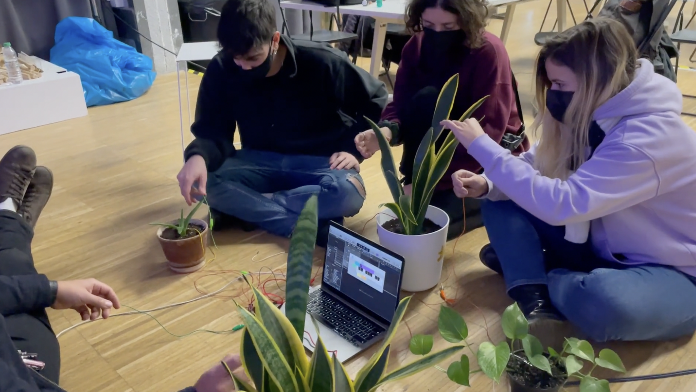

First Insights

###### We managed to extract some interesting insights from these experiments. First of all, it was intriguing to see how the sounds produced did not only dramatically change the perception of the users towards this plant, but also the interaction that comes with it. From slight touching and caressing to pinching and hitting the plant, a wide range of interactions could be observed just by linking different sounds to the individual plants. Secondly, the perception of the experiment as a whole changed according to what musical mood we were aiming for: There proved to be a much different vibe between mysterious, atmospheric synthesizer and bell chimes samples on the one hand and some pulsing electronic lead synths on the other hand – while one made our test users connect to the plant on a emotional level, the driving electronic rhythms resonated with our test subjects on a more physical level. This first experiment clearly illustrates why sample selection is an incredibly integral part of the intervention, because it profoundly shapes both interaction with and perception of the plants.

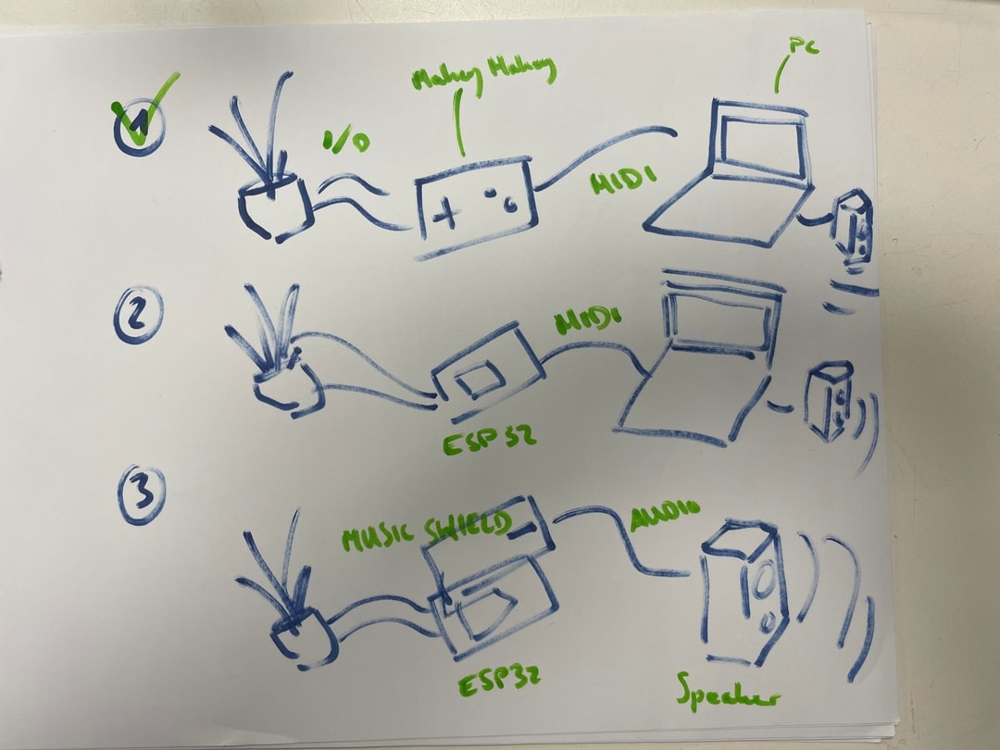

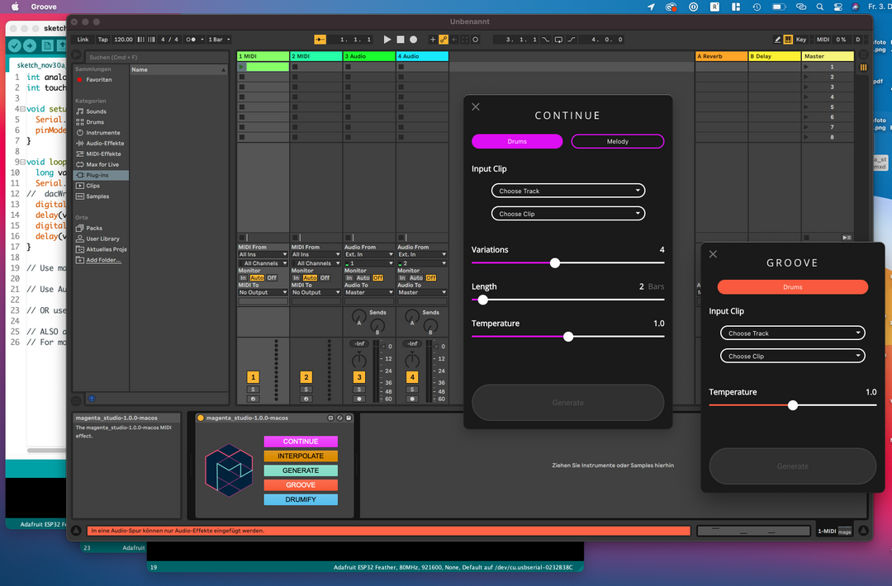

Preparation

###### For the preparation of the intervention we split the work between the tree of us, each taking charge of a different component of the final product. That meant figuring out the electronics, designing and building the plant boxes and doing the sound design for the plants. Below, you can find some images documenting our progress towards the final result.

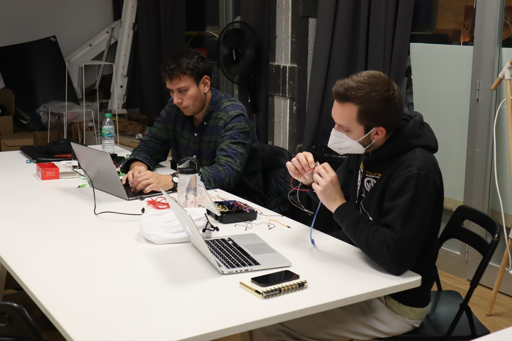

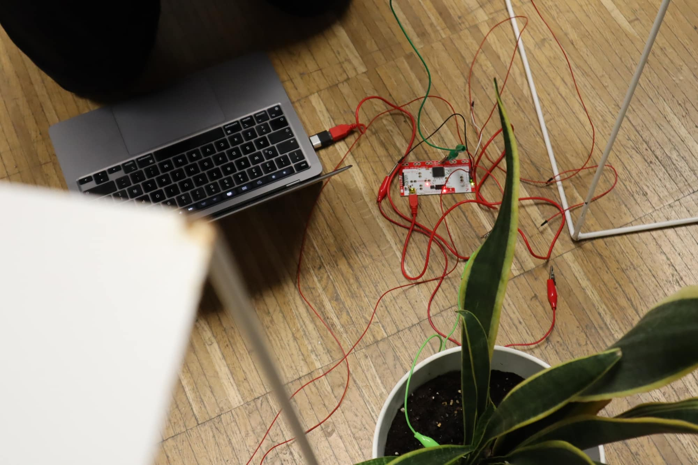

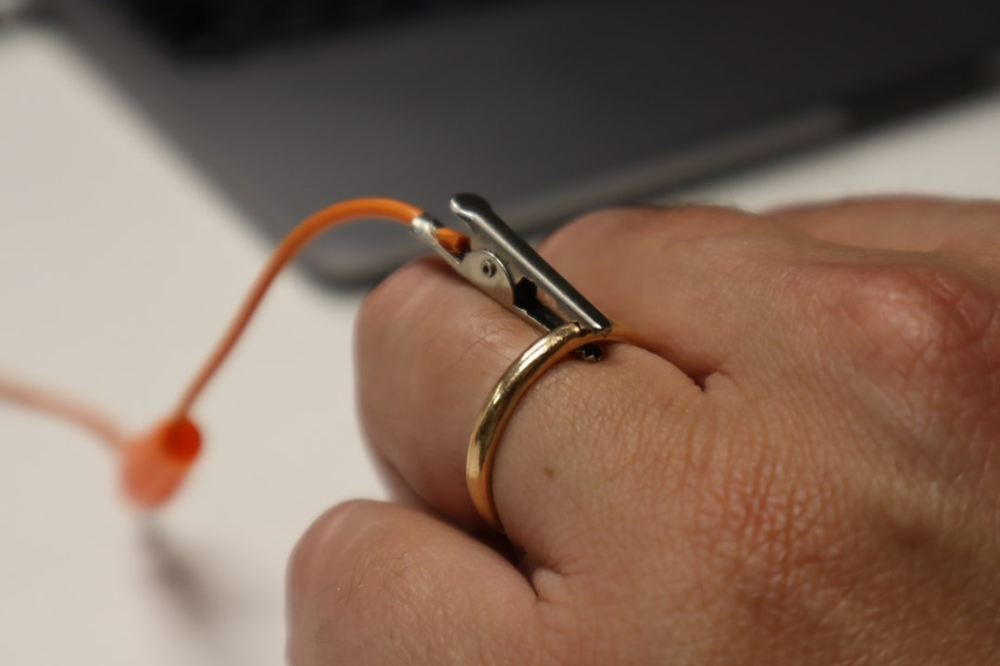

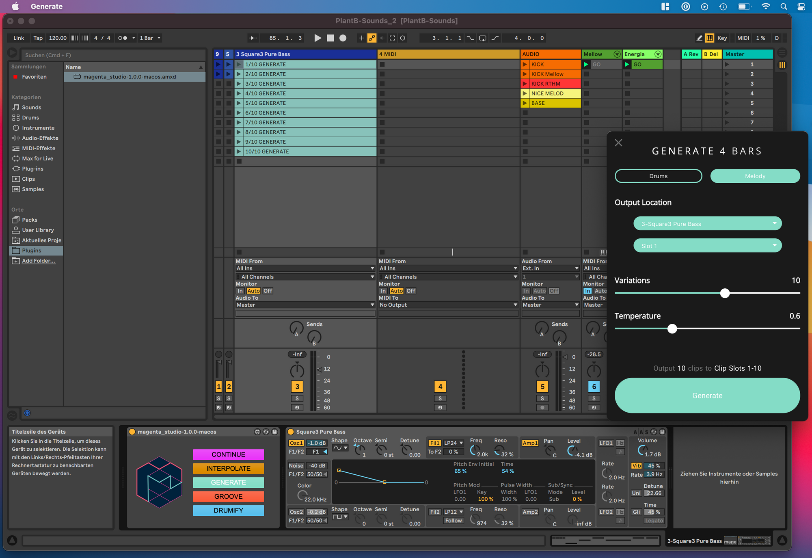

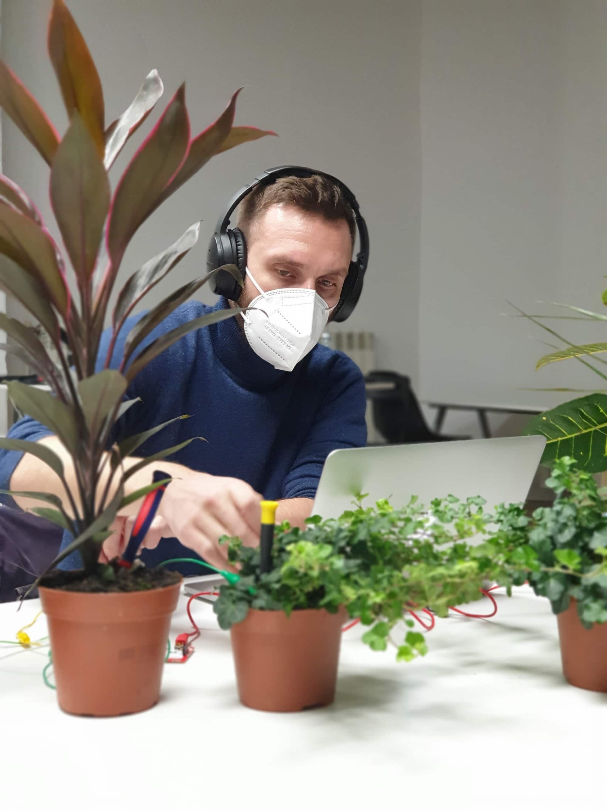

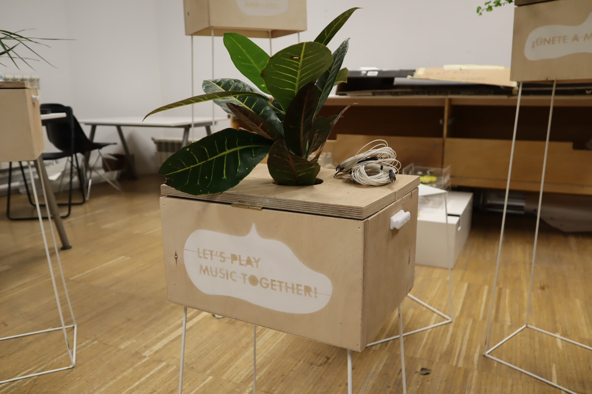

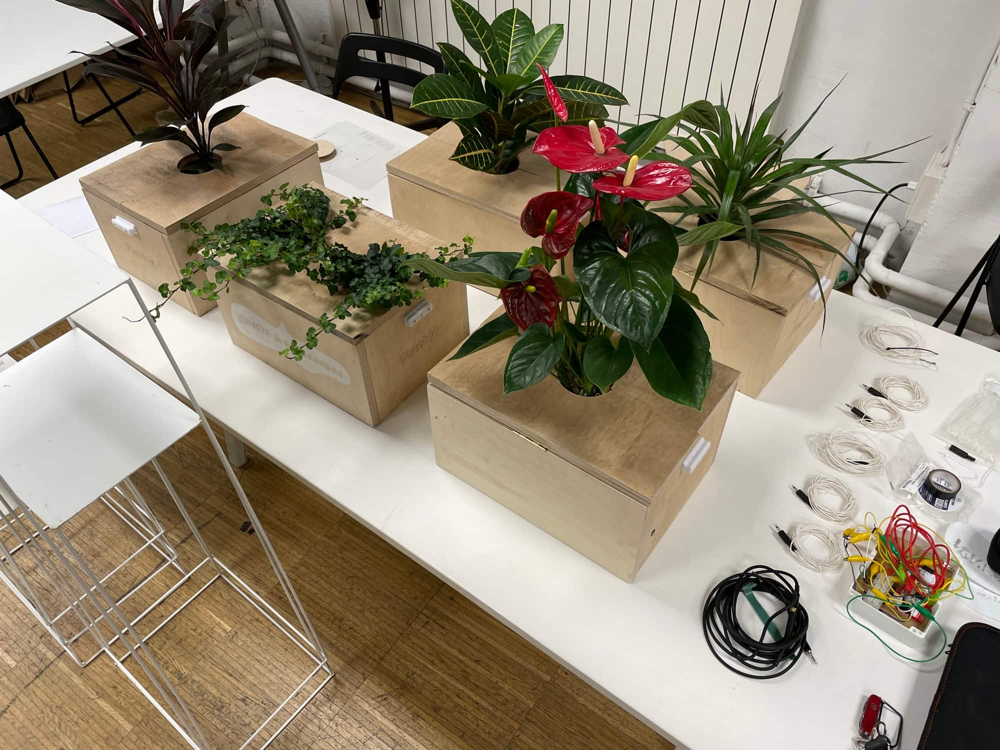

The Intervention

###### On the day of our intervention, which was Sunday, 12 Dec, we were blessed with a beautiful weather and a calm Sunday noon vibe in Parc de la Cuitadella, where a lot of families went for a walk. Already while setting up, people stopped and asked to interact with the plants. We'll let the images below speak for themselves.

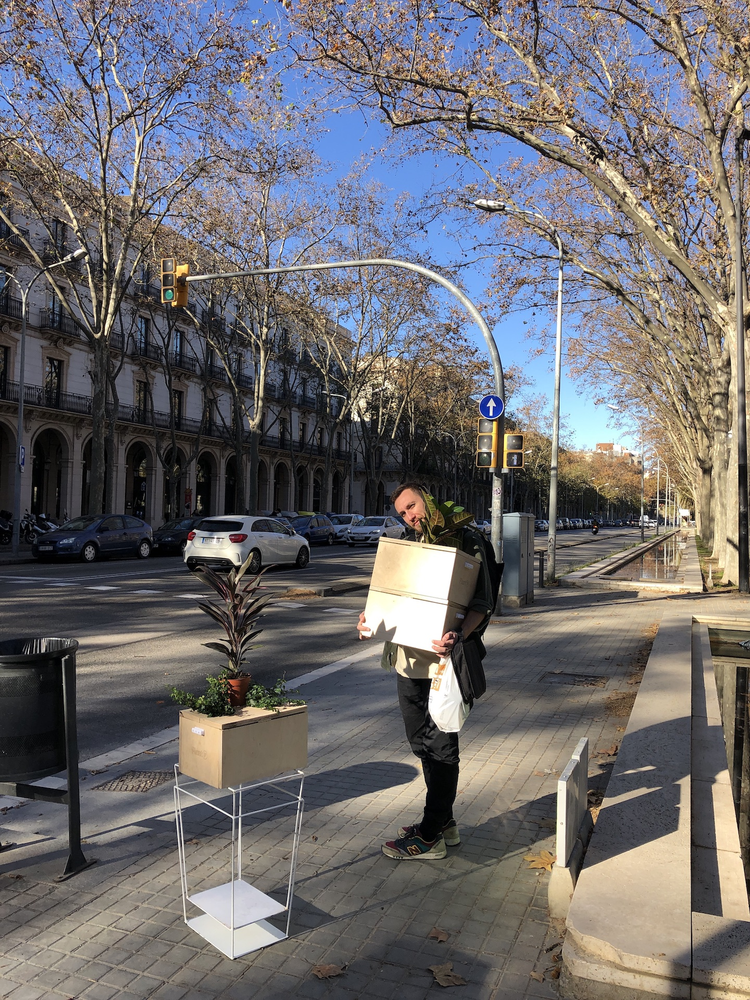

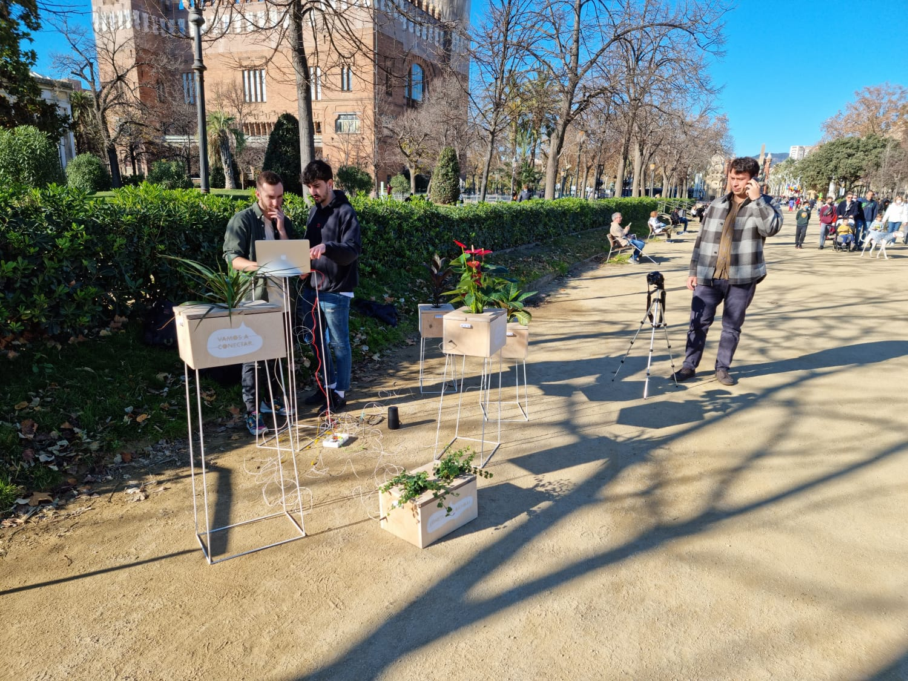

Reflections on the Intervention

###### The response to our intervention was overwhelming and for all of us everything but anticipated. As it can be seen in the pictures and the video above, we were fortunate to witness some very special moments of intimate interactions between passersby and plants to make music together. Especially children were absolutely enchanted by the concept of singing plants and were the most fearless when it came to interacting with the plants. Often, adults would be shy at first – but after inviting them in to join, they usually lost their initial hesitancy. Throughout all ages and genders, people were amazed by this way of interacting with plants, which was new for almost all of them. 

###### People touched the plants softly, with respect, caressing them to test out the different sounds. Quickly, people understood the basic logic of the setup and how a circuit was closed to trigger the sounds. From there, it often took just a single comment about the conductivity of the human skin in order to start people holding hands while making music. By doing that, they were able to multiply the amount of touch points with the plants and through that, were able to create much more complex soundscapes. These were the moments when we were sure to have enabled a rare moment of collaboration, not just between people but between two species. 

###### The sounds the plants made were not fixed – rather, they were changing constantly as we were trying to evolve the music piece that was collectively composed: Changing from major to minor scales, modulating tempo, drum patterns and chords as well as giving people more percussive or atmospheric sounds to play with. This influenced the interactions with the plants in a very profound way, since the sound each plant made was somehow understood as its 'voice', thus shaping the perception of its character. Through experimentation and iteration with the sounds, we began to understand what worked best in the context of this public performance. A looped drum pattern was integral to giving the collective jam session a rhythmic backbone and was necessary in order to draw people in to interact. On top of that, atmospheric and layered sounds in harmonic chords and re-triggering patterns proved to be among the most accessible samples to make music with in this particular setup, with this particular crowd of participants. Further inquiry into the sound design is needed. 

###### Many people asked about our social media profiles and/or personal contact details, which underlined the need for a good online presence (beyond this website) as well as the potential for professionalizing this intervention as a live performance. We declined any money offered to us by the intervention participants.

###### Reflecting on the intervention with some distance, our most important goal was achieved, which was placing plants front and center in the interactions. In our experiment they were the integral part, to which the other components, music and technology, connected. This sparked many interesting conversations, which revolved around connecting to plants, how plants perceive touch, how plants react to the music we play and how plants feel in a profound way. Using music as a vehicle for creating empathy for other organisms to inspire inter-species collaboration proves to be a promising idea. 

**Future Possibilities**

###### As far as the next steps of this project are concerned, there is a lot more to discover. The most immediate impulse was, of course, to frame this more as a curated live performance, which can be played in a music venue or club. This also begs for exploring the potentials of an integrated A/V show including generatively produced visuals accompanying the performance. This should be feasible and fairly easy to implement through connecting Ableton with Notch or Touchdesigner (thank you for pointing that out Tatjana!). 

###### The other interesting conceptual avenue to go down would be, instead of bringing plants to the city in artificial and highly curated environments, to bring the people to the nature to be embedded in the environment the plants originate from. This would enable us to facilitate more spontaneous and less curated interactions with the plants that are found there, to use music to improvise and to meditate with the ecosystem there. Conceptually, this is a very interesting approach to take with this experiment, which is to be regarded the polar opposite of the curated live show described in the paragraph above.

All the information of our design intervention, observations and reflections, are in this link:

https://plant-b.io

