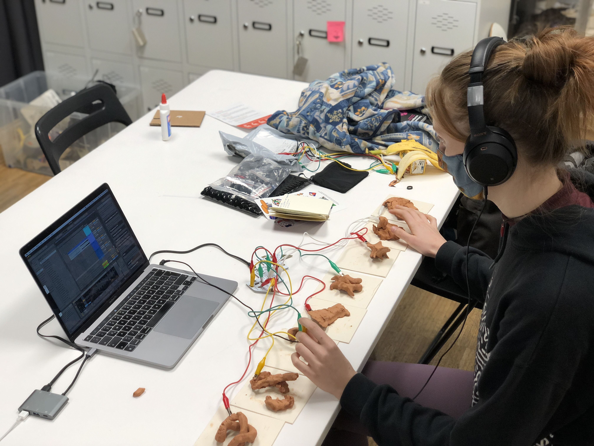

---
hide:
    - toc
---

##### Week 13

#### TERM 2

# Design Studio

**Teachers:**

Oscar Tomico

Tomás Vivanco

Mariana Quintero

#### Goals for the second term:

-Grow our community

-Project bottoms up

-Refine personal Identity

-Learn of new materials and tools

#### Three learnings from the first term:

##### 1. The Magic machine. 

The magic machine exersice looking it from now, was a groundbreaking exersice for my journey. In a way, it make me define from my own consciousness, what are my actual interests, and what moves me from my guts. In that case, i made a machine that makes music and its so simple that it can be played by everyone. So that shows my interest for making musical, technological and simple ways that improve peoples lives.

Also I will use that exercise with my students back in Chile, because to find something that interest us from very deep sometimes is very difficult, and with this tool, it can be much easier, it work different with every people but it was a very insight and successful exercise.

##### 2. 1PP Video

The 1 person perspective video also was a Second exersice that gave to me a lot of learnings from it. 
 Having the focus on only one task for a day is something that i think that i had not experience before, and it give to me a lot of insights.

 The improvisation in the exersice of design, opens a new creative way of doing things for me. My design process starts all the time with a pencil and a paper, seated in my desk triyng to figure things out. In this case I didn´t grab my pen, neither my notebook, just from the moment that I woke up, i started improvising by the normal daily activities. that released me from the "designer" point of view, to the 1PP and participant way of view. So i started doing thing in a very fluid and efficient way, moving from one activitie to another, almost like an artist in his/her attelier, just creating.

 At the end of the exersice, I realise that I had commited my objective, that was creating something physical, from music. So when I complete that, I ended the day.

##### 3. Scale Diagram

The scale diagram that mariana showed us in the weak signals lecture, its the next step from 1PP design, going forward from us in the center, to a global context. I had work with iniciatives that goes from local to global, but with this tool, I realized that the stages in the middle are very important, and that its almost mandatory to make all the steps to move in a bigger or in a down scale.

This level of analizing projects or different subjects, leads to a sistemic way understanding a project in its complete context. 

Also with the content of the recent lecture, we can add another axis to the graph. I have realized that time cannot be lef apart because it is crucial to understand what has happened before, to speculate what is going to happen in the different scales in upcoming futures.

Reflection 1st term

#### What

Investigation about how the intersection of fabrication, design, music and social impact, can lead to new projects in the emergent futures. Understanding the music as an energy that transform our physical world, and Design as a vehicle of  conscient and focused creation with specific people in a specific context.

#### Why?

I find in music, a mysterious way to get things done. Some people use it for sports, some other for relax, and some other just to enjoy. In my case, I play electric guitar, experimenting and exploring sound. Also i come from a family of Musicians, My grandfather was an orchestra director back in Chile, and also a cultural gestor, funding the juvenile orchestra foundation for kids with low resources. thats where i saw that music can change peoples lives.
The same kind of impact I noticed in design when I worked with young people with Epidermolysis Bullosa (Butterfly skin) developing products to improve their daily life. Noticing that involving in some others life, with simple, low tech and creative solutions,  can make a huge impact in their way of living.
So in this investigation, im crossing two things that I love, Music and the physical world of design. 

#### Now what

Now it’s time to summarize all the learnings and experiments that I have made in the first term and reflect about it.

It’s necessary to find and activate the community where the project can affect in a positive way or make a real impact.

At first im looking for musicians that are interested to collaborate with this in an experimental way. Also looking for places, clubs, foundations, etc, that gather this kind of people, and are interested in non traditional ways of showing a music spectacle.

Designers, Sonar artist of materialist, are some other people that I would like to connect with, Because it would be a great opportunity to collaborate and enrich the process.

#### Comparison with past actions

In first term, I made 7 experiments that relate low tech, music, energy, frequencies, fractals and materials. It was an interesting straight forward process, where I open the relation of music and fabrication. All of the experiments were made by me, in my studio. So for the second term I will aim to involve more people to this process, to hear opinions, look for comments, and co create something. Understanding that the music and creating experience is more rich, when it is collaborative.

#### what if questions

-What if I connect with musicians and artist in a local intervention?

-what if I use a self made piece of music to fabricate something.

-What if I look for this relation in urban spaces?

-What if I connect people to create this things in a distributed way(Online)

-What if I use AI or other systems to automatize the process of creation?

-What if I make a public design intervention, using using to materialize something?

-What If I work with people who don’t have nothing to do with music?

##### Design Intervention 2.0

OPEN JAM

The second version of the design intervention will be to enable people to create, record, and reproduce music easily, accesible, by creating a stand alone open source system without the need of a computer or any complex and expensive device or software.

**Communities:**

The community search is open wide to three main subjects, Music exploration, nature and tech projects, and audiovisual installations, where is a interaction between the musical work and people.

Related to people, I have found that I have a lot of musical connection with people in Barcelona, Some profesional musicians, and people that I had work with, in musical instruments.

Also I had added music spaces that will be able to collaborate to make a public intervention, near my house. In gracia, there is a place called, Soda acustic, where every thursday, they make an experimental music session, just before jams sessions.

State of the art:

Analyzing my music making devices.

I had made a quick tryout with one challenge, wich would be the easiest way to create/record music with more people. At first I had tried with an synth, the OP-1, that is a multitrack, self sufficient device for creating music.
It enables to record, sample, and modify each track like the old 4 tape recorders.
With the interaction of my classmates, I had noticed that is not that easy to encourage people to create music, if the instruments are made for one person use. Also that the process of playing with sound, sometimes can be even anoying if someone is working in a different thing, So maybe the classroom is not the best place to experiment with sound.

From left to right: 1.Boss Loop Station, 2. Zoom audio interface and recorder,3. Pocket operator rythm.

This devices are the simplest devices that I have to make and record a musical piece, with the loop. its possible to create a track in a specific amount of time that repeats everytime, and it allows to record or erase another track, just pushing the lid. With the recorder its posible to obtain any sound from the environment, to people looks very appealing to record their voices and play with loops. Finally with the PO, its possible to create rythms by just pushing those buttons.

This is a sample of a piece of music created with these three devices:

The cons of useing this kind of devices is that they run on battery, the are pretty expensive, and no one is open source, they use a lot of non recyclable parts, and they are closed hardware, So there is an opportunity to develop this kind of musical devices and re-thinking them to be used in different contexts.

**Opening Communities.**

I went to find a music space that is open to artist, so I found "Nocturna Discordia" in soda acoustic, a music bar in my neighborhood, Gracia.

Nocturna Discordia is an instance where experimental Music is welcome, they had opened that space since 2012, So its almost 10 years where there has been experimental music, artists, and creators.

I went to a concert to experience what nocturna discordia was about, And for my surprise, was actually very interesting and nice. They were a group of musicians that were improvising and they didn’t new between each other before, so the result was also very interesting. because was fully improvisational.

(foto musicos en nocturna discordia)

After the concert I talked to the vocalist, she was very nice and friendly, I told her was I was doing and she told me about new places like hangar.org or la escosesa, in Poble nou. 

Th other guy that I talked, was Andrés, he is the organizer of the event, and he was very interested and open to see what we were able to do there. I talked him about the plant b project, and we agreed that I have to send him some material, and set a date to play there.
For next steps I will go to hangar and la escosesa so see what we can do, or collaborate.

**Making a Looper machine with Chris**

We manage to build a DIY collaborative looper stations called OPENJAM BOX, using raspberry Pi and youtube tutorials to make it work.

Our goal was to build some musical project that would be easy to build and program, and we manage to find the tutorial for a multitrack looper. and we transformit into a looper that enable more people to create music together, so the initial design is meant to be used by four people, where they can record and play a track.

All info related to the looper is in 

https://github.com/chris-ernst/fablab-challenge-1

### Intervention Pilot

<iframe src="https://player.vimeo.com/video/685879276?h=7543a17592&amp;badge=0&amp;autopause=0&amp;player_id=0&amp;app_id=58479" frameborder="0" allow="autoplay; fullscreen; picture-in-picture" allowfullscreen style="position:absolute;top:0;left:0;width:100%;height:100%;" title="Design Intervention 3.0.mp4"></iframe>

https://youtu.be/v7L5VUTHf0o

**Planing**

Continuing to exploring my question about the relationship with music and physical realities.

This pilot consist to make an instance were people will modify clay figures related to the music that they are listening.

So this are the planned steps related to the activity.

1.- Bring the clay and guitar(my instrument) to the class.

2.- I will invite the classmates to sit in front of three or four clay balls, and I will guide them through to tell them that the can modify the pieces while listening to music, so each figure will represent a moment.

Also I will ask them to be "blind" to make the sense of listening better.

3.- It should be some classmate that would help me to record this intervention.

4.-I will record each track to use it later with the fogures.

5.-The results will be documented in pictures with collab and 3d scanning and printing.

6.- The final result will be a collaborative and meaningfull series of objects.

**Why Clay**

Clay is a natural and noble material, it has amazing properties and its very easy to work, also this kind of clay, dries in almost one day, so for working by hand and keeping its shape is a very usefull material for this exercise.

**Preparing the setup**

For the setup, I used the MDEF room, that has space for playing and 10 people aprox, to sit and gather arround. Thanks to Manu and Lina, the team of communication, as they needed to document Iaac projects, they offered to make a nice setup to be recorded way more professionally than I expected, the good thing appart of the result of the audiovisual material, is that it opens a window for MDEF students to document their project in a nice and profesional way.

The material that they will use are these four squares of clay, marked by a 1, 2, 3, 4 dots. each one is for each track so it will be easy to diferinciate and group it later.

**Playing Music**

For playing the music I used my electric guitar, as my main instrument, followed by a set of guitar pedals that able the guitar to shape its sound with different effects, like reverb, pitch, freeze, overdrive, a looper, etc. All the Audio goes through a recorder to have the audio in good quality, and then to a guitar amp that can fit the room, to have a good musical experience. The sound was tested first to have good settings for the ocasion.

**Music Parameters.**

As I was aiming to make people mold figures out of clay, I knew that the result will be arround 35-40 figures, and that result should be comparable and analyzable, so I added four simple parameters(Pitch, Duration, Timbre change, Loudness) for the music to "conceptualize" and compare the result later with these previous concept. So each track is in a way guided by these four parameter.

Track 1/ Pitch

<iframe width="100%" height="300" scrolling="no" frameborder="no" allow="autoplay" src="https://w.soundcloud.com/player/?url=https%3A//api.soundcloud.com/tracks/1224512260&color=%23ff5500&auto_play=false&hide_related=false&show_comments=true&show_user=true&show_reposts=false&show_teaser=true&visual=true"></iframe>
<a href="https://soundcloud.com/joaquin-rosas-sotomayor-14875730" title="Joaquin Rosas" target="_blank" style="color: #cccccc; text-decoration: none;">Joaquin Rosas</a> · <a href="https://soundcloud.com/joaquin-rosas-sotomayor-14875730/pista-1" title="Pista 1" target="_blank" style="color: #cccccc; text-decoration: none;">Pista 1</a>

Track 2/ Duration

<iframe width="100%" height="300" scrolling="no" frameborder="no" allow="autoplay" src="https://w.soundcloud.com/player/?url=https%3A//api.soundcloud.com/tracks/1224512908&color=%23ff5500&auto_play=false&hide_related=false&show_comments=true&show_user=true&show_reposts=false&show_teaser=true&visual=true"></iframe>
<a href="https://soundcloud.com/joaquin-rosas-sotomayor-14875730" title="Joaquin Rosas" target="_blank" style="color: #cccccc; text-decoration: none;">Joaquin Rosas</a> · <a href="https://soundcloud.com/joaquin-rosas-sotomayor-14875730/pista-2" title="Pista 2" target="_blank" style="color: #cccccc; text-decoration: none;">Pista 2</a>

Track 3/ Timbre change

<iframe width="100%" height="300" scrolling="no" frameborder="no" allow="autoplay" src="https://w.soundcloud.com/player/?url=https%3A//api.soundcloud.com/tracks/1224513712&color=%23ff5500&auto_play=false&hide_related=false&show_comments=true&show_user=true&show_reposts=false&show_teaser=true&visual=true"></iframe>
<a href="https://soundcloud.com/joaquin-rosas-sotomayor-14875730" title="Joaquin Rosas" target="_blank" style="color: #cccccc; text-decoration: none;">Joaquin Rosas</a> · <a href="https://soundcloud.com/joaquin-rosas-sotomayor-14875730/pista-3" title="Pista 3" target="_blank" style="color: #cccccc; text-decoration: none;">Pista 3</a>

Track 4/ Loudness

<iframe width="100%" height="300" scrolling="no" frameborder="no" allow="autoplay" src="https://w.soundcloud.com/player/?url=https%3A//api.soundcloud.com/tracks/1224514093&color=%23ff5500&auto_play=false&hide_related=false&show_comments=true&show_user=true&show_reposts=false&show_teaser=true&visual=true"></iframe>
<a href="https://soundcloud.com/joaquin-rosas-sotomayor-14875730" title="Joaquin Rosas" target="_blank" style="color: #cccccc; text-decoration: none;">Joaquin Rosas</a> · <a href="https://soundcloud.com/joaquin-rosas-sotomayor-14875730/pista-4" title="Pista 4" target="_blank" style="color: #cccccc; text-decoration: none;">Pista 4</a>

**Modeling**

As I started playing the music, my classmates started with their eyes closed, using clay with hands, I think I didnt tell that they could be able to use others parts from their bodies, but for the fist iteration its super interesting about how the initial format, standarise the final result. Also is very interesting that some results are almost the same, I didn´t realize if they were looking each other, but its very interesting to see some similar results from different persons and melodies.

**Comments and observations.**

Classmate 1:

I felt like the **music was shaping the way I moved and flowed through the clay**. At times being a bit more shy and just touching with my fingertips and suddenly embracing all the clay with a more intense rythm. 

With the second melody I felt like the more prominent sounds were creating spontaneous mutations in my clay sculpture and playing a bit more with pitches. 

For the 3rd one I was a bit more **anxious** because of the music and the clay helped me release that tension and absorb it. I expressed it with the form of texture making. Pinching it more and squishing it hard. 

For the 4th one I felt like a continuous shape was emerging and continuously changing as well. I found **my fingers were following the beat** as they went through the surface of the clay. In this way modeling a very rough and textured piece.

Classmate 2

- variations in each soundscape were great. I enjoyed not knowing what would come next.
- it would be interesting to change the seating configurations of participants and performer/sound. Like what if we were sitting in a circle around the sound, with the plants, etc.
- also at some point I wanted to move my body but didn’t have the space to.
- **the shape of the clay pieces you started** with determine the initial way we interact with it. Whst if you started with balls not flat squares?
- **The experience was powerful with my eyes closed** but also at some point I became self conscious because I was aware of the cameras around me. 

**Results**

<iframe src="https://player.vimeo.com/video/684227090?h=d5e365475a" width="640" height="564" frameborder="0" allow="autoplay; fullscreen" allowfullscreen></iframe>
 Set of figures, related to its sound.

Track 1/ Pitch

Track 2/ Duration

Track 3/ Timbre change

Track 4/ Loudness

Relations founded between shapes.

Tubing

Spheres

Typo

Sheets

parametric

**Analisis of the clay figures**

*Shape:* The shape in the four tracks look very different from each other, there are some determined by bassically shapes( cubes, long strips, balls, spheres, cones, etc.) Also there are some random shapes, or figurative like the monster.

The first group in average are almost one single shape or a solid geometry, maybe because the first track is more melodyc and harmonius, than the rest, and that can be related to geometric or simple shapes.

The second row of clay objects looks more expansive,as I was playing with the pitch,  sowing some defragmentations, and also main shapes.

The third track was about timbre, si that was the most "bizzare" and sometimes akward or uncomfortable for some people, so is very possible to see in the clay figures some actions, like squeezing the object on the surface, showing that the participants were using much more strenght to create that kind of shapes, related to the other tracks.

The fourth track(loudness) has some very interesting results, because one were the same for different people.

*Actions:*

Press, Roll, Compress, tubing, breaking, joining, graining, laminating, hit, round, poke, flat, fit, expand, divide, pull, wait. breathe.

**Playtronica+Clay**

The interesting thing of the clay result, is that it is possible to make an instrument from it. Using the playtronica board, its possible to make music using conductive objects, to make dry clay conductive again, it was necessary to wet the piece a bit, ass the times passes by, the clay will dry again and will continue its conductivity in arround three hours.

*As the clay was dried, at first it was not conductive.*

*A shot of water would do the job of making the clay wet again:*

*With the track 1, was possible to play different sections of the track using ableton live and playtronica.*

**Infinite loop**

One interesting concept is to make the process of creating music and fabrication, almost in a loop.  because its starts from the guitar, then to the clay, and the clay becomes the instrument again, so in a way, the process becomes evolving and infinite.

-Created track using clay pieces.

<iframe width="100%" height="300" scrolling="no" frameborder="no" allow="autoplay" src="https://w.soundcloud.com/player/?url=https%3A//api.soundcloud.com/tracks/1224552016&color=%23ff5500&auto_play=false&hide_related=false&show_comments=true&show_user=true&show_reposts=false&show_teaser=true&visual=true"></iframe>
<a href="https://soundcloud.com/joaquin-rosas-sotomayor-14875730" title="Joaquin Rosas" target="_blank" style="color: #cccccc; text-decoration: none;">Joaquin Rosas</a> · <a href="https://soundcloud.com/joaquin-rosas-sotomayor-14875730/grabacion-usando-arcilla" title="Grabacion Usando Arcilla" target="_blank" style="color: #cccccc; text-decoration: none;">Grabacion Usando Arcilla</a>

**Conclusions and whats next.**

-Closing the loop.
To create something tha3t can turn into somethign else, is very interesting, because its a circular process that in a way emulates the process of nature, that can be repeated or reproduced many times, and also makes it a living system.

-Sensorial and meditation experience.
For some participants, this intervention was an experience, a moment to forget everything, or just a moment to use hands and interact with clay, I didnt predict that kind of things would happen this time, so is interesting to observe that the things that we do have unexpected consequences. 

-Wide possibilities

Exploring with music and materiality, or fabrication, is very interesting and can be almost infinite, so its neccesary to focus the investigation with some context, to dont loose the focus and to drive into more complex project, not only experiments.

-Colaborating with classmates

As these experiments or activities need a bunch of people and infrastructure, that enable people that can interact, the Fablab of mdef room is a good laboratory to explore these kind of things.

-Importance of "open planning" and documenting.

Thanks to the planning of the intervention, everything worked pretty well, and the good thing is that was almost impossible to predict the results, but having the concept or the idea planed, make things much easier, to keep going through the project.

Real Time.
The clay at it get stiff, has a certain period of time to be modified or to interact with, and as im interested in the relationshipo beetween material and music, would be very interesting to explore how this interaction can be happening in real time.

**Design Dialogues preparation**

1. WHAT. Make a clear list of what you will show at Design Dialogues - personal project, group interventions, fab challenge outputs.

For design dialogues, I will present all the exploration that I havee been doing relating music and fabrication.

1)Physical: the clay shapes  builted by classmates 
the playtronica board connected to the clay pieces, to enable people to play with that.

Arduino with pure data to be usable

3) Kinect with interaction with grasshopper and the body

2)Audiovisual.
Videos of different process

3)Colab, loop station with Chris.

4)FabChallenge:

2. WHAT2. Prepare a clear and simple statement on your presentation at DD, what is your purpose, vision and mission. We will use this to co-curate the projects, so ensure that it reflects your project from a communications perspective.

Purpose:

To exhibit and experience the process of my exploration through the subject "Music, fabrication and the physical world."

Vision(simplificar)

the creative community he circular phenomenom of objects created by listening to music, and how this objects can turn into musical instruments again to play the music that they were created by.

Mision:

make creative tools, machines,and different technologies to enable the community that will be interacting in this exploration about the intersection of music and physical realites.

3. WHY Make a clear list of your aims for the DD session. Remember, DD is an extension of your project work and serves your exploration. What do you want to gain insights, feedback on, or perhaps test at the DD?

The main objective of the design dialogues presentation is to demonstrate the relationship beetween sound, music and the physical world, and start a conversation around it. In this case, the feedback is very important because, it will shape the course of the project to a context and more specific subject. 

4. WHO Clearly and concisely identify your target stakeholder/s for DD. A design intervention is a design action done in context and in collaboration with outside people, communities, companies or institutions. Your DD experience must expand on this to explore possibilities, prototype with experts, co-design, create participative activities, gather feedback, insights etc. You must clearly identify and engage necessary stakeholders.

Music profesionals, plastic artist, designers from fablab, architects.

I will invite people from hangar, and some other experimental sound places, or musicians from barcelona.

The idea is to have a realtime instalation that enables people to create something at the same time that music is created.

5. HOW Draft of how you plan to achieve the above for your personal and/or group showings. What mechanisms, artifacts or short processes have you imagined to support you in achieving the aims you have? EG. Do you imagine showing videos, a small exhibition or performance? Have you thought of producing a survey, in-person feedback or inviting members of your community to be present?

It would be great to have an interactive instalation where people can walk and blend with the installation, without any explanation. and then it should be great to recieve feedback from them.

Also the loop station made with Chris is a collaborative instrument, that enables people to create their own beats, so in a way, that object is allready an interactive piece that can be shown and used by the users of the intervention.

