---
hide:
    - toc
---

##### Week 14

## Exploring Emergent technologies.

**Teachers**

 Lara campos
 Laura freixas
 Dafni

#### Sesion 1

*Lara Campos*
*Laura Freixas*

At the first session, she shows about her projects, related about designing and creating bio materials.

Be growed: fabricademy project, related to the concept how almost anything, is clothes that have seeds and material that allow to grow grass-weed in

Ceggmica: Eggshell and ceramics material for designing products.

Remix, el barrio: Award winning project that aims to gather local communities working with local waste with transdisciplinar design.

Antopocene geology

From Bauhaus curriculum, to Krebs cycle of creativity of Neri Oxman.

She aims to question our interaction with materials, Re-design of materials, customize properties, and mixing it with contemporary process.

Material/Culture/Nature

Reflection 
Sesion 2

We manage to cook diffent recipies of biomaterials.

#### Agar Agar:

I had worked before with agar agar, mixing it with more organic waste, like coffe, corn starch, and different peels. The thing I didnt know is that here in spain its also a very abundant product in the coast, so its not something that is imported and not local, that is great for the environment, and also a potential resource.

#### Alginate:

I had worked with alginate before, but I didnt notice that it is possible to work with it in different formats, as people use it in molecular food, making it react with another components, it gets hard by time.

#### Pine resin:

this is an interesting binder that I had never used before. It is very interesting because the difference between Agar Agar and gelatine, is that it dries very fast and doesn't shrinks very much as the other ones, And that is pretty good for design purposes, because the shrinkage percentage is crucial to any design desition.

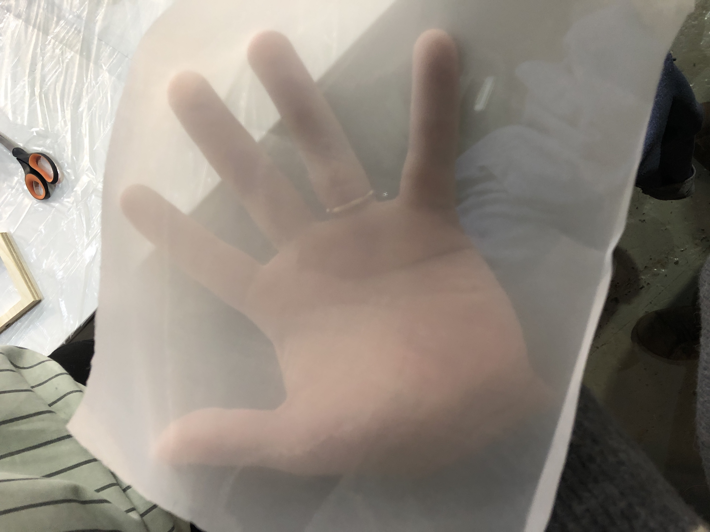

fabric used for agar agar and gelatin moulds

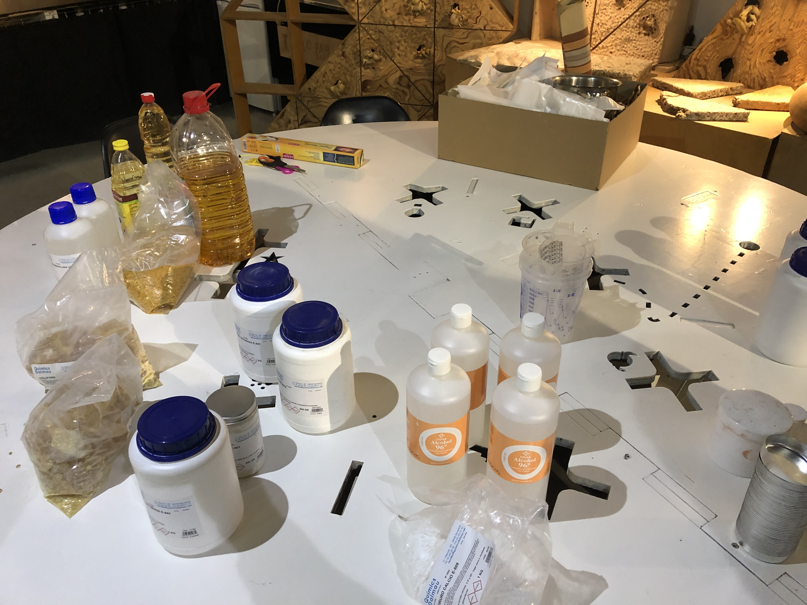

Materials and ingredients used ion the process

Pine resin mix with Coffee

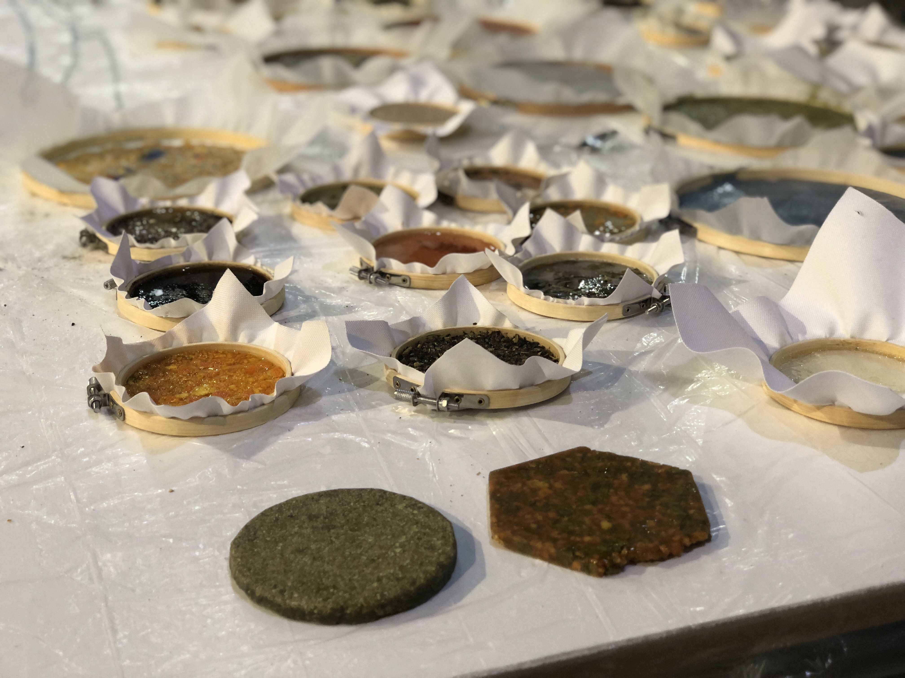

Biomaterials samples cooked in the second sesion

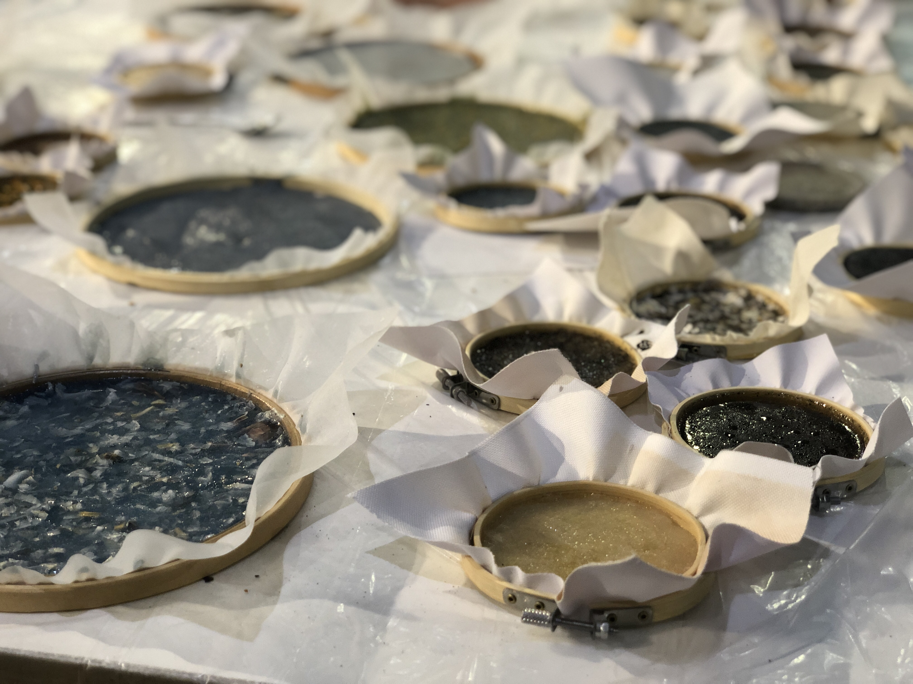

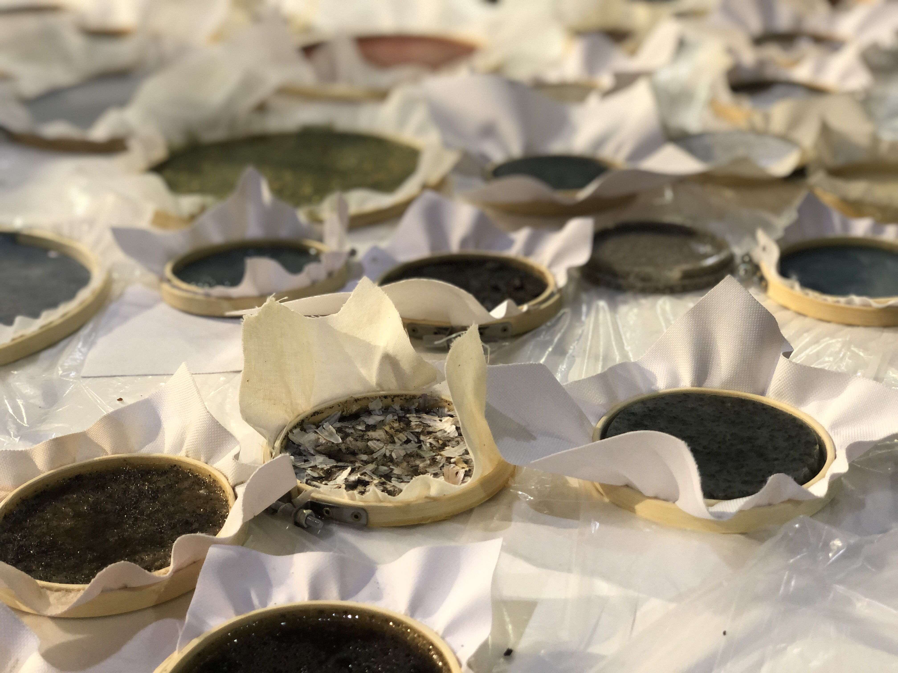

The fabric is used for the material to stick and don't shrink that much.

**Properties of the material.**

I chose the material made with pine resin and wax recipe, mixed with organge peel.

At first it looks very interesting because depending on the grain size, its possible to identify the orange and yellow color of the peel, thats is interesting because it makes the appearence of the material unique. 

I tried to smell the material as well, because as it is made of orange, its suposed to smell like orange peel, But with time that smell goes away, I think that is because of the pine resin that has its own smell and properties. The mechanical properties are not that high, with a bit of strenght the material breaks easily.

As its made with hand preasure, it has one side much slipery than the other, that its parameter to consider while its being fabricated.

It would be very interesting to see how this material can resemble the orange smell nice propertie, because is something that is very common for almost everyone that eats orange, so the material could gather meaningfullnes by its smell and memory.

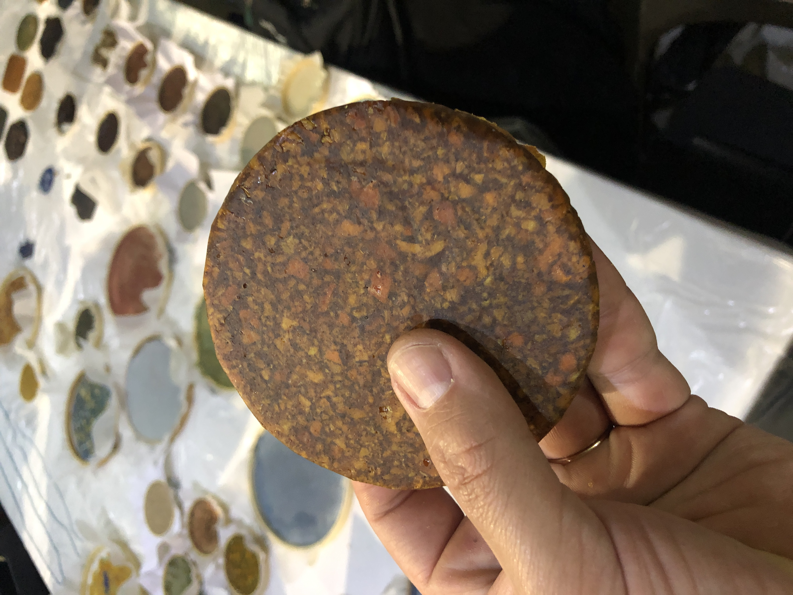

**Material designers and projects.**

#### Squeeze the Orange

Research of biomaterials from orange peel.

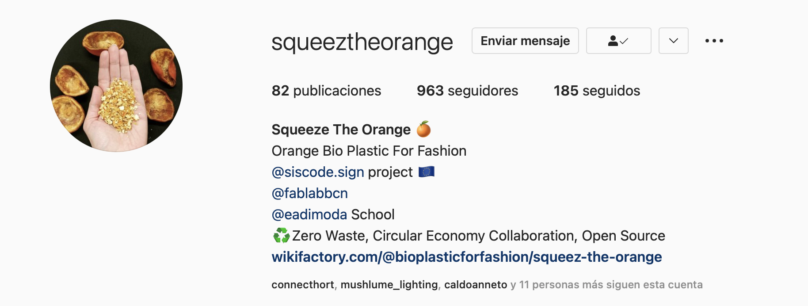
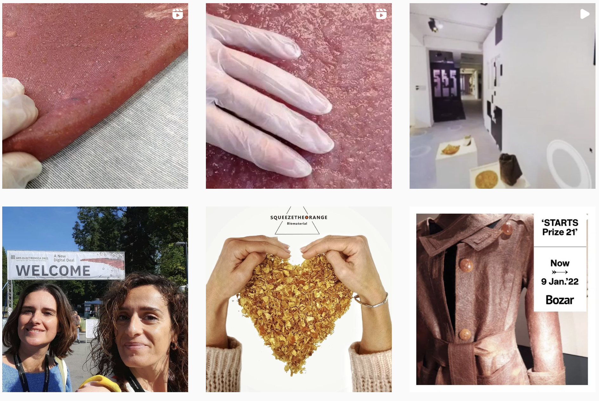

#### Materiom

Open source Biomaterial Library.

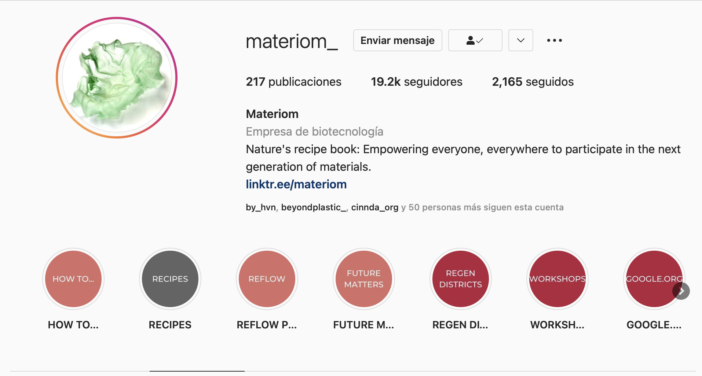
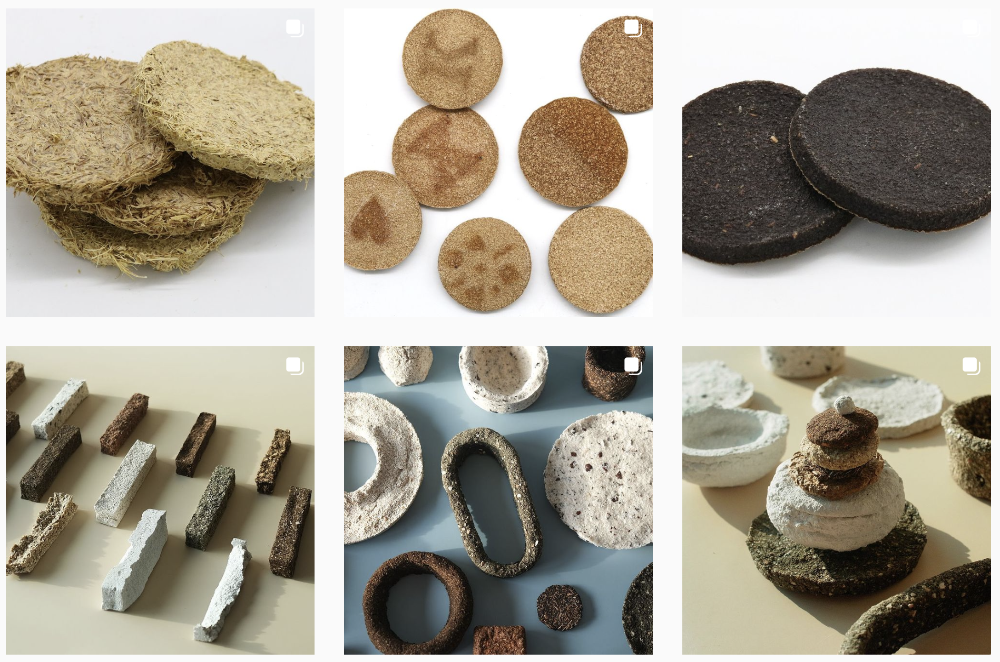

#### FabLab U. de Chile

Research of local waste and developing technologies and tools to go further with biomaterial fabrication.

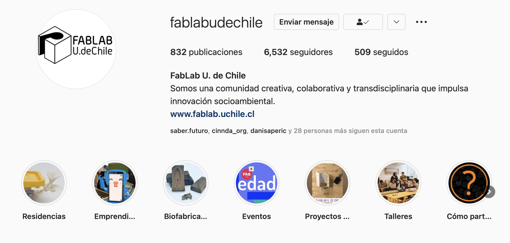
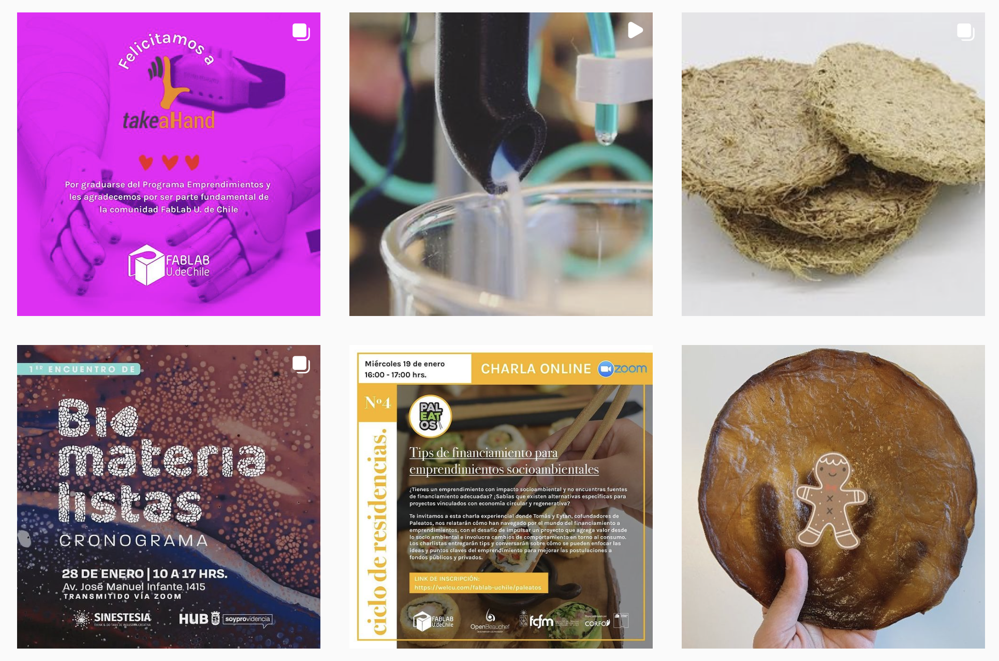

**Breadcrumbs waste as a material.**

Me and José did an exploration with bread crumbs, agar agar and pine resin. 

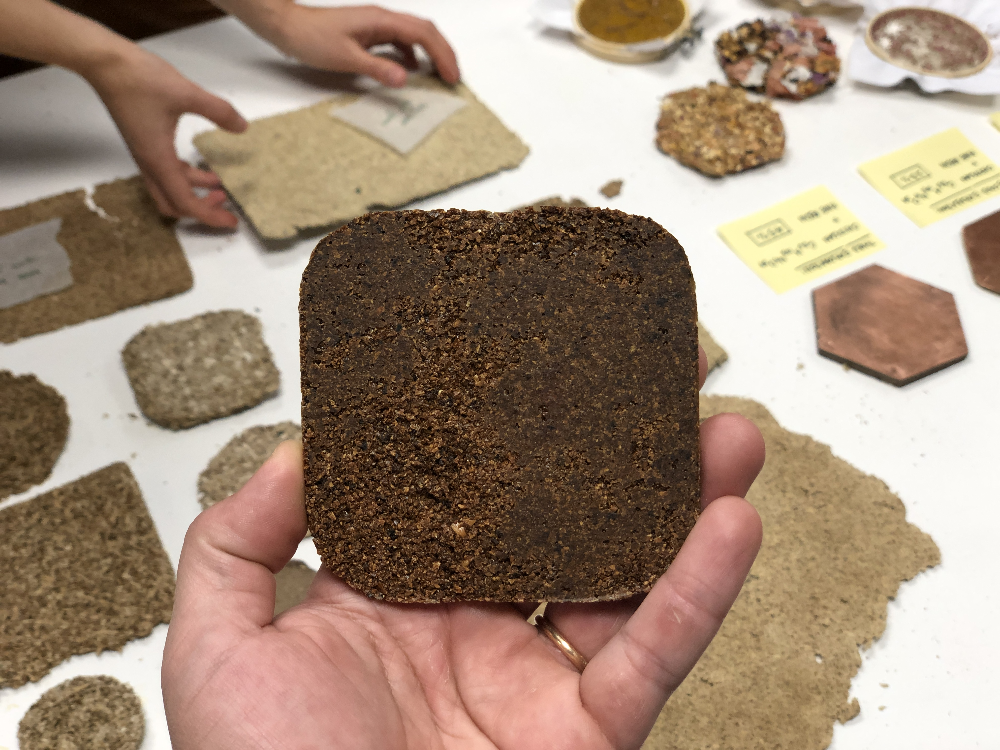
*Sample of breadcrumbs and pine resin*

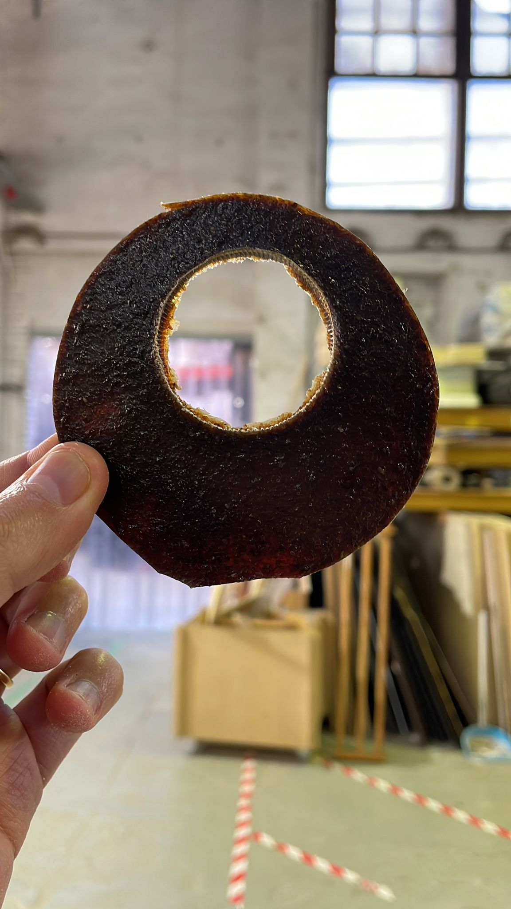
*Sample of breadcrumbs and agar agar*

We figure that as we are working with food, the possibilities of reusing bread crumbs are on the same path, as agar agar is also edible, we made  the sample with a hole in the middle, so it has the possibility to be hanged in trees, to give it as food to birds in the eighborhood.

Its interesting to see that just "relocating" the waste to the same purpose can have a nice way to impoact the environment, in this case it has the possiblilty to atract pidgeons to places that are not that crowded.

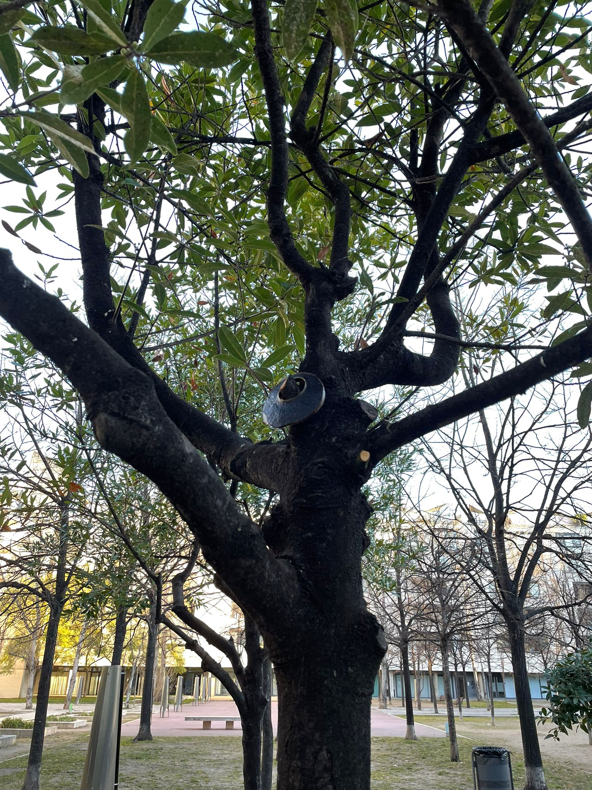
*Agar agar sample hanging in the tree*

More info of the project of Bread Crumbs can be founded here:

https://docs.google.com/presentation/d/1bfWTQE6fajpcnCwdZSG8ggF9suYxF7SznpOskbxr8sU/edit?usp=sharing

**analizing properties and future aplications.**

The samples with both mixtures were very different, the one with pine resin was very hard but easy to brake, and the one with agar agar, as we managed the amount of glycerin, it was pretty flexible, and resistant, but that sample also shrinked much more than the pine resin one.

We will continue to explore the mixture with bread crumbs, because we think that is a very good oportunity to use local bakeryes waste, as In Barcelona, eat fresh bread is very common, almost all bakeries have the machine to cut the bread, so its possible to get from almost all bakeries.

#### Reflection:

This Sesion has been interesting to my biomaterial knowledge, because it has been great to see my peers working and creating with this kind of materials, and exploring new ways of directing biomaterial research.

Its also very nice to see that there are so mamny projects in development related to biomaterials here in Europe. In Chile its a recently interest from fablabs, universities, and local designers, to investigate and do real projects with this kind of materials.

There is also a very interesting aproach to design with biomaterials, that is the MDD(Material driven design) Methodology. that would be great to add to this lessons, because it leads to people to create new kind of biobased products, understanding its visceral and symbolic aproaches to material design. thats a way to reach to new kind of products, and not only replace the ones that allready exist and make it with biomaterials.

The next step in my opinion should lead this investigation to bioproducts, or to acctually design with this materials and its properties. Back in Chile, with the team of Fablab U. de Chile, we developed a Biofabrication Node, where we develop a series of machines that would able peole to design and fabricate in a standarized way, not just cooking biiomaterials, but acctually understandign their properties and meaning, to reach similar results all around the world.

