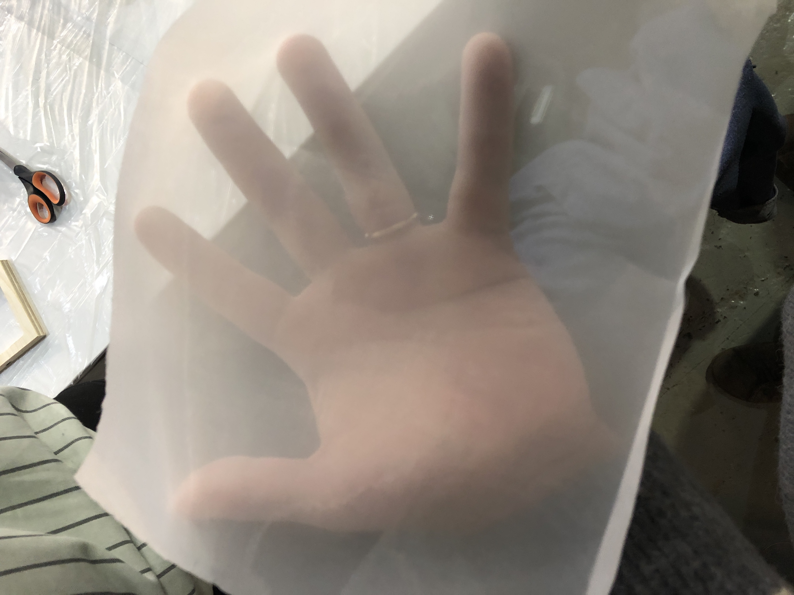
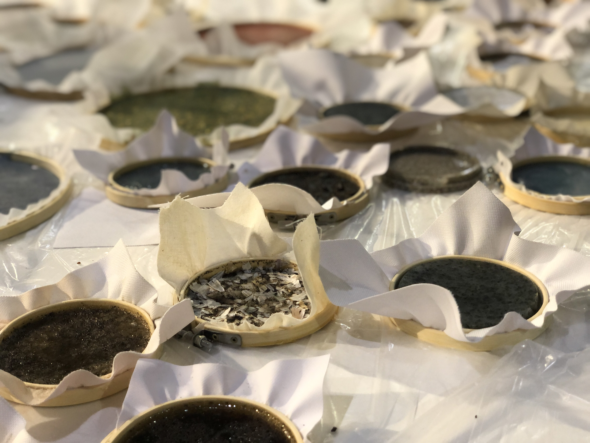
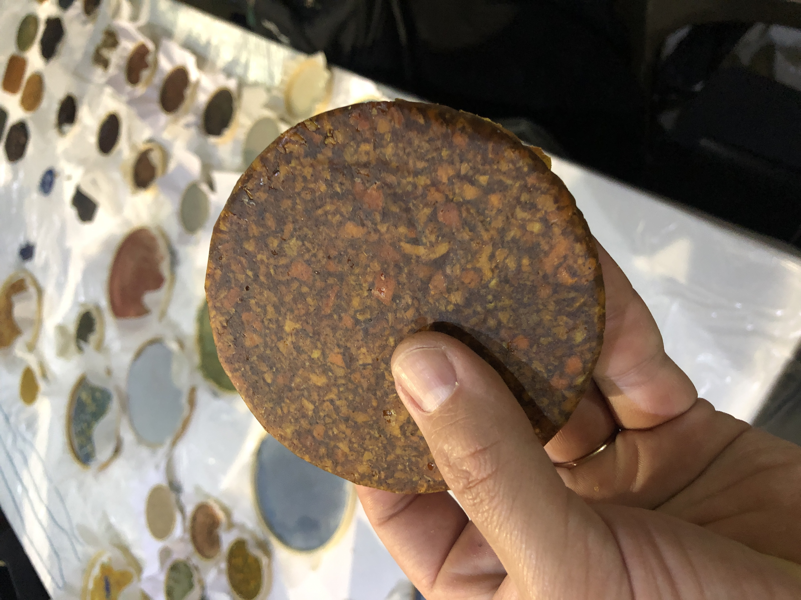

---
hide:
    - toc
---

##### Week 14

## Exploring Emergent technologies.

**Teachers**

 Lara campos
 Laura freixas
 Dafni

#### Sesion 1

*Lara Campos*

At the first session, she shows about her projects, related about designing and creating bio materials.

Be growed: fabricademy project, related to the concept how almost anything, is clothes that have seeds and material that allow to grow grass-weed in

Ceggmica: Eggshell and ceramics material for designing products.

Remix, el barrio: Award winning project that aims to gather local communities working with local waste with transdisciplinar design.

Antopocene geology

From Bauhaus curriculum, to Krebs cycle of creativity of neri oxman.

She aims to question our interaction with materials, re design of materials, customize properties, and mixing it with contemporary process.

Material/Culture/Nature

Reflection 
Sesion 2

We manage to cook diffent recipies of biomaterials.

#### Agar Agar:

I had worked before with agar agar, mixing it with more organic waste, like coffe, corn starch, and different peels. The thing I didnt know is that here in spain its also a very abundant product in the coast, so its not something that is imported and not local, that is great for the environment, and also a potential resource.

#### Alginate:

I had worked with alginate before, but I didnt notice that it is possible to work with it in different formats, as people use it in molecular food, making it react with another components, it gets hard by time.

#### Pine resin:

this is an interesting binder that I had never used before. It is very interesting because the difference between Agar Agar and gelatine, is that it dries very fast and doesn't shrinks very much as the other ones, And that is pretty good for design purposes, because the shrinkage percentage is crucial to any design desition.

fabric used for agar agar and gelatin moulds

Materials and ingredients used ion the process

Pine resin mix with Coffee

Biomaterials samples cooked in the second sesion

The fabric is used for the material to stick and don't shrink that much.

#### Reflection:

This Sesion has been interesting to my biomaterial knowledge, because it has been great to see my peers working and creating with this kind of materials, and exploring new ways of directing biomaterial research.

Its also very nice to see that there are so mamny projects in development related to biomaterials here in Europe. In Chile its a recently interest from fablabs, universities, and local designers, to investigate and do real projects with this kind of materials.

There is also a very interesting aproach to design with biomaterials, that is the MDD(Material driven design) Methodology. that would be great to add to this lessons, because it leads to people to create new kind of biobased products, understanding its visceral and symbolic aproaches to material design. thats a way to reach to new kind of products, and not only replace the ones that allready exist and make it with biomaterials.

The next step in my opinion should lead this investigation to bioproducts, or to acctually design with this materials and its properties.Back in Chile, with the team of Fablab U. de Chile, we developed a Biofabrication Node, where we develop a series of machines that would able peole to design and fabricate in a standarized way, not just cooking biiomaterials, but acctually understandign their properties and meaning, to reach similar results all around the world.

