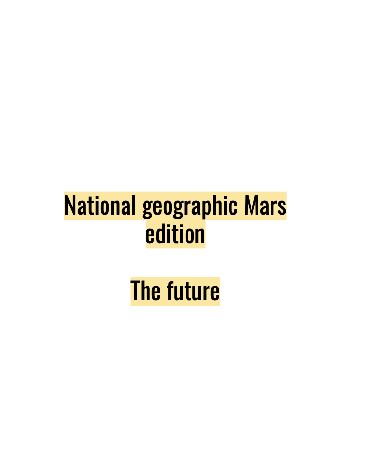

---
hide:
    - toc
---

##### Week 12

## Design for next Billion seconds.

**Teacher**

 Andres colmenares,IAM

#### Futures as plural

We started talking about the Futures, and why this has to be a "plural" concept rather than a singular one. The  number of possible futures is endless, so we have to be concient that its not a singular one.

Definition of futures for me: A vector or a direction that sometimes we take for granted, we dream of, or we chase.

Definitions for my classmates:

Collective result of actions/Energy/a cone that it stretching out/presents that are going to be/ Collective desire/ something that we imagine/ The future is only in our minds.

#### The everything manifesto

https://medium.com/iam-journal/the-everything-manifesto-a-thought-experiment-for-the-next-billion-seconds-bcd9b9c938dc

#### General concepts:

Definition of everything
Sistemic changes rather than solutions
Climate emergency rather than climate change
We are citizens with rights and responsabilities.
The ones that have more, have more responsabilities in our society
Design for solidarity.
Words change worlds

#### Definitions:

#### WTF in internet:####
 The internet for me is other level of consciousness of the human being, because it makes possible the connection between humans, (in a very fast speed) independently where you are. It has the bad thing is that it gives me the feeling that internet is embodied to ourselves, so we can’t live without it anymore. In that case I think that it has become part of the humanity itself, and the devices that we are using right now are going to be more and more embodied till we became one thing only.

#### WTF is Time: #### 

Time for me is a verbalization of existence, that we as humans have named for ourselves, to give some order in how we go in a civilized way, for organising daily activities, or just wake up in the morning, in a way, time it's a way of how we measure our existence and life.

#### Exercise 1:####
Imagine yourself in the next billion second and answer this questions.

**A day in my post technological life**

How young will you be in 2052?

Think about your morning routine.. What can change?

What are you having for breakfast?

How would you like to move around?

What other kinds of occupations can exist? How do we create and exchange value?

What are you eating?

E-commerce is a huge thing today… how can it change?

How is your social life?

What’s on your mind before turning off?

What kind of topics will you be reading about?

If you have 3 more extra hours “Every now and then say WTF!” ;)

#### New concept of Time, TedX

We are circadian organisms that function with the power of the sun, in some places it work that way, but now we are disconnected from that concept so much, that we don't make a good use of resources because of that. We spend a lot of energy iluminating our nightlife, much more that woring about living with the natural life of the sun. In a case, the other "kingdoms" work with their circadians cicles naturally. Plants, insects, mushrooms, averyone has its own rythm of life. As technology goes forward, we are even more far from our cycle because of the human interference and our definition of time and productivity. Since we are childs, we lear that time is priceless and that we have to make it profitable. 

" To live in harmony with nature we should harmonise with it"

#### The great awareness
Andrés Colmenares

Its a tale of Andrés, talking about the present and futures, how technology and socio-political subjects have changed over time and over our own imagination. In the tale, he talk about longer life, a new pandemic, migrants issues, crush of networks, hibernation, capitalism, and fall of the power.

#### The Geat Silence

It is a very interesting article about a parrot communicating with humans, the great silence make a direct reference to extincion of species, and how in a way, humans are headed in that direction. How loosing language, rituals, tradition, take us to direct failure about ourselves, because we tend to think that we are unique, and that we are more valuable than any other organism.

With the Fermi paradox, the great silence also makes allusion to outer space life, and if there is life outside, for protection, they are been avoiding contact, because of selfcaring from humans.

#### Letter to 1990

In this exercise, we had to write a letter to someone in the 90's.
I choose my father, because he was a huge fan of time, technology, science fiction, and a lot of things that now are very different of how he imagined would be. In the letter I

To Felipe

###### *Hello Bold man !, I'm sorry to tell you but in the future you will be Bold. I am Joaquin, from a billion seconds in the future. I know you are good at calculations, but to save you work, it is about 30 years.*######

###### *Can you imagine wanting to have a video chat with someone anywhere in the world, whenever you want? Just look at your briefcase that you use to call Drina, your wife, or Octavio at your work, that heavy thing that must have cost you a lot, that you surely brought it from the USA, (that continues to happen today). Now imagine that this briefcase is a device that is the size of the palm of your hand, it is rectangular, with a color touch screen and you use it with your fingers. Now with that device, being much more powerful and faster than the PC windows you use, you can surf the Internet (almost at instant speed), take photos, watch videos, imagine! You can connect with all your friends that you stopped seeing. You must be thinking, that we are like in Star Trek, but don't worry, there's a long way to go for that. Millionaires are beginning to travel into space, but not in ships like the Enterprise at warp speed, but rather phallic shaped ships, similar to a rocket and just to experience zero gravity. What you might like is that we are in a new space race, but to Mars! We're not there yet, but it won't be long. I hope I don't disappoint you.* ######

###### *I know that in Chile they are just returning to democracy, the worst is over. Today if you knew, today Gabriel Boric has just been elected, he is 35 years old, he started as a student leader, he is part of the broad front (similar to the PS but younger) and he has not stopped participating in politics until today. we are happy and hopeful that it will be a better country. The bad thing is that socially we are still the same, half the country thinks that money will save the world, and the other (like me) that we should live in a more just and egalitarian country.* ######

###### *Now I'm writing to you from a bar full of old Catalans, drinking beer and watching a Real Madrid game against Barcelona, although the latter are no longer as good as before, and football is still almost the same, only today there are some referees who review the dubious camera plays, well and the players are getting more and more millionaires. But it is still an entertaining sport to watch with friends.* ######

###### *As you like cars, don't worry, they still exist even though they don't fly yet. They are trying with drones , similar to helicopters with more helixes. Here in Europe the majority are already electric !! There are some charging points in the city, but one can charge them at home too. I move by bicycle, it is still the most efficient and entertaining thing in the city.* ######

###### *The music has also changed a lot lately, (we keep listening to classic rock, don't worry). The new thing is that now there is a digital platform called Spotify, where you can listen to any song, (yes, anyone !!) It even recommends music based on what you listen to. In fact, I have an album there, don't think I'm a rockstar, now anyone can create music from their room and create whatever. Walkmans, cassettes, are a thing of the past, but curiously we continue to listen to music on vinyl, it is a kind of fashion that doesn't make much sense, but as you know, fashions are fashions.* ######
 
###### *I know you are wondering about your field. The agronomy continues to grow, the Chinese continue to buy cherries like crazy, the harvest is now mechanized, despite the fact that many people (mainly immigrants) continue to work almost all day in mechanical work that is still expensive to replace. Surely you are already thinking of something for that. And what carries it today are the fungi, today the Mycelium is being investigated as a construction material, insulation, even as a leather to dress. What madness no ?.* ######

###### *Well, a billion seconds or 30 years can dream a lot, some things like technology advance very fast, even though we don't have big wars, we are going through a world pandemic, which thanks to globalization, affected us all, and made us Realizing that we are a great organism and that we move forward together in this ship called earth, you will imagine that some of us understand it but others still do not understand it.* ######

###### *Now enjoy what you have left with a daughter because I am born early, I am not going to tell you the date to make it a surprise, but I am a Piscis.I love you very much, and see you in a year.Your son.* ######

###### *Ps: you have two grandchildren (from Pindi) Antonia and Santiago, I married a beautiful woman, Angelita. My mother continues to live in Curicó and work at Surfrut, and our Chilean soccer team, U Católica, has been champion 4 times in a row, and the Chilean team won two America cups over Argentina. who would say, we are finally good.* ######

A picture where im writing the letter, a bar in Barcelona, 2022.

**Green growth possibilities**

Talk by Giorgios Kallis

In the talk, giorgios talks about degrowth and its real possiblities in our capitalism society. He talks about a very interesting concept, "Decoupling" that makes reference to  the separation of economy growth to the environmental impact in countries. He shows how the concept of resource vary from different countries and societies.

"imagine an scenario wehere we don't have all the things that we want right now, well, that is degrowth, is that terrible? It´s something that requires drastic redesing and work." If we short the hours of work, maybe there will be more space to more people to be able to work.

The final exercise of the course, is to create a speech from our created government, and how we imagine a specific city in one billion seconds from now.

<iframe src="https://player.vimeo.com/video/666695511?h=a06b784efb&amp;badge=0&amp;autopause=0&amp;player_id=0&amp;app_id=58479" frameborder="0" allow="autoplay; fullscreen; picture-in-picture" allowfullscreen style="position:absolute;top:0;left:0;width:100%;height:100%;" title="wakanda_DNBS.mp4"></iframe>

