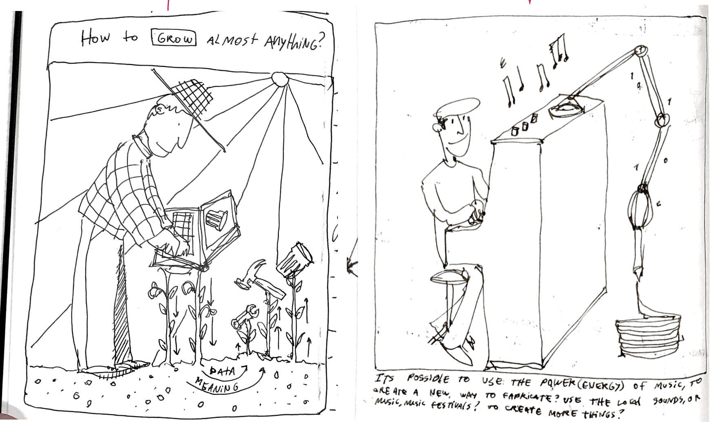

---
hide:
    - toc
---

## Making Sense and meaning

**Teacher**

Tomás Diez

## Readings.

Distributed nature of design

Design as participation

History of the world in seven cheap things

This is distributed design

**Abstract**

At the end of 2015, back in Chile I presented my thesis project, It was called “Make care”, it was a set of 3d printed objects that were made to improve daily task (eating, higene, dress) for young people with Epidermolysis Bullosa( Butterfly skin). At that time I was not aware of the huge impact of what I was doing, The whole process of empathizing and working with someone completely different from you, designing by research, prototying and iterating with digital fabrication, made me embrace and internalize what design means in my life. For me is not only my profesional definition, its a way how I describe myself, being part of my personality, my daily acts, my life choices. Over time I have understand design as a way of living and being ecological(in matter of relation) with the world. In this paper I will show a bit deeply about this project, its impact, and how open and distributed technologies had opened an opportunity for a new kind of projects.

During the last three years, I have worked with very different people, from different countries, disciplines, ages, socioeconomical context, etc. In this journey of multidisciplinary collaboration, I have discovered that design can be understanded as many different ways, as an innovation driven discipline, as an creative statement, as a different way of living, or simply as a creative tool to develop something or to solve a problem.
In that context, I had realized that design can ́t go alone in the seek of the solving problems, or improve peoples lives. Its crucial and necessary to understand that we(designers) are allways part of a community, or a team that goes forward in group than alone. We are the creative and radical piece of the network, that drives the seek for new ways of tackling life.

I see in design/designers an amazing capability of change realities and futures, as we understand society and our community as organic systems that are in constant change. More complex and planetary topics as politics, economics, climate crisis, are been challenged by new ways of doing things and open technologies as Blockchain, Nft ́s, Crypto currency, digital fabrication, distributed design, Ai, etc. All these technologies are a glimpse of what will change in the next years to come, and the knowledge and practice of that technologies will become crucial at the moment of embrace
new projects that will challenge our present. Personally, as we are learning about new methodologies as 1PP, this will be the perfect time to make a cross between my personal needs and concerns and the local contexts that I will be part off. Avoiding cheapness its something that I have found very interesting related to the “7 cheap things” lecture, because the challenge to change or transform our traditional “capitalist” mindsets and how we live.
In this publication, I will show some examples about distributed and local projects that have impacted me during my careeer, and also some people that have inspired me to be the designer that I am now, focused on exploring my personal path and how that will change and improve my world by design.

**Publication**

Design: The conscious and intuitive effort to impose [adapt to] meaningful order” (Papanek, 1985, p. 4).

In 2017 while I was living in Barcelona, It was the first time that i heard (consciously) about Victor Papanek and his definition of design,  paradoxically in the same time that I was having  a “break” of work and things related with design and fabrication. At the time, I had already worked at FabLabs and teaching classes in University. At that time, I already thought that I knew what design was about. After reading to Papanek manifesto, some kind of social responsibility came back to my consciousness and my normal way of understanding design. One of the best quotes that I remember from his book “designing for the social world”, was that if a person kills himself by a car accident , it was a design fault, So bad designers can actually became murderers if they don’t take decisions according to the context and user that they were designing. After that hard statement, at the pure style of old Bauhaus/Ulm designers like Dieter Rams, I stablished my own “good design has to be…” to make a personal statement that was going to be the path to continue my career.

Good design is:

-Focused on the user
-Have a high impact
-Its sustainable
-Its atemporal, avoiding fashion trends and obsolescence
-It takes credit for complex and complete systems.
-Is coherence with its context
-Its iterative, non finite.
-Its a result of an extense process of research.
-Its specific, but extrapolated.
-Its strategic.
-Its economically viable.
-It reflects on details.
-Its multidisciplinary.

Five years later, after being much more involved in Fablab community, Teaching classes in a public University, coursing MDEF, and knowing professionals from all around the world, Time has transformed my understanding of the concept of design much more complex, personal and meaningful. For this first part, I want to express the meaningfulness of design in my life, expanding the old “good design” list into different concepts, showing my understand of design now as a concept that has many different levels of understanding, as a organism that keeps evolving into a bigger complex system. In this publication, Im going to split topics  into “Design as..” to explore the variety that design has today in me, and its projection to be a key concept in the the present and futures to come.

1.Design as a way of describing myself.

Today, when you meet a person for the first time, Is usual that the first or second question that will appear in the conversation is “¿What is your profesional background?”, or “¿What do you do or living?”. With that statement we can say that in the current society, our jobs or career defines ourselves in a very deep level, being the way that we introduce ourselves to the world. I understand when people get a bit uncomfortable when they get defined by their jobs, because it reflects the way how the “duty of productivity” or “to be busy” is am important matter in our personal concerns, In my opinion we are much more complex beings than our current work or our profesional background, but as we are spending most of the day working, its something that we have to take in consideration.

The only time that design maybe was an issue for me, was back in school in Chile. There, I had a very traditional education, where the option of being an artist or a designer even didn’t exist, so in a way I was the “ ugly duck” of the class, because I always was always drawing , or creating random objects, instead of studying that much other asignatures. In the other side, my classmates were following their ambition to be lawyers, doctors, agronomists, or business people. Things that I found very boring at the moment, but the hesitation was always around, knowing that almost all the guys that you know were on a similar path. Luckily, my parents encourage me to pursue design, creativity and the things that I love, instead of the things that the society imposed me at that moment.

Over the years I can confirm that Im very proud that I can describe myself as a designer, not only in the profesional matter. Design is my every day way of thinking and acting. As designers, we have to be making decisions all the time, but we have the freedom or the knowledge of anticipation, to prototype first and to ensure that some concept or Idea that we have actually works. I know that I am in a privilege position in society, Where I have the opportunity to “prototype” life decisions, and if something doesn’t work, there is the possibility to go back, learn and try new things again. 

Also, I feel that Im observing my surround all the time, analyzing human and non behaviour, and watching around how the environment affects the real time. or how time affects in my surround. for a couple of years I have been observing and taking pictures of how weathering works to understand behavior or the past. The Idea, is to create a methodology related to anticipation, If we know how things are used, we can seek for new design opportunities. Today I register every observation in this instagram page. https://www.instagram.com/des.gaste/ 

2.Design as a link to connect dots.

I have found that design in my life is a very good match of creativity and logic. An example of a situation of connecting dots that I was surprised about things that I had learned, is how the designer way of thinking makes unusual connections to solve problems. About two month ago, we were with friends at the beach, and my wife Angela, lost her wedding ring in the sand after moving her towel where she always leaves it before taking a swim. At first we were a bit desperate looking for it, each person by their own, with no results. At that moment, I remembered how hunters look for the hunted duck in a field, or how police look for someone lost in big areas, they make grids, that can be reachable by the participants of the search. So we organized ourselves, we determined a perimeter, we stand up in a line, and we started walking and looking very slowly in the same direction. In one minute a friend found the ring, and he told me, “ now I see why you are a designer” I was a bit embarrassed but proud as well. Also I was very surprised about the creative/logic way of thinking. and thats why I found that design is a crucial tool of creation and to embrace any kind of challenge.

3. Design as a way to improve human and non human lives.

Epidermolisis Bullosa(EB) or Butterfly skin is a skin disease that makes the body tissues weak, in simple words, the skin is like a house roof that its not attached to the house, so with any outer force, it will break or blow away. With this disease it happens the same, in regular conditions, people have blisters in their feet or hands, because are parts of the body that have lot of friction. The severe cases have injuries inside their bodies too, so they can’t live regular lives, because they have a lot of trouble with daily actions, like eating, dressing, etc. Back in 2015, I worked with Joaquin, he was a 17 years old kid with EB in severe conditions, because he had also cocoon hands, that means that the fingers as they have so many injuries, they bend and join into one single stump, in his hand and feet. He was also surprisingly small and skiny, because the body has to take almost all its energy to heal from injuries so he didn’t grew that much. 

As I visited Joaquin for the first time, I noticed that his family was over protecting him, because  they have been used to live a life of assistant and care, so Joaquin, having capabilities to do some things, he didn’t do that actions, because he was used to get attention from his parents. 

One week later, I met Isabel, an 30 year old women with the same conditions of Joaquin, but with the capability to move her thumb, so that simple movement, let her grab coffee mugs, clothes, and scissors, a crucial tool that is used to open package, cut bandage and heal themselves. So at the moment, I had known two people with almost the same conditions living with this desease. EB has no cure, So I focused on how over protection would affect this kid life and independence in the future. 

After months of visits, research and prototyping, the final outcome became as a set of 3d printed products, for young people with EB, to enable them to tackle daily tasks as eating, cutting, and prevention of the cocoon hands process. Today this projects lives open source as bits, and when its necessary, it turns into atoms. thanks to 3d printers and Debra foundation that makes the actions to fabricate this objects,Today its possible to create this products for a very specific group of people, that didn’t have the chance before, because mass productions offers no other alternatives to adapt to existing objects, and normally not designed to that actions.

https://joaquinrosas.com/MAKE-CARE

The first time that I went to Joaquin house with the final products, I was surprised how the process of empathizing, prototyping and  as ron Wakary says, “designing with”, and not “for” someone, can make a huge impact on peoples lives.

4. Design as an opportunity to tackle boundaries, tabus, and complex systems.

Ricardo Cavolo is a Spanish Illustrator, he has amazing and open minding book, called, “Periferias, Illustrated book of the extraordinary”. In that book is possible to find the most extraordinary humans, organisms, animals, places and rare agents of the world we live in, but who we normally dont see, or we don’t want to see. Like albino africans, Kurds women, prostitutes, favelas, etc. 

After reading this extraordinary book, I realized that as designers we have the opportunity to know, embrace, and work with the marginate to create extraordinary things. I realized that as far from the center you are, more interesting and complex it becomes to work and design with these groups.  Peripheral design has the opportunity to grow as a methodology, or as a way to confront specific issues of our modern society, where everything is standardized and where there is no space for the uniqueness or singularity of the organism, actual system is trying to show people as numbers, not as subjects with particular characteristics. So in design is the chance to embrace peripheries, tabus, as part of our society and to act as one complex organism.

5. Design as a link in a multidisciplinary chain.

FabLab U. de Chile, is the perfect example of how multidisciplinary collaboration goes ahead to confront difficult and complex problems. In our team we were three designers, two engineers, mechanical and electrical, and one Biologist. the interesting thing is that the FabLab is public, so we accepted different kind pf projects related to technology and socio ecological impact, In FabLab were like five teams working all day long in the same space, So it was kind of a zoo of disciplines, we had philosophers, chemists, sociologist, mathematicians, programers, etc. and once a month we made the fab meetings, where they explained their monthly work and the community give them feedback to improve the projects and their work. Also we made entrepreneurship cycles, so they had the chance to share knowledge and their process and projects, that were open to the public so every time they presented, the community grew a bit more.

At that time, I was coordinating the entrepreneurship and profesional projects that were working in the Fablab, So I knew each team and each project, So that was the moment that I realized that design is fundamental in any team but also I narrow down this grandiloquent designer view that “design is all” in a project, to understand that we are part of a system that works and collaborate in communion to go through challenges and projects, I have seen the capability of an Engineer to calculate or simulate complex systems, or a Chemist to understand complex chemical formulas to develop a material with specific qualities. So from my point of view we have to understand ourselves as a link that joins a chain as any other discipline.

6. Design as  exploration through creativity, moral responsibility and new futures

As the concept of design has evolved through time, we moved from designing furniture and objects to something much more flexible sistematic and complex. Today the boundary with arts, science, and any discipline is even more blurry, we had taken the role of the inventor, or the creator of new realities. At the time, we have the privilege and the freedom to use creativity as a valuable resource. That means that as designers we have green light to move forward, to build spaces, new connections, and to make decisions that will affect every way of living in the planet.

We are in the constant seek of opportunities to create. For example the biomaterial knowledge and exploration has expanded worldwide, Today its possible to find FabLab Austral, in the deep south of Chile, working and exploring with biomaterials of the area, At the same time, here in Barcelona, we can found a lot of Universities, collectives, and individual agents that see in the biomaterial world an opportunity to change the course of the traditional way of creating. Materiom is a very good example of how open source platforms and communities, sharing knowledge can create vectors of research, making an impact in  the discipline.

That capability of creation (or almost a superpower), comes with a huge responsibility of how we affect our environment with our decisions. As designers I think that is mandatory to have a moral code that draw a line related to social justice, fairness, and concern about the other. If we understand ourselves as a huge single organism, we will understand that all of our definitions and choices, will affect others, and for that reason is that we have the responsibility to make the world better, more ecological, to harmonize with nature, and ourselves.

In a way, design has become so personal in my life, that for me it’s possible to cross my deep thoughts and passions with the profesional world. Currently, Im exploring the relationship with the human cognition of music, technology and how it affects with the physical world to create new things. In this process Im in a constant reflection of how this is going to be this in the future. I don’t really know the answer, but as we are working and having the space to make ourselves this questions, we will be able to have the space to keep creating futures in a meaningful way that will improve our life and society.

**Vignette:**

*¨The future of creation.¨*

