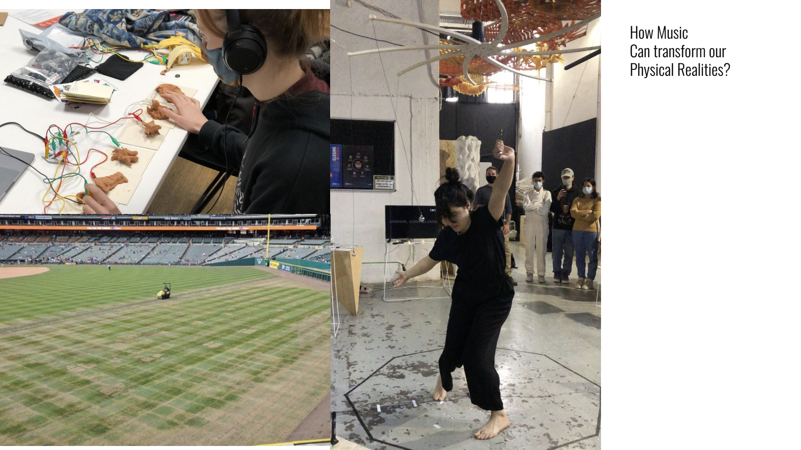
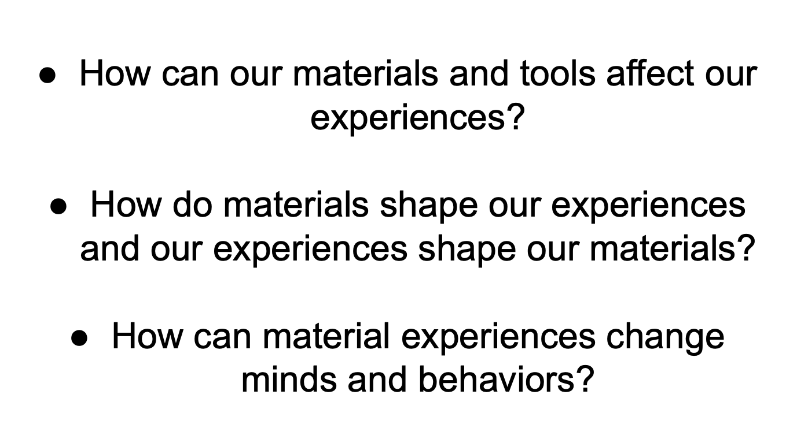
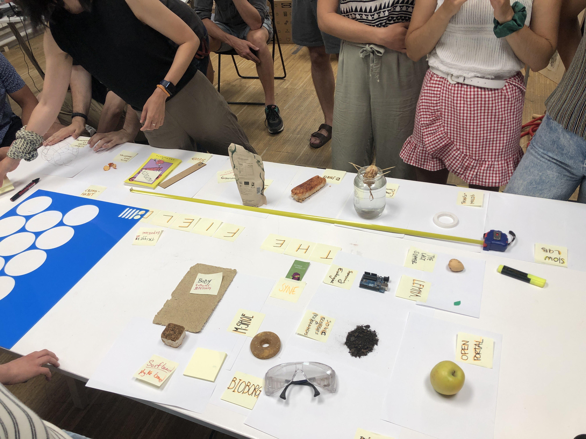
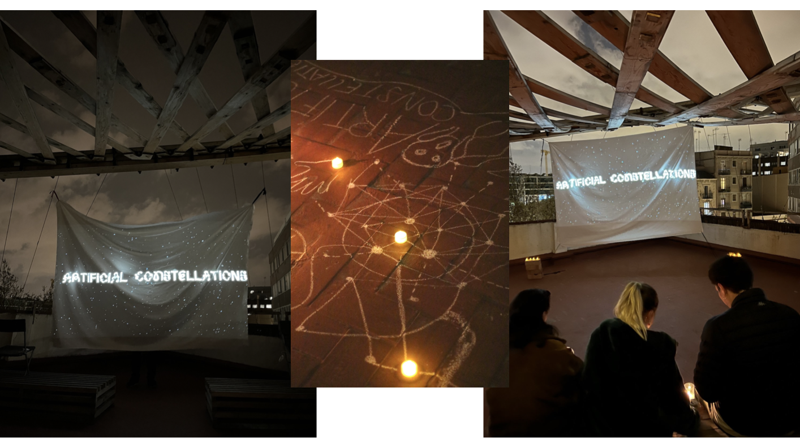
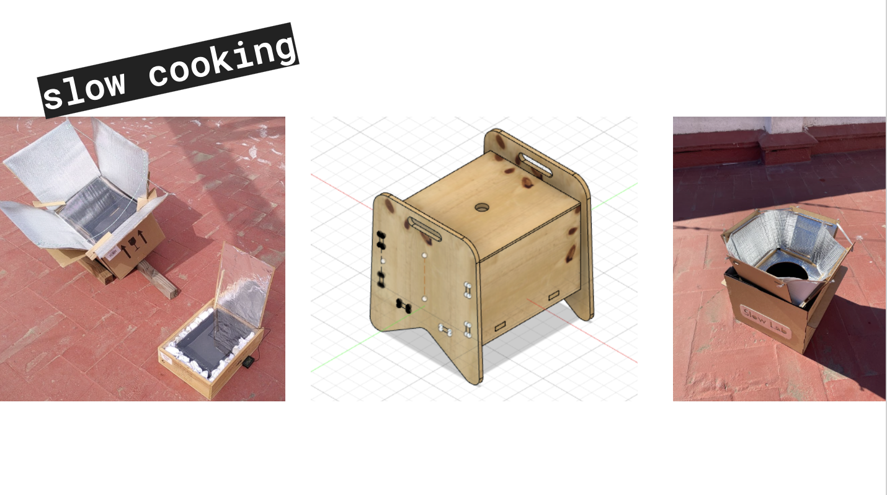
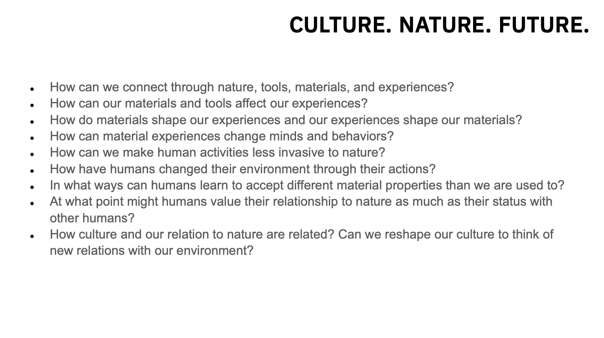

---
hide:
    - toc
---

The Field

Daniel Charnay.

https://wegoforth.org

The first task of the Field, was to write in a sheet of paper, different kind of things that we wanted to chande, avoid, finish, etc. So communicate as a whole collective, what were our intentions and our common interests.

So the main goal of the class is to curate the MDDEFESt going through a process of curation. 
I found this very interesting because I havent work with curators and I find their work very delicate in terms of design. Nothing appears to be random, if more things have meaning and coherence the better.

The second step was to define our areas of interest with projects and refences that we had. with that approach is easier to get points in common and share with others.

I added my projects embodied (Re)cognitions, and I related the change of the physical world through music. Showing that a rock concert is much more heavy duty for the grass than another concert.

We gathered in a small group with Julia and Roberto because we say that our work was related into tech, nature, and ecosystems. So a bunch of initial questions arise from that first metimg

Then we gathered on a big group to continue seeking and exploring what things we have in common, and that resumed the process in this questions.

